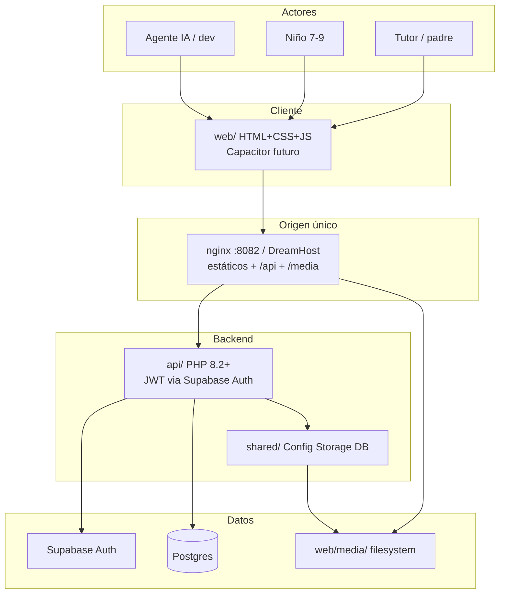

# 01 — Contexto de sistema

**Specs:** [docs/kidepik.md](../../docs/kidepik.md), [SPEC_POC_PHP_DREAMHOST_ARCHITECTURE.md](../specify/SPEC_POC_PHP_DREAMHOST_ARCHITECTURE.md), [SPEC_HOSTING_FREE_TIER_STACK.md](../specify/SPEC_HOSTING_FREE_TIER_STACK.md)

## Quién usa qué

## Arquitectura vigente (única)

| Incluido | Descartado (no reabrir sin decisión) |
| --- | --- |
| DreamHost PHP + Supabase + media local | Cloudflare R2 / S3 / MinIO |
| Auth Google (tutor) | FastAPI / carpeta `backend/` |
| Cliente `web/` en `:8082` | Oracle OCI Always Free |
| | GCP Cloud Run como hosting API |

## Anti-errores

- Producto local = **`http://localhost:8082`**.
- Media = disco bajo `web/media/`, no blob en Postgres ni object storage cloud.
- Arranque = `./scripts/poc-up.ps1` únicamente.
