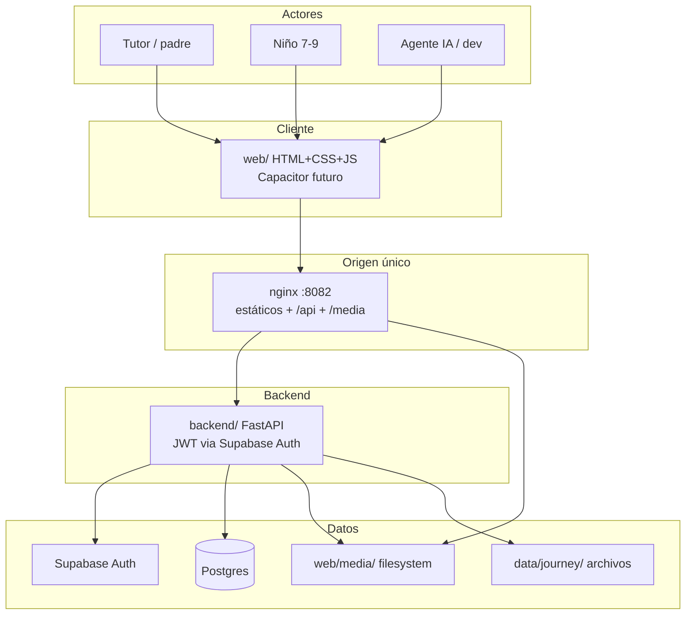

# 01 — Contexto de sistema

**Specs:** [docs/kidepik.md](../../docs/kidepik.md), [SPEC_FASTAPI_BACKEND_MIGRATION.md](../specify/SPEC_FASTAPI_BACKEND_MIGRATION.md), [SPEC_POC_DOCKER_LOCAL_DEV.md](../specify/SPEC_POC_DOCKER_LOCAL_DEV.md), [SPEC_HOSTING_FREE_TIER_STACK.md](../specify/SPEC_HOSTING_FREE_TIER_STACK.md)

## Quién usa qué

## Arquitectura vigente (dev local)

| Incluido | Pendiente / descartado |
| --- | --- |
| Docker `:8082` + FastAPI + Supabase + media local | Hosting prod (DreamHost PHP vs VPS FastAPI — sin decidir) |
| Auth Google (tutor) | Cloudflare R2 / S3 / MinIO |
| Cliente `web/` | Oracle OCI Always Free |
| Ledger `data/journey/` + Gemini (Pydantic AI) | GCP Cloud Run como hosting API |

## Anti-errores

- Producto local = **`http://localhost:8082`**.
- Media = disco bajo `web/media/`, no blob en Postgres ni object storage cloud.
- Arranque = `./scripts/poc-up.ps1` únicamente.
