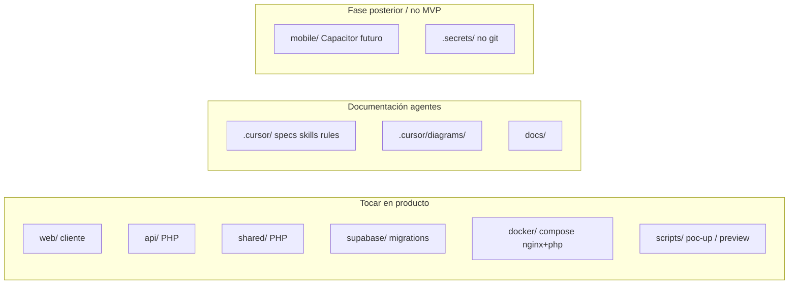

# 02 — Layout del repositorio

**Specs:** [PROJECT_OVERVIEW.md](../plan/PROJECT_OVERVIEW.md), [SPEC_WEB_FRONTEND_ARCHITECTURE.md](../specify/SPEC_WEB_FRONTEND_ARCHITECTURE.md)

## Carpetas (hechos)

| Ruta | Rol |
| --- | --- |
| `web/` | Cliente producto: `index.html`, `css/`, `js/`, `media/` |
| `api/` | `public/index.php` + Controllers/Services + PHPUnit |
| `shared/` | `Config`, `Storage/LocalFilesystemDriver`, `Database/` |
| `supabase/` | Migraciones SQL + Auth/DB locales |
| `docker/` | `compose.yaml` nginx:8082 + php-fpm |
| `scripts/` | `poc-up.ps1`, `poc-down.ps1`, `poc-web-preview.ps1`, OAuth helpers |
| `tools/preview-electron/` | Shell Electron 390×844 |
| `.cursor/` | Specs, tasks, skills, rules, diagramas |
| `tmp/` | Salidas Playwright (gitignore) |

**Eliminado del repo:** `backend/` (FastAPI), OCI MCP, stub S3/R2, `poc-web-dev.ps1`.

## Anti-errores

- No reintroducir FastAPI, R2, MinIO u OCI sin decisión explícita del usuario.
- No meter capturas fuera de `tmp/playwright-output/`.
- Secretos solo en `.secrets/` / `.env.poc` (no versionar).
