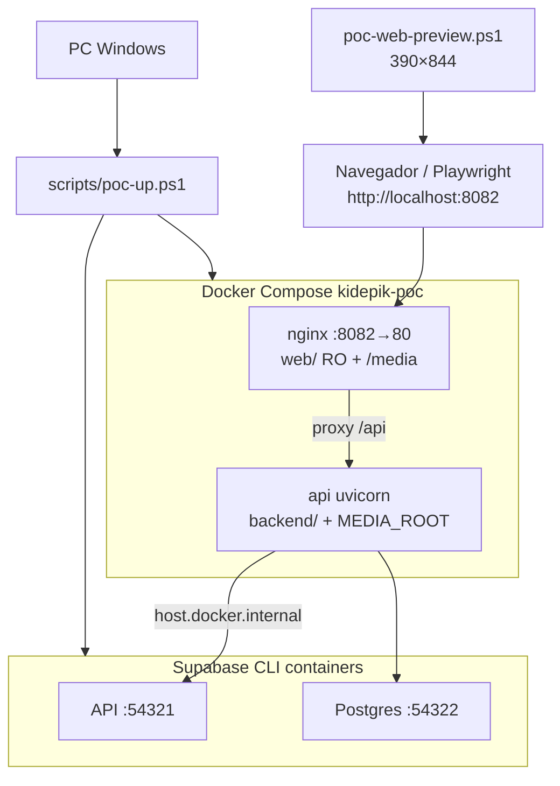

# 03 — Runtime local

**Specs:** [SPEC_POC_DOCKER_LOCAL_DEV.md](../specify/SPEC_POC_DOCKER_LOCAL_DEV.md), [PROJECT_OVERVIEW.md](../plan/PROJECT_OVERVIEW.md), skill [web-mobile-preview](../skills/web-mobile-preview/SKILL.md)

## URLs

| Superficie | URL |
| --- | --- |
| App + API + media | `http://localhost:8082` |
| Media | `http://localhost:8082/media/...` |
| Supabase API | `http://localhost:54321` |
| Postgres (host) | `localhost:54322` |

## Scripts

| Script | Uso |
| --- | --- |
| `./scripts/poc-up.ps1` | Arranque canónico |
| `./scripts/poc-down.ps1` | Parar stack |
| `./scripts/poc-web-preview.ps1` | Electron móvil |
| `./scripts/poc-write-config.ps1` | Genera `web/js/config.js` |

## Anti-errores

- Sin PHP en el host Windows: tests API en contenedor `api` (pytest).
- Viewport UI móvil: **390×844**.
- Única URL de producto: `:8082`.
