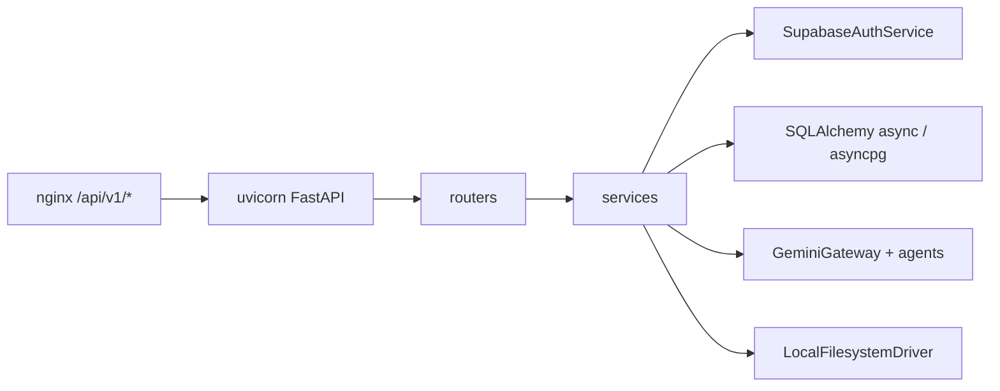

# 04 — Backend FastAPI

**Specs:** [SPEC_FASTAPI_BACKEND_MIGRATION.md](../specify/SPEC_FASTAPI_BACKEND_MIGRATION.md) (canónica POC), legado PHP [SPEC_PHP_BACKEND_ARCHITECTURE.md](../specify/SPEC_PHP_BACKEND_ARCHITECTURE.md)  
**Entrada:** `backend/app/main.py` → routers FastAPI

## Rutas HTTP (paridad `/api/v1`)

| Método | Ruta | Router |
| --- | --- | --- |
| GET | `/api/v1/health` | health |
| GET | `/api/v1/architecture/config\|status` | architecture |
| GET | `/api/v1/migrations/status` | architecture |
| POST | `/api/v1/storage/prepare-upload` | storage |
| POST | `/api/v1/storage/upload` | storage |
| GET | `/api/v1/legal/:slug` | legal |
| POST | `/api/v1/parents/bootstrap` | parents |
| GET/PATCH/DELETE | `/api/v1/parents/me` | parents |
| GET/PATCH | `/api/v1/parents/me/settings` | settings |
| GET/POST | `/api/v1/crew` | crew |
| GET/PATCH/DELETE | `/api/v1/crew/:id` | crew |
| PATCH | `/api/v1/crew/:id/permissions` | crew |
| POST | `/api/v1/play/:id/dialogue/session\|turn` | play |
| GET | `/api/v1/play/:id/dialogue/history` | play |
| GET | `/api/v1/play/:id/journey/summary\|timeline` | play |
| * | `/api/v1/debug/ai/*` | debug_ai |
| POST | `/api/v1/client/logs` | client_logs |

## Auth

- Validar sesión con Supabase Auth HTTP (`GET /auth/v1/user`); **no** confiar solo en decode JWT local.
- Escrituras de negocio vía FastAPI + `DATABASE_URL`.

## Anti-errores

- Cliente `web/` y generadores procedurales **no** se reescriben.
- PHP `api/`/`shared/` no se borran aún; no reciben tráfico.
- Hosting prod aplazado (solo Docker local).
