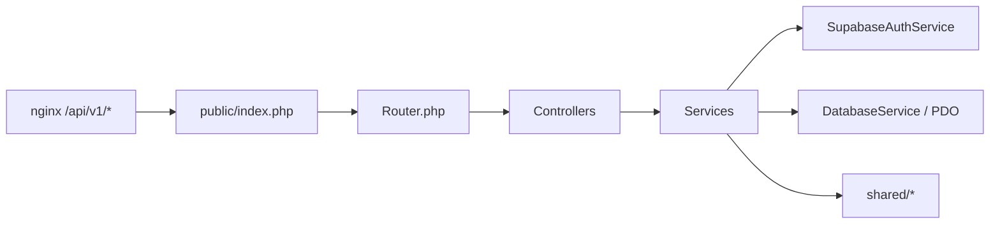
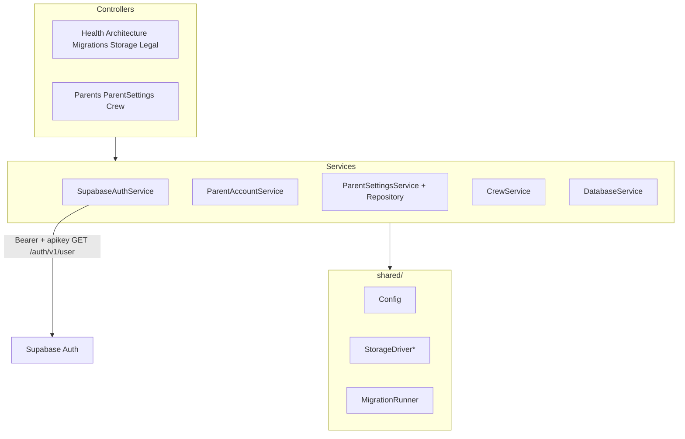

# 04 — Backend PHP

**Specs:** [SPEC_PHP_BACKEND_ARCHITECTURE.md](../specify/SPEC_PHP_BACKEND_ARCHITECTURE.md), [SPEC_PHP_DB_MIGRATIONS_AND_LEGAL.md](../specify/SPEC_PHP_DB_MIGRATIONS_AND_LEGAL.md)  
**Entrada:** `api/public/index.php` → `Router::dispatch`

## Rutas HTTP (`api/src/Router.php`)

| Método | Ruta | Controller |
| --- | --- | --- |
| GET | `/api/v1/health` | Health |
| GET | `/api/v1/architecture/config\|status` | Architecture |
| GET | `/api/v1/migrations/status` | Migrations |
| POST | `/api/v1/storage/prepare-upload` | Storage |
| POST | `/api/v1/storage/upload` | Storage |
| GET | `/api/v1/legal/:slug` | Legal (`terms`/`terminos`, `privacy`/`privacidad`) |
| POST | `/api/v1/parents/bootstrap` | Parents |
| GET/PATCH/DELETE | `/api/v1/parents/me` | Parents |
| GET/PATCH | `/api/v1/parents/me/settings` | ParentSettings |
| GET/POST | `/api/v1/crew` | Crew |
| GET/PATCH/DELETE | `/api/v1/crew/:id` | Crew |
| PATCH | `/api/v1/crew/:id/permissions` | Crew |

## Capas

## Auth

- Validar sesión con Supabase Auth HTTP; **no** confiar solo en decode JWT local.
- Escrituras de negocio (parents/crew/settings) vía API PHP + `DATABASE_URL` (no INSERT directo desde `authenticated` en RLS).

## Anti-errores

- No añadir framework pesado; patrón actual Controllers + Services + `shared/`.
- RAG / OpenRouter = hoja de ruta post-POC, no MVP activo.
