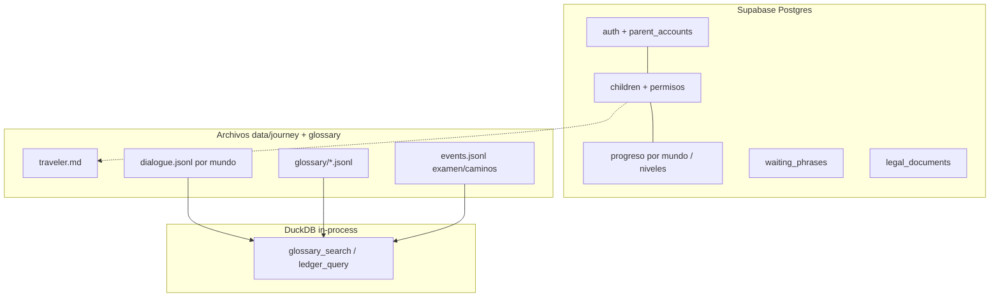
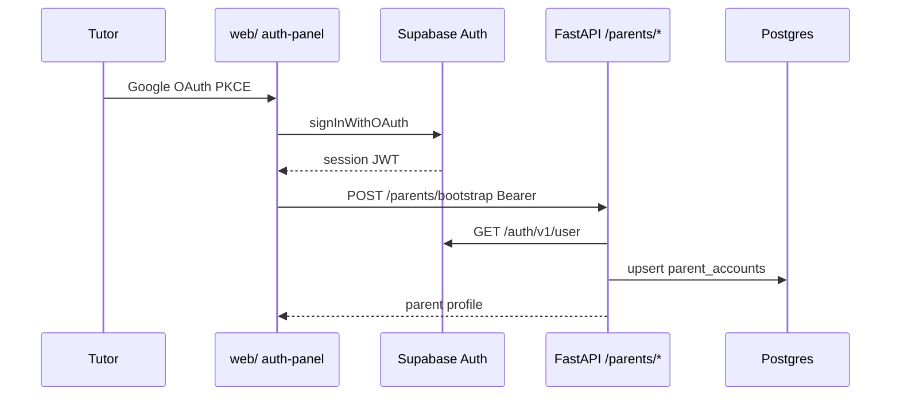
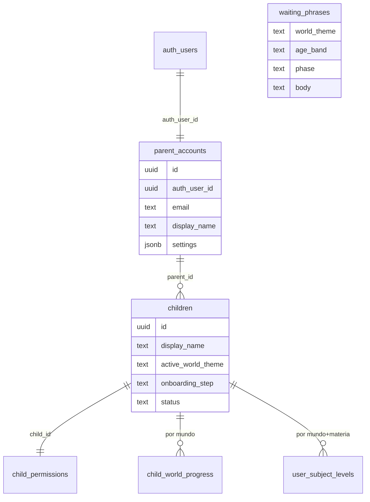

# 05 — Auth y modelo de datos

**Specs:** [SPEC_APP_AUTH.md](../specify/SPEC_APP_AUTH.md), [SPEC_APP_AUTH_GOOGLE_IMPLEMENTATION.md](../specify/SPEC_APP_AUTH_GOOGLE_IMPLEMENTATION.md), [SPEC_DATA_STORAGE_LAYERS.md](../specify/SPEC_DATA_STORAGE_LAYERS.md), [SPEC_APP_PARALLEL_WORLDS.md](../specify/SPEC_APP_PARALLEL_WORLDS.md), [SPEC_APP_WAITING_PHRASES.md](../specify/SPEC_APP_WAITING_PHRASES.md), migraciones en `supabase/migrations/`

## Capas (ago 2026)

## Auth tutor (MVP)

## Modelo relacional (tablas clave de producto)

> **Deprecado como fuente de verdad:** `dialogue_turns`, `story_*`, `placement_exams`, `placement_answers`, `narrative_quests`, `child_traits` — ver [SPEC_DATA_STORAGE_LAYERS](../specify/SPEC_DATA_STORAGE_LAYERS.md).

## Migraciones (orden)

Ver `supabase/migrations/` y [SPEC_PHP_DB_MIGRATIONS_AND_LEGAL.md](../specify/SPEC_PHP_DB_MIGRATIONS_AND_LEGAL.md). Nuevas tablas de producto (`waiting_phrases`, `child_world_progress`) se añaden al implementar las specs propuesta.
