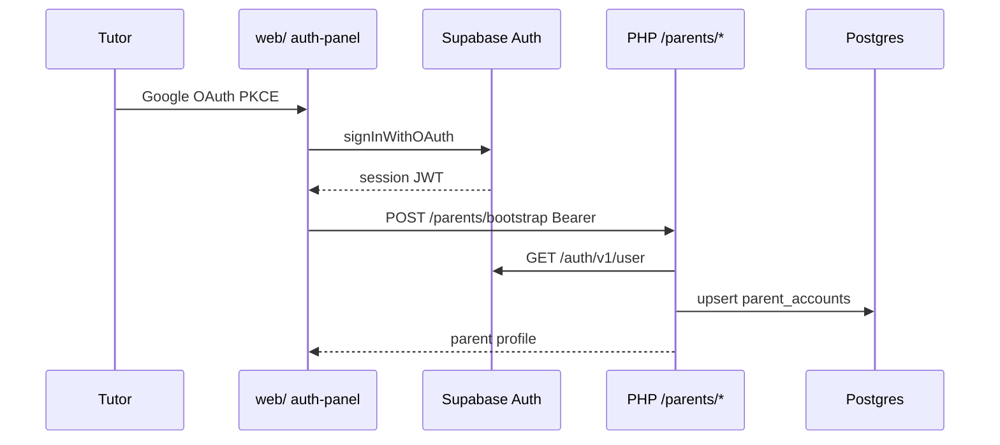
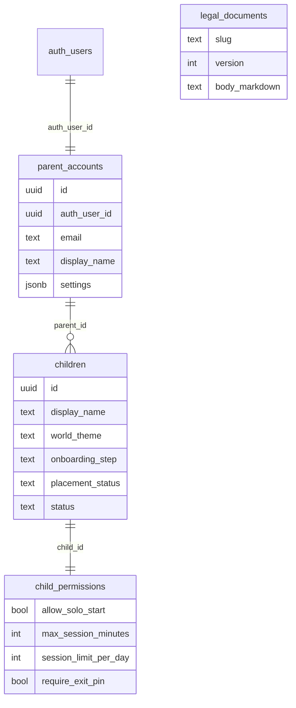

# 05 — Auth y modelo de datos

**Specs:** [SPEC_APP_AUTH.md](../specify/SPEC_APP_AUTH.md), [SPEC_APP_AUTH_GOOGLE_IMPLEMENTATION.md](../specify/SPEC_APP_AUTH_GOOGLE_IMPLEMENTATION.md), migraciones en `supabase/migrations/`

## Auth tutor (MVP)

## Modelo relacional (tablas clave)

## Migraciones (orden)

| Timestamp | Contenido |
| --- | --- |
| `20260615000000` | `poc_health` |
| `20260720163000` | `legal_documents` |
| `20260725140000` | seed legal v2 |
| `20260725180000` | `parent_accounts` |
| `20260726230000` | `parent_accounts.settings` jsonb |
| `20260726230100` | `children` + `child_permissions` |
| `20260728220000` | `max_session_minutes` 5–120 step 5 |

## `parent_accounts.settings` (defaults)

Claves: `ui_theme`, `font_scale_ui`, `font_scale_play`, `reduce_motion`, `world_intensity`, `crew_defaults`, `learning`, `narrative`, `privacy`, `schema_version` — ver `ParentSettingsService::defaults()`.

## Anti-errores

- Slugs legales DB: `terms` / `privacy`; front/hash: `terminos` / `privacidad` (mapeo en LegalController).
- RLS: lecturas selectivas; **mutaciones de negocio por PHP**, no por cliente authenticated.
- MVP auth = **solo Google**.
