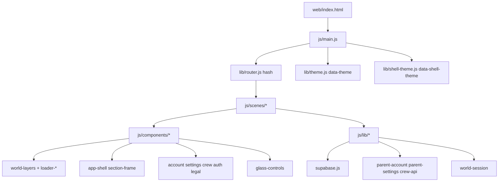

# 06 — Arquitectura frontend

**Specs:** [SPEC_WEB_FRONTEND_ARCHITECTURE.md](../specify/SPEC_WEB_FRONTEND_ARCHITECTURE.md), [DESIGN.md](../DESIGN.md)

## Capas de código

| Carpeta | Responsabilidad |
| --- | --- |
| `js/scenes/` | Montaje por ruta (`loader`, `home`, `account`, `settings`, `crew`, `legal`, `auth-callback`) |
| `js/components/` | DOM factories: loader*, shell, paneles, glass |
| `js/lib/` | Router, temas, sesión mundo, APIs, navegación shell |
| `css/` | Tokens, layout, themes, `components/glass-controls.css` |
| Sin bundler | ES modules + cache-bust `?v=` en imports críticos |

## Temas (dos ejes)

| Eje | Storage / attr | Ámbito |
| --- | --- | --- |
| Mundo visual dual | `localStorage` `kidepik-theme` → `data-theme` = `fantasy` \| `spaceOpera` | Capas / tipografía mundo |
| UI shell tutor | `kidepik.shell.uiTheme` → `data-shell-theme` = `fantasy` \| `sci-fi` | Chrome, tipografía gestión |

**No confundir** tema UI padre con `children.world_theme` (`fantasy` \| `sci-fi`).

## Anti-errores

- No introducir React/Vite como requisito MVP.
- Controles tutor: glass blanco ([DESIGN.md](../DESIGN.md)); sin accent-color de sistema.
