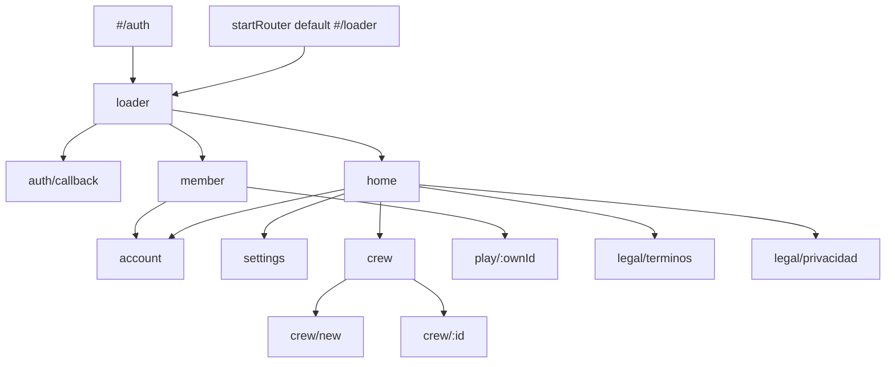
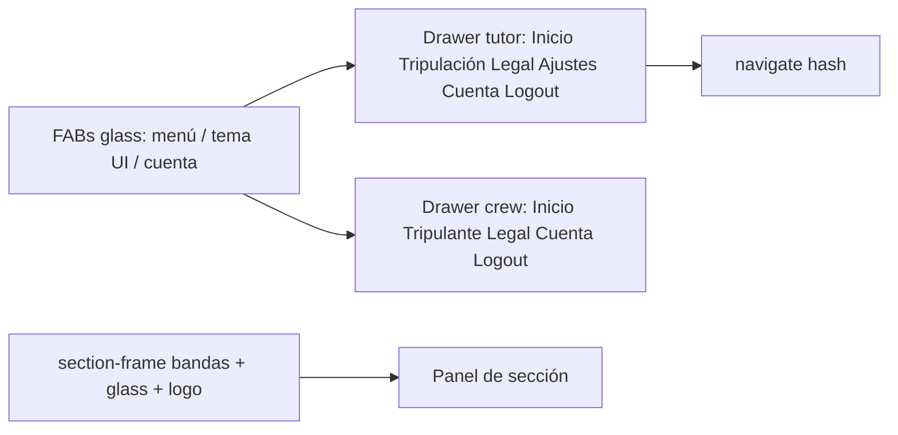

# 07 — Rutas y navegación

**Código:** `web/js/main.js`, `web/js/lib/router.js`, `web/js/lib/shell-navigation.js`  
**Specs:** [SPEC_APP_SHELL_CHROME.md](../specify/SPEC_APP_SHELL_CHROME.md), [SPEC_APP_SECTION_FRAME.md](../specify/SPEC_APP_SECTION_FRAME.md), [SPEC_APP_CREW_MEMBER_ACCOUNT.md](../specify/SPEC_APP_CREW_MEMBER_ACCOUNT.md) (ruta `#/member`)

## Hash routes registradas

| Hash | Escena | Notas |
| --- | --- | --- |
| `#/loader` | loader | Mundo + gate + auth embebido |
| `#/auth` | **mismo** loader | No hay escena auth standalone |
| `#/auth/callback` | auth-callback | OAuth return |
| `#/home` | home | Post-login + shell |
| `#/account` | account | Marco sección |
| `#/settings` | settings | Fase A gestión |
| `#/crew`, `#/crew/new`, `#/crew/:id` | crew | Fase A gestión (solo `role=tutor`) |
| `#/member` | member | Ficha propia `role=crew` — [SPEC_APP_CREW_MEMBER_ACCOUNT](../specify/SPEC_APP_CREW_MEMBER_ACCOUNT.md) |
| `#/legal/terminos\|privacidad` | legal | Con o sin shell según sesión |
| `#/play/:childId` | — | **Contrato** (aún no registrado en main.js) |

## Shell post-login

- `app-shell` se monta **fuera** de `#app` (`web/js/components/app-shell.js`), así sobrevive al `innerHTML = ""` del router.

## World handoff

Al cambiar entre rutas “mundo” (`isWorldRouteHash`), el router pasa `worldHandoff` al teardown para **no destruir** capas (park en `body`). Ver [08-world-layers-themes.md](08-world-layers-themes.md).

## Anti-errores

- `#/auth` ≢ pantalla distinta: es alias del loader.
- Rutas desconocidas → redirect `#/loader`.
- No remontar el shell dentro de `#app`: se perdería en cada navegación.
