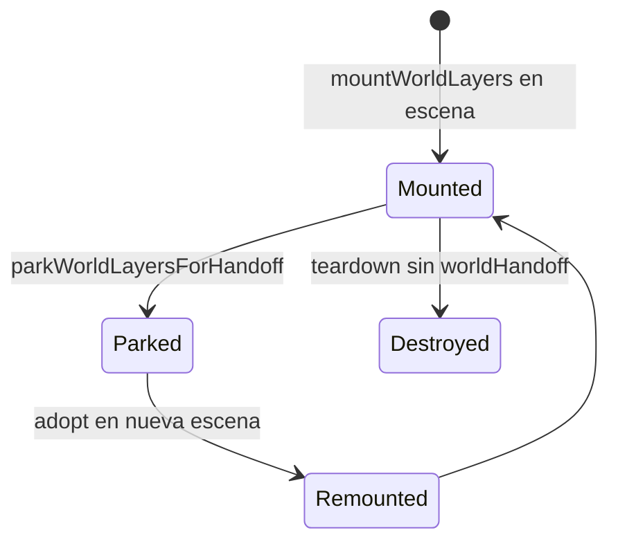
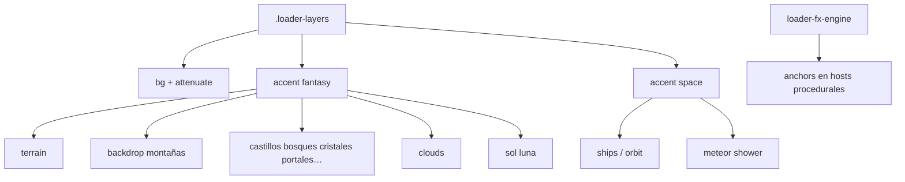
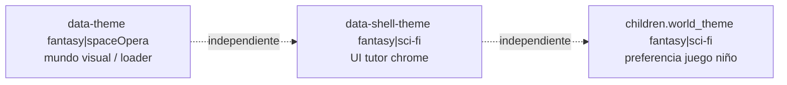

# 08 — Capas de mundo y temas

**Specs:** [SPEC_WORLD_LAYERS_PERSISTENCE.md](../specify/SPEC_WORLD_LAYERS_PERSISTENCE.md), [SPEC_LOADER_SCREEN.md](../specify/SPEC_LOADER_SCREEN.md), [SPEC_LOADER_FANTASY_ENGINE.md](../specify/SPEC_LOADER_FANTASY_ENGINE.md), [SPEC_LOADER_FX_ENGINE.md](../specify/SPEC_LOADER_FX_ENGINE.md)

## Persistencia entre rutas

- Singleton de sesión: `web/js/lib/world-session.js`
- DOM capas: `web/js/components/world-layers.js` (`.loader-layers`)
- Mitad fantasía + mitad sci-fi (space) en la misma instancia

## Composición de capas (simplificado)

## Dos temas vs mundo niño

## Anti-errores

- No recrear capas en cada navegación legal/home (flash negro).
- No mezclar `?v=` divergente en singletons de mundo.
- Specs loader FX/fantasía: detalle fino en `specify/SPEC_LOADER_*`; este diagrama solo orienta.
