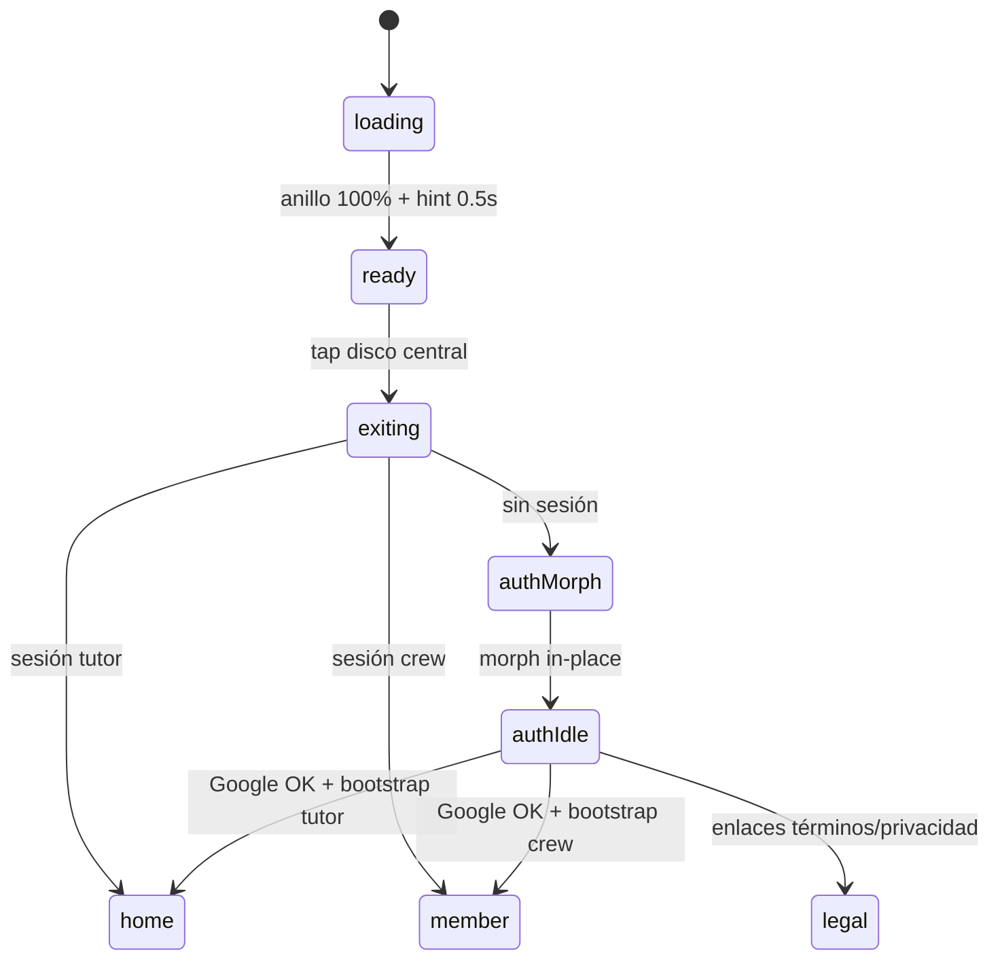
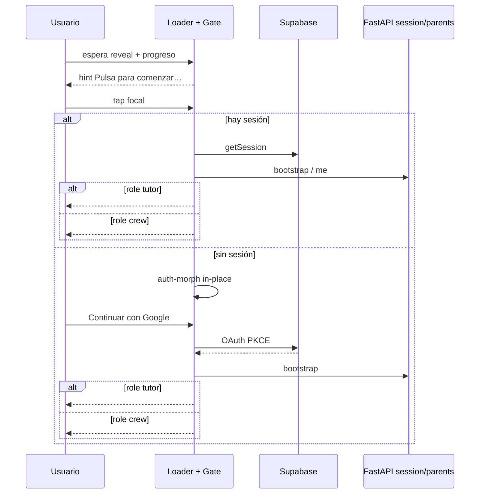

# 09 — Loader, puerta y auth

**Specs:** [SPEC_LOADER_APP_GATE.md](../specify/SPEC_LOADER_APP_GATE.md), [SPEC_APP_AUTH.md](../specify/SPEC_APP_AUTH.md), [SPEC_LOADER_SCREEN.md](../specify/SPEC_LOADER_SCREEN.md)  
**Código:** `loader-gate.js`, `loader-auth-morph.js`, `auth-panel.js`, `scenes/loader.js`

## Flujo feliz

**Implementado:** [SPEC_APP_CREW_MEMBER_ACCOUNT.md](../specify/SPEC_APP_CREW_MEMBER_ACCOUNT.md) — el bootstrap elige tutor vs tripulante por Gmail invitado.

## Hechos de producto

- Hint: «Pulsa para comenzar» (sci-fi) + «tu viaje épico» (fantasía).
- `#/auth` ≡ loader (panel embebido).
- Tras reload: siempre vuelve a pasar por `loading` → `ready` (tap confirma entrada).

## Anti-errores

- No crear escena auth separada con fondo distinto.
- No bloquear el tap por latencia de red; resolver sesión en paralelo tras el gesto.
