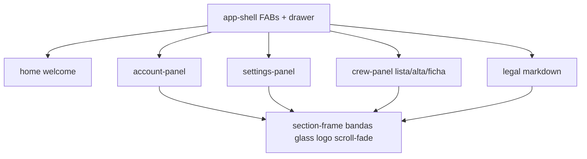
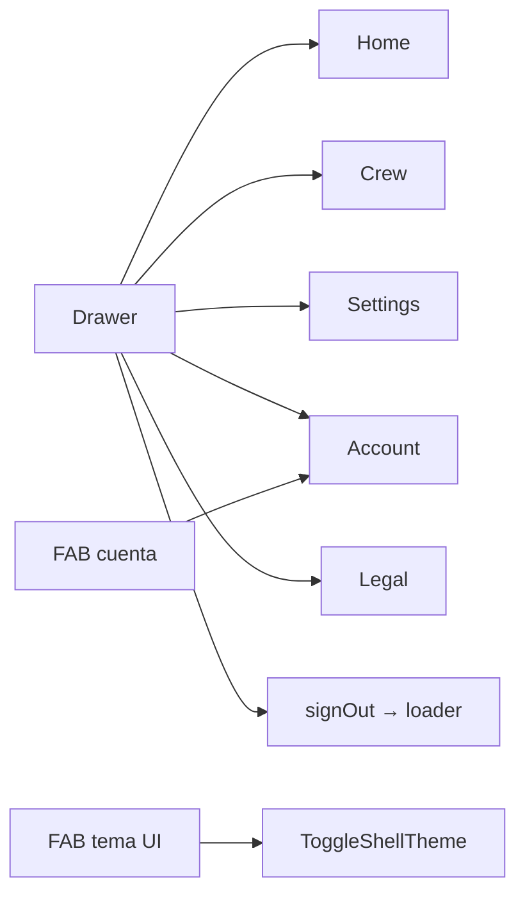

# 10 — Superficies del tutor

**Specs:** [SPEC_APP_ACCOUNT_SECTION.md](../specify/SPEC_APP_ACCOUNT_SECTION.md), [SPEC_APP_SETTINGS_SECTION.md](../specify/SPEC_APP_SETTINGS_SECTION.md), [SPEC_APP_CREW_SECTION.md](../specify/SPEC_APP_CREW_SECTION.md), [SPEC_LEGAL_AUTHENTICATED_SESSION.md](../specify/SPEC_LEGAL_AUTHENTICATED_SESSION.md), [SPEC_APP_SECTION_FRAME.md](../specify/SPEC_APP_SECTION_FRAME.md), [DESIGN.md](../DESIGN.md)

## Estado de implementación (jul 2026)

| Superficie | Estado | API |
| --- | --- | --- |
| Cuenta | Implementada | `GET/PATCH/DELETE /parents/me` |
| Ajustes | Fase A gestión | `GET/PATCH /parents/me/settings` |
| Tripulación | Fase A gestión (plaza, lista, ficha, permisos) | `/crew`, `/crew/:id`, permissions |
| Legal autenticado | Shell + vuelta a home sin logout | `GET /legal/:slug` |
| Play desde crew | **Pendiente** (contrato en 11) | — |

## Navegación típica

## Anti-errores

- Home **no** usa bandas compactas del section-frame (excepción de spec).
- Permisos de niño ≠ settings del hogar; defaults de crew viven en `settings.crew_defaults`.
- Controles: catálogo glass en DESIGN.md / `glass-controls.css`.
