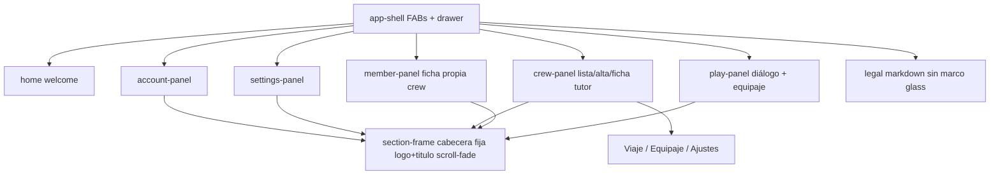
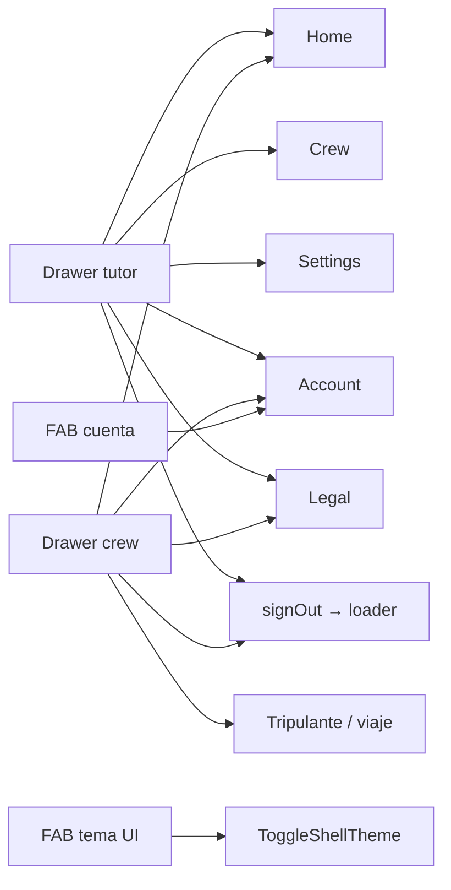

# 10 — Superficies del tutor

**Specs:** [SPEC_APP_ACCOUNT_SECTION.md](../specify/SPEC_APP_ACCOUNT_SECTION.md), [SPEC_APP_SETTINGS_SECTION.md](../specify/SPEC_APP_SETTINGS_SECTION.md), [SPEC_APP_CREW_SECTION.md](../specify/SPEC_APP_CREW_SECTION.md), [SPEC_APP_CREW_MEMBER_ACCOUNT.md](../specify/SPEC_APP_CREW_MEMBER_ACCOUNT.md), [SPEC_APP_CREW_BAGGAGE_TAB.md](../specify/SPEC_APP_CREW_BAGGAGE_TAB.md), [SPEC_LEGAL_AUTHENTICATED_SESSION.md](../specify/SPEC_LEGAL_AUTHENTICATED_SESSION.md), [SPEC_APP_SECTION_FRAME.md](../specify/SPEC_APP_SECTION_FRAME.md), [DESIGN.md](../DESIGN.md)

## Estado de implementación (ago 2026)

| Superficie | Estado | API |
| --- | --- | --- |
| Cuenta | Implementada; título «Cuenta» en cabecera | `GET/PATCH/DELETE /parents/me` |
| Ajustes | Fase A gestión; título en cabecera | `GET/PATCH /parents/me/settings` |
| Tripulación | Fase A + cartas TCG; **ficha v2 propuesta** (Viaje / **Equipaje** / Ajustes + progreso) | `/crew`, `/crew/:id`, permissions; `GET …/baggage`; `progress` en crew detail |
| **Tripulante (`#/member`)** | **Implementada** [SPEC_APP_CREW_MEMBER_ACCOUNT](../specify/SPEC_APP_CREW_MEMBER_ACCOUNT.md) | `GET/PATCH /member`, `POST /member/unlink`; play solo `child_id` propio |
| Play (`#/play/:id`) | Vertical slice; título capítulo; **propuesta** toggle equipaje + HUD nivel | dialogue session/turn; `GET …/baggage` |
| Legal autenticado | Shell + vuelta a home; **sin** section-frame | `GET /legal/:slug` |

## Navegación típica

## Anti-errores

- Home **no** usa bandas compactas del section-frame (excepción de spec).
- Permisos de niño ≠ settings del hogar; defaults de crew viven en `settings.crew_defaults`.
- Controles: catálogo glass en DESIGN.md / `glass-controls.css`.
