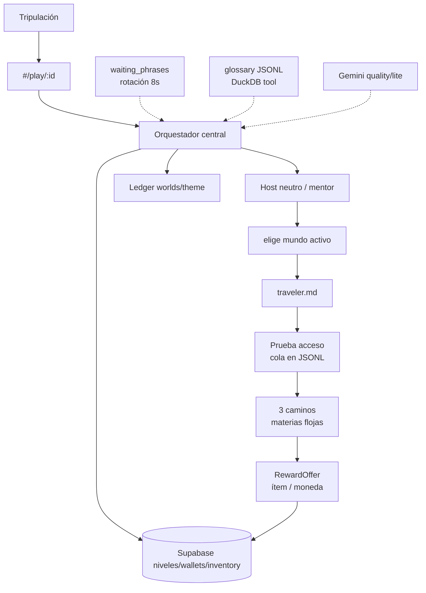

# 11 — Pipeline de aventura infantil (contrato)

**Specs canónicas (ago 2026):** [SPEC_APP_JOURNEY_MECHANICS.md](../specify/SPEC_APP_JOURNEY_MECHANICS.md), [SPEC_DATA_STORAGE_LAYERS.md](../specify/SPEC_DATA_STORAGE_LAYERS.md), [SPEC_AI_CENTRAL_ORCHESTRATOR.md](../specify/SPEC_AI_CENTRAL_ORCHESTRATOR.md), [SPEC_AI_GEMINI_GATEWAY.md](../specify/SPEC_AI_GEMINI_GATEWAY.md), [SPEC_AI_PYDANTIC_AGENTS.md](../specify/SPEC_AI_PYDANTIC_AGENTS.md), [SPEC_AI_AGENT_SKILLS.md](../specify/SPEC_AI_AGENT_SKILLS.md), [SPEC_AI_JOURNEY_FILE_LEDGER.md](../specify/SPEC_AI_JOURNEY_FILE_LEDGER.md), [SPEC_APP_PARALLEL_WORLDS.md](../specify/SPEC_APP_PARALLEL_WORLDS.md), [SPEC_APP_WORLD_GLOSSARY.md](../specify/SPEC_APP_WORLD_GLOSSARY.md), [SPEC_APP_WAITING_PHRASES.md](../specify/SPEC_APP_WAITING_PHRASES.md), [SPEC_APP_CANONICAL_VOCABULARY.md](../specify/SPEC_APP_CANONICAL_VOCABULARY.md), [SPEC_APP_PLAY_FIRST_RUN.md](../specify/SPEC_APP_PLAY_FIRST_RUN.md), [SPEC_APP_SUBJECT_CATALOG.md](../specify/SPEC_APP_SUBJECT_CATALOG.md), [SPEC_APP_AGE_BANDS.md](../specify/SPEC_APP_AGE_BANDS.md), [SPEC_APP_REWARDS_ECONOMY.md](../specify/SPEC_APP_REWARDS_ECONOMY.md), [SPEC_APP_PLAY_BAGGAGE_TOGGLE.md](../specify/SPEC_APP_PLAY_BAGGAGE_TOGGLE.md), [SPEC_APP_PLAY_PROGRESS_HUD.md](../specify/SPEC_APP_PLAY_PROGRESS_HUD.md)

> Runtime: FastAPI + orquestador + Gemini. **Sin** PlacementBank / OpenRouter. Detalle de flujos Mermaid en [SPEC_APP_JOURNEY_MECHANICS](../specify/SPEC_APP_JOURNEY_MECHANICS.md). Equipaje/moneda: [19-rewards-inventory](19-rewards-inventory.md).

## Persistencia

| Capa | Qué |
| --- | --- |
| Supabase | auth, children, progreso por mundo, wallets, inventory; `user_subject_levels` se **reconstruye** al rebobinar caminos (no se borra por `updated_at`) |
| Archivos | dialogue/events/summary/traveler por mundo; estado examen/caminos; `reward_granted` |
| DuckDB | tools sobre JSONL (glosario + ledger) |

**Currículo vs lore:** el examen de acceso pregunta **conocimiento escolar previo**; el envoltorio del mundo no es temario. En caminos, lore inventado solo si acaba de enseñarse en el pasaje.
| Código/JSON | ItemCatalog `data/items/` |

## Anti-errores

- No PlacementBank / `default.json` de ítems.
- No escribir transcript ni cola de examen en Postgres.
- No modelos de pago.
- No segunda voz de chat: solo mentor del mundo activo.
