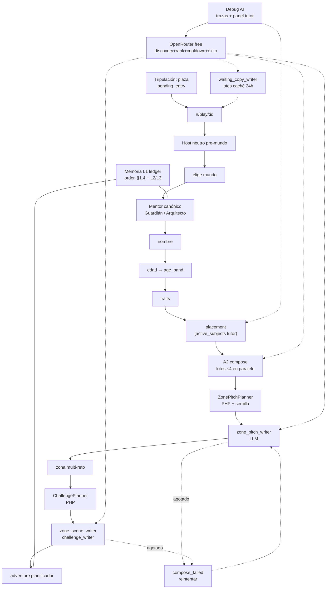

# 11 — Pipeline de aventura infantil (contrato)

**Specs:** [SPEC_APP_PLAY_FIRST_RUN.md](../specify/SPEC_APP_PLAY_FIRST_RUN.md), [SPEC_APP_CHARACTER_TRAITS.md](../specify/SPEC_APP_CHARACTER_TRAITS.md), [SPEC_APP_AGE_BANDS.md](../specify/SPEC_APP_AGE_BANDS.md), [SPEC_APP_SUBJECT_CATALOG.md](../specify/SPEC_APP_SUBJECT_CATALOG.md), [SPEC_APP_MENTOR_PLACEMENT_ADAPTIVE.md](../specify/SPEC_APP_MENTOR_PLACEMENT_ADAPTIVE.md), [SPEC_APP_MENTOR.md](../specify/SPEC_APP_MENTOR.md), [SPEC_APP_JOURNEY_MEMORY.md](../specify/SPEC_APP_JOURNEY_MEMORY.md), [SPEC_APP_PLACEMENT_EXAM.md](../specify/SPEC_APP_PLACEMENT_EXAM.md), [SPEC_APP_ADVENTURE_DIALOGUE.md](../specify/SPEC_APP_ADVENTURE_DIALOGUE.md), [SPEC_APP_ADVENTURE_DIALOGUE_HISTORY.md](../specify/SPEC_APP_ADVENTURE_DIALOGUE_HISTORY.md), [SPEC_APP_ADVENTURE_SESSION.md](../specify/SPEC_APP_ADVENTURE_SESSION.md), [SPEC_APP_ADVENTURE_STORY_RICHNESS.md](../specify/SPEC_APP_ADVENTURE_STORY_RICHNESS.md), [SPEC_APP_ADVENTURE_LLM_NARRATIVE.md](../specify/SPEC_APP_ADVENTURE_LLM_NARRATIVE.md), [SPEC_APP_ADVENTURE_ZONE_BIBLE.md](../specify/SPEC_APP_ADVENTURE_ZONE_BIBLE.md), [SPEC_APP_PROGRESSION_RANKS.md](../specify/SPEC_APP_PROGRESSION_RANKS.md), [SPEC_APP_WORLD_JOURNEY_CANON.md](../specify/SPEC_APP_WORLD_JOURNEY_CANON.md), [SPEC_AI_OPENROUTER_GATEWAY.md](../specify/SPEC_AI_OPENROUTER_GATEWAY.md), [SPEC_AI_PLAY_ORCHESTRATION.md](../specify/SPEC_AI_PLAY_ORCHESTRATION.md), [SPEC_APP_DEBUG_MODE.md](../specify/SPEC_APP_DEBUG_MODE.md)

> **Estado:** contratos + **LLM narrative aprobado** (2 ago 2026) — solo LLM, sin plantillas; fallo → `compose_failed`. Plan: [tasks/AI_ADVENTURE_LLM_NARRATIVE_PLAN.md](../tasks/AI_ADVENTURE_LLM_NARRATIVE_PLAN.md).

## Persistencia

| Capa | Qué |
| --- | --- |
| Perfil | mundo, nombre, edad/banda, traits, niveles, mentor_id |
| L1 | dialogue_turns + story_beats + decisions (trazable) |
| L2 | story_summaries condensed_full |
| L3 | últimos beats/turns al retomar |
| Debug (no-prod) | `ai_call_attempts` / traza en response — [SPEC_APP_DEBUG_MODE.md](../specify/SPEC_APP_DEBUG_MODE.md) |

## Anti-errores

- No implementar sin aprobación P0 del plan.
- No modelos de pago (`AI_ALLOW_PAID=false`).
- No segunda voz de chat: solo mentor.
- No versionar `OPENROUTER_API_KEY`.
