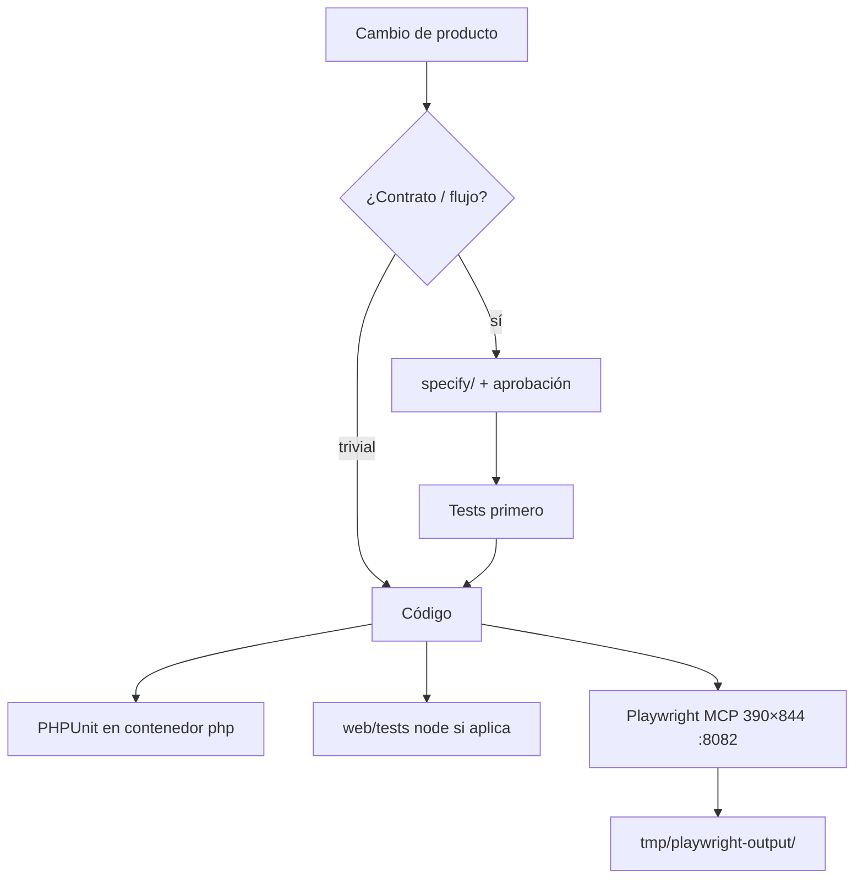

# 13 — Dev, test y validación

**Specs:** skill [spec-driven-dev-kidepik](../skills/spec-driven-dev-kidepik/SKILL.md), [web-mobile-preview](../skills/web-mobile-preview/SKILL.md), reglas browser MCP

## Comandos típicos

| Qué | Cómo |
| --- | --- |
| Stack | `./scripts/poc-up.ps1` |
| **Suite completa** | `./scripts/test-all.ps1` (PHPUnit + JS + Playwright) |
| PHPUnit | `docker compose --env-file .env.poc -f docker/compose.yaml exec php vendor/bin/phpunit --coverage-text` |
| JS unit + cobertura | `cd web && npm run test:coverage` |
| Playwright E2E | `cd web && npm run test:e2e` |
| Health | `GET http://localhost:8082/api/v1/health` |
| UI agente | MCP `playwright` → `http://localhost:8082`, viewport 390×844 |
| **Auth local Playwright** | `./scripts/e2e-auth-setup.ps1` → [SPEC_DEV_LOCAL_AUTH_PLAYWRIGHT.md](../specify/SPEC_DEV_LOCAL_AUTH_PLAYWRIGHT.md) |
| Electron | `./scripts/poc-web-preview.ps1` |
| Codegraph | Desde raíz kidepik: `codegraph index .` / `codegraph status .` |
| Spec tests | [.cursor/specify/SPEC_DEV_TEST_CI.md](../specify/SPEC_DEV_TEST_CI.md) |

## Anti-errores

- No `php` / `php -S` en el host Windows.
- No declarar UI lista sin flujo feliz + borde en Playwright (si MCP disponible).
- No versionar PNG de prueba fuera de `tmp/`.
