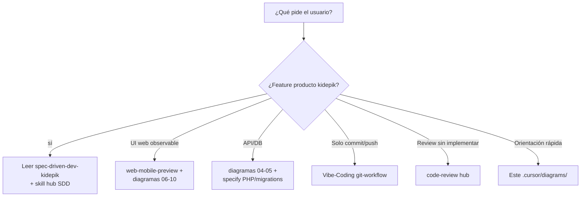

# 14 — Árbol de decisión para agentes

## Matriz rápida

| Pedido | Leer primero | Diagramas |
| --- | --- | --- |
| Loader / gate / auth Google | SPEC_LOADER_APP_GATE, SPEC_APP_AUTH* | 08, 09 |
| Shell / drawer / FABs | SPEC_APP_SHELL_CHROME | 07, 10 |
| Cuenta / ajustes / crew | SPEC_APP_*_SECTION | 10, 05 |
| Play / examen / diálogo / IA / mentor / memoria / materias / **riqueza narrativa** / **LLM aventura** / **historial paginado** | SPEC_APP_SUBJECT_CATALOG / MENTOR_PLACEMENT_ADAPTIVE / PLAY_* / MENTOR / JOURNEY_MEMORY / **ADVENTURE_DIALOGUE_HISTORY** / **ADVENTURE_STORY_RICHNESS** / **ADVENTURE_LLM_NARRATIVE** / ZONE_BIBLE / MENTOR_PROSE_CLARITY / AGE_BANDS / SPEC_AI_* | 11 |
| Ruta API nueva | SPEC_PHP_BACKEND + Router.php | 04 |
| Migración SQL | supabase/migrations + MigrationRunner | 05, 03 |
| Media / upload | SPEC_MEDIA_STORAGE | 12 |
| Docker / puerto | SPEC_POC_DOCKER_LOCAL_DEV | 03 |
| Playwright auth local (agentes / E2E UI) | SPEC_DEV_LOCAL_AUTH_PLAYWRIGHT | 13 |
| Diseño controles tutor | DESIGN.md | 06, 10 |
| Codegraph desfasado | `codegraph index .` en kidepik | README |

## Precedencia documental

1. Spec aprobada en `.cursor/specify/`  
2. Código actual (`web/`, `api/`) si la spec dice “implementada”  
3. Diagramas (mapa, no contrato)  
4. Engram (decisiones previas)

## Anti-errores globales

- URL producto = `:8082`.
- Stack = PHP + Supabase + `web/media/` — **no** FastAPI, R2, MinIO, OCI, Cloud Run.
- No inventar `#/play` como ya implementado.
- MCP codegraph del hub ≠ índice kidepik salvo root correcto.
