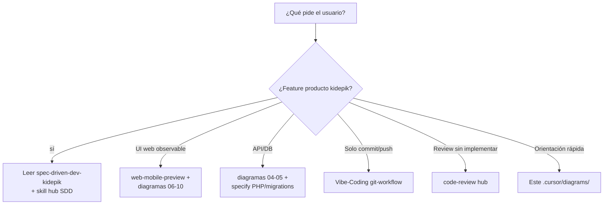

# 14 — Árbol de decisión para agentes

## Matriz rápida

| Pedido | Leer primero | Diagramas |
| --- | --- | --- |
| Loader / gate / auth Google | SPEC_LOADER_APP_GATE, SPEC_APP_AUTH* | 08, 09 |
| Shell / drawer / FABs | SPEC_APP_SHELL_CHROME | 07, 10 |
| Cuenta / ajustes / crew | SPEC_APP_*_SECTION | 10, 05 |
| **Cuenta de tripulante / Gmail plaza / rol crew** | **SPEC_APP_CREW_MEMBER_ACCOUNT** (+ AUTH, SHELL, CREW, ACCOUNT) | **05, 07, 09, 10** |
| Play / examen / diálogo / IA / mentor / memoria / materias / **riqueza narrativa** / **LLM aventura** / **historial paginado** / **compose compacto (chips en log)** | SPEC_APP_JOURNEY_MECHANICS + SUBJECT_CATALOG / PLAY_* / MENTOR / JOURNEY_MEMORY / ADVENTURE_* / AGE_BANDS / **SPEC_APP_PLAY_COMPOSE_COMPACT** / SPEC_AI_* (OpenRouter legado) | 11 |
| **IA agentic FastAPI** (Gemini, orquestador, skills, ledger, DuckDB/glosario, mundos paralelos) | **SPEC_DATA_STORAGE_LAYERS** / **SPEC_AI_CENTRAL_ORCHESTRATOR** / **SPEC_AI_GEMINI_GATEWAY** / **SPEC_AI_PYDANTIC_AGENTS** / **SPEC_AI_AGENT_SKILLS** / **SPEC_AI_JOURNEY_FILE_LEDGER** / **SPEC_APP_PARALLEL_WORLDS** / **SPEC_APP_WORLD_GLOSSARY** / **SPEC_APP_WAITING_PHRASES** / **SPEC_APP_CANONICAL_VOCABULARY** | **15**, 11, 05 |
| Mecánicas de viaje (flujos de decisión jugables) | **SPEC_APP_JOURNEY_MECHANICS** | **16**, 11 |
| Dónde guardar datos (PG vs archivos vs DuckDB) | **SPEC_DATA_STORAGE_LAYERS** | **17**, 05 |
| Mundos en paralelo / cambio fantasy↔sci-fi | **SPEC_APP_PARALLEL_WORLDS** | **18**, 08 |
| Recompensas / moneda / equipaje / HUD nivel play | **SPEC_APP_REWARDS_ECONOMY** / **SPEC_APP_INVENTORY_BAGGAGE** / **SPEC_APP_ITEM_CATALOG** / **SPEC_APP_CREW_BAGGAGE_TAB** / **SPEC_APP_PLAY_BAGGAGE_TOGGLE** / **SPEC_APP_PLAY_PROGRESS_HUD** (+ EFFECTS / SPENDING futuro) | **19**, 11, 10, 17 |
| Ruta API nueva | SPEC_FASTAPI_BACKEND_MIGRATION + `backend/app/routers` | 04 |
| Migración SQL | supabase/migrations + MigrationRunner (Python) | 05, 03 |
| Media / upload | SPEC_MEDIA_STORAGE | 12 |
| Docker / puerto | SPEC_POC_DOCKER_LOCAL_DEV + compose FastAPI | 03 |
| Playwright auth local (agentes / E2E UI) | SPEC_DEV_LOCAL_AUTH_PLAYWRIGHT | 13 |
| Diseño controles tutor | DESIGN.md | 06, 10 |
| Codegraph desfasado | `codegraph index .` en kidepik | README |

## Precedencia documental

1. Spec aprobada en `.cursor/specify/`  
2. Código actual (`web/`, `api/`) si la spec dice “implementada”  
3. Diagramas (mapa, no contrato)  
4. Engram (decisiones previas)

## Anti-errores globales

- URL producto = `:8082`.
- Stack POC = **FastAPI** (`backend/`) + Supabase + `web/media/` + cliente `web/` — PHP legado sin tráfico HTTP.
- No inventar `#/play` como ya implementado.
- MCP codegraph del hub ≠ índice kidepik salvo root correcto.
