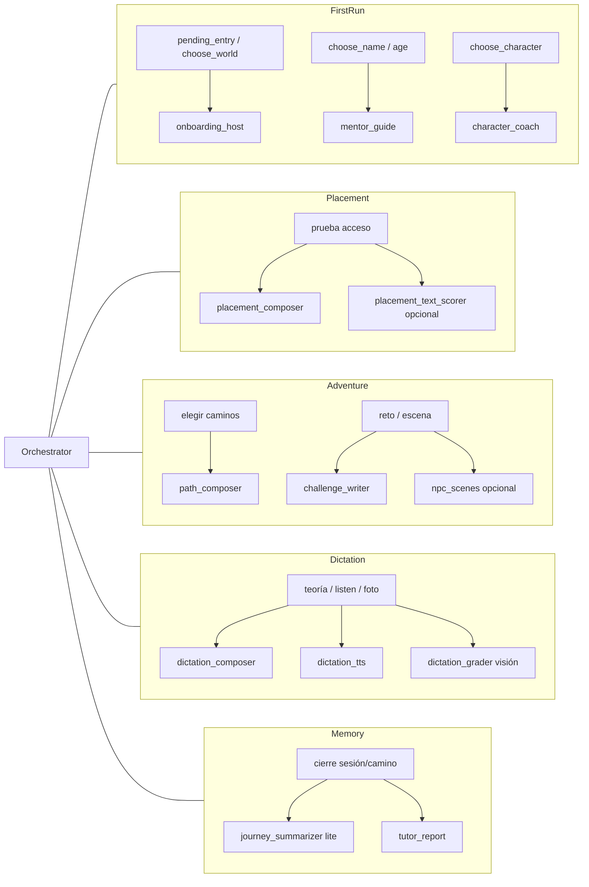
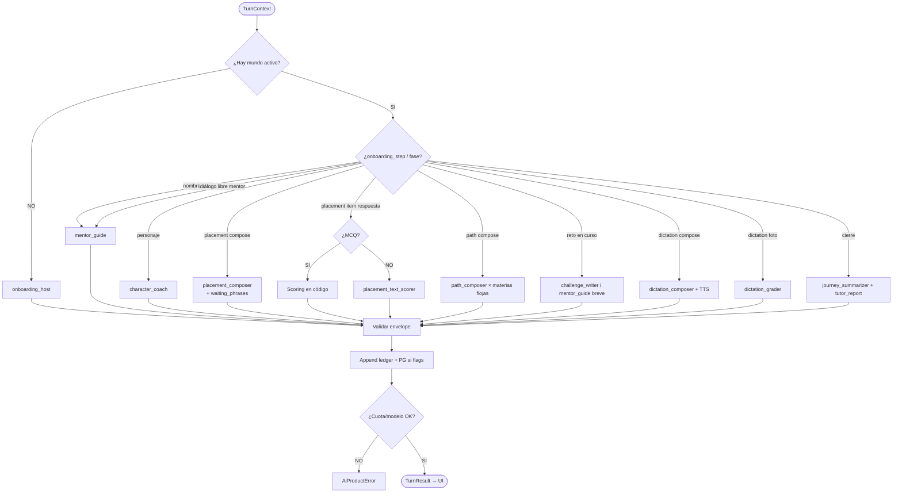

# 15 — Orquestador y agentes de play

**Specs:** [SPEC_AI_CENTRAL_ORCHESTRATOR.md](../specify/SPEC_AI_CENTRAL_ORCHESTRATOR.md), [SPEC_AI_PYDANTIC_AGENTS.md](../specify/SPEC_AI_PYDANTIC_AGENTS.md), [SPEC_AI_AGENT_SKILLS.md](../specify/SPEC_AI_AGENT_SKILLS.md), [SPEC_AI_GEMINI_GATEWAY.md](../specify/SPEC_AI_GEMINI_GATEWAY.md), [SPEC_APP_WORLD_GLOSSARY.md](../specify/SPEC_APP_WORLD_GLOSSARY.md), [SPEC_APP_DICTATION.md](../specify/SPEC_APP_DICTATION.md) *(propuesta)*, [SPEC_AI_GEMINI_TTS.md](../specify/SPEC_AI_GEMINI_TTS.md)

> Mapa del **runtime de IA de producto** (no confundir con [14](14-cursor-doc-routing.md), que orienta al agente de Cursor).

## Arquitectura

```mermaid
flowchart TB
  UI[Play UI] --> Svc[DialogueService / compose]
  Svc --> Orch[Orchestrator.run]
  Orch --> Plan{¿Qué rol(es) necesita<br/>este TurnContext?}
  Plan --> Sub[Subagente desde agents/*.md]
  Plan --> Multi[Varios subagentes<br/>p.ej. path_composer ×3]
  Sub --> Skills[Skills declaradas]
  Sub --> Tools
  Multi --> Tools
  subgraph Tools[Tools]
    G[glossary_search DuckDB]
    L[ledger_query DuckDB/FS]
    P[leer flags/niveles PG]
  end
  Sub --> Env[Envelope tipado]
  Multi --> Env
  Env --> Orch
  Orch --> FS[(Ledger JSONL/MD)]
  Orch --> PG[(Supabase flags/niveles)]
  Orch --> Svc
  Svc --> UI
  GW[GeminiGateway quality/lite] -.-> Sub
  GW -.-> Multi
```

## Mapa fase → agente(s)



## Árbol de decisión del orquestador (turno)



## Skills típicas por rol

| Rol | Skills (orientativo) | Tier |
| --- | --- | --- |
| onboarding_host | safety-tone, audience-language | quality |
| mentor_guide | mentor-voice, world-canon, audience-language, safety-tone | quality |
| character_coach | character-traits, audience-language, safety-tone | quality |
| placement_composer | placement-exam, subject-pedagogy, audience-language | quality |
| path_composer | challenge-design, zone-pitches, world-canon, glossary tool | quality |
| challenge_writer | challenge-design, npc-scenes, evaluation-rubric | quality |
| journey_summarizer | journey-summary | lite |
| dictation_composer | dictation-orthography, audience-language, safety-tone, mentor-voice | lite |
| dictation_grader | dictation-orthography, evaluation-rubric, audience-language | lite + imagen |
| dictation_tts | — (gateway TTS) | Gemini Flash TTS |

## Anti-errores

- No llamar `run_purpose` desde el service en el camino feliz: pasar por Orchestrator.
- No mezclar este diagrama con el árbol 14 (Cursor).
- Sin PlacementBank: compose siempre agentic.
