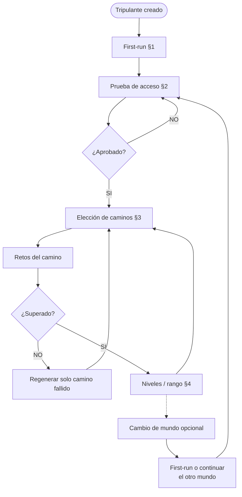
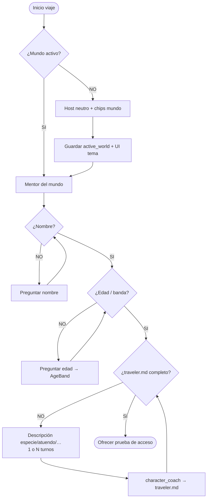
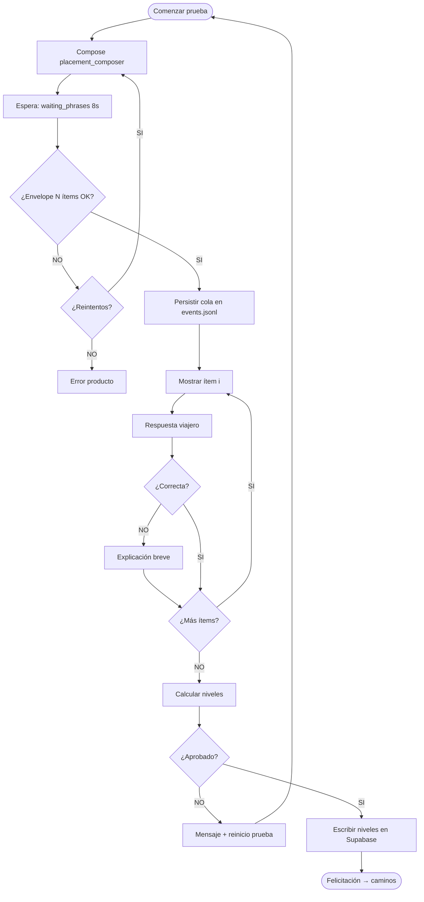
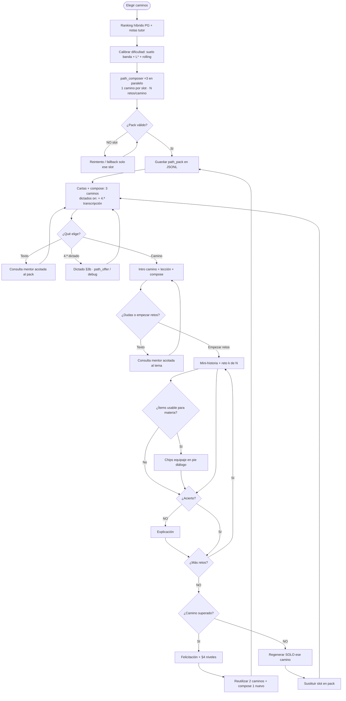
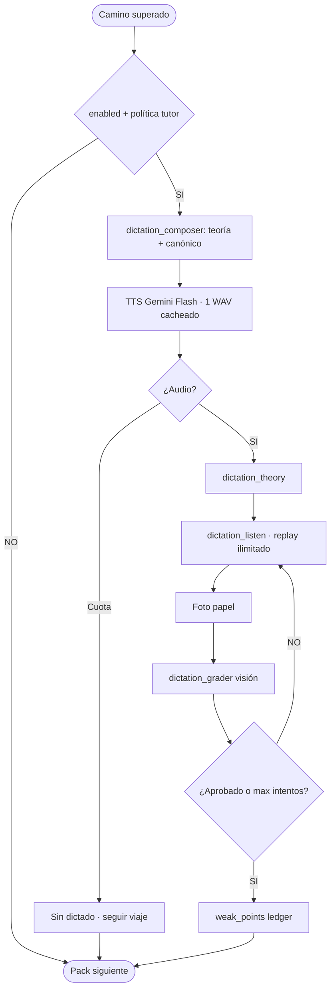
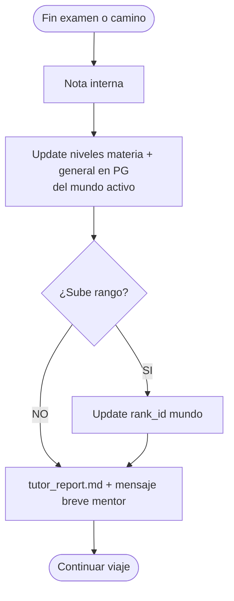
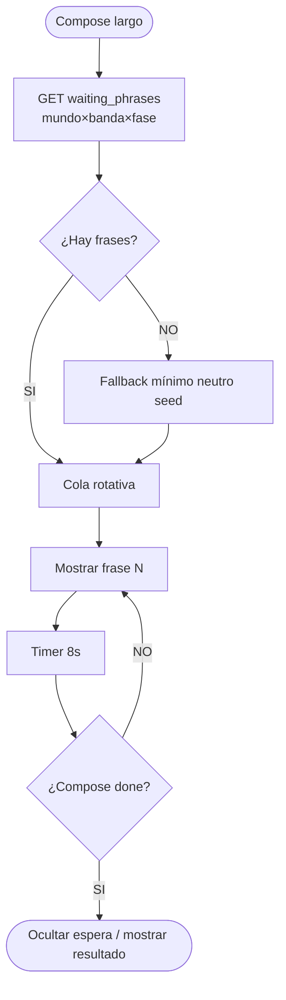

# 16 — Flujos de mecánicas de viaje (decisiones de producto)

**Specs:** [SPEC_APP_JOURNEY_MECHANICS.md](../specify/SPEC_APP_JOURNEY_MECHANICS.md), [SPEC_APP_WAITING_PHRASES.md](../specify/SPEC_APP_WAITING_PHRASES.md), [SPEC_APP_PLAY_FIRST_RUN.md](../specify/SPEC_APP_PLAY_FIRST_RUN.md), [SPEC_APP_PARALLEL_WORLDS.md](../specify/SPEC_APP_PARALLEL_WORLDS.md), [SPEC_DATA_STORAGE_LAYERS.md](../specify/SPEC_DATA_STORAGE_LAYERS.md), [SPEC_APP_PATH_CHALLENGE_COUNT.md](../specify/SPEC_APP_PATH_CHALLENGE_COUNT.md) *(implementada: N retos/camino)*, [SPEC_APP_DICTATION.md](../specify/SPEC_APP_DICTATION.md) *(propuesta: gate dictado)*

> Contratos detallados en la spec; aquí el **mapa de decisión** jugable.

## Vista global del viaje

## §1 First-run — decisiones

## §2 Prueba de acceso — decisiones

## §3 Caminos — decisiones

## §3b Dictado (propuesta — [SPEC_APP_DICTATION](../specify/SPEC_APP_DICTATION.md))

## §4 Niveles / rango — decisiones

## §5 Espera LLM — decisiones

## Persistencia en cada decisión clave

| Decisión | Escribe |
| --- | --- |
| Mundo / nombre / edad flags | Supabase `children` |
| Personaje | `traveler.md` |
| Cola examen / respuestas / path pack / dictados | `events.jsonl` (mundo) + WAV `/media/audio/` + fotos `/media/dictations/` (TTL) |
| Niveles oficiales | Supabase por mundo |
| Diálogo | `dialogue.jsonl` (mundo) |
