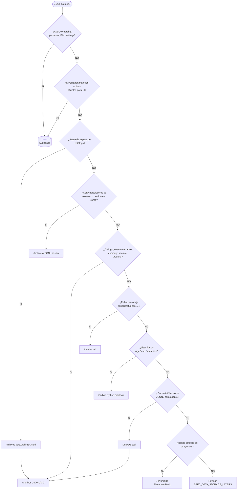
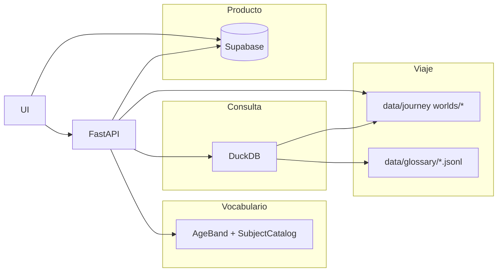

# 17 — Dónde guardar: árbol de decisión de almacenamiento

**Specs:** [SPEC_DATA_STORAGE_LAYERS.md](../specify/SPEC_DATA_STORAGE_LAYERS.md), [SPEC_AI_JOURNEY_FILE_LEDGER.md](../specify/SPEC_AI_JOURNEY_FILE_LEDGER.md), [SPEC_APP_PARALLEL_WORLDS.md](../specify/SPEC_APP_PARALLEL_WORLDS.md), [SPEC_APP_CANONICAL_VOCABULARY.md](../specify/SPEC_APP_CANONICAL_VOCABULARY.md)

> **Nota:** Parquet / `.duckdb` persistente / ETL → **aplazado** (SPEC_DATA_STORAGE_LAYERS D13).  
> Frases de espera: JSONL (no Postgres).
## Resumen visual de capas

## Anti-errores

- DuckDB no guarda cuentas ni es fuente de niveles oficiales.
- Examen/retos **no** van a `placement_exams` / `narrative_quests`.
- `child_traits` PG → no; usar `traveler.md`.
