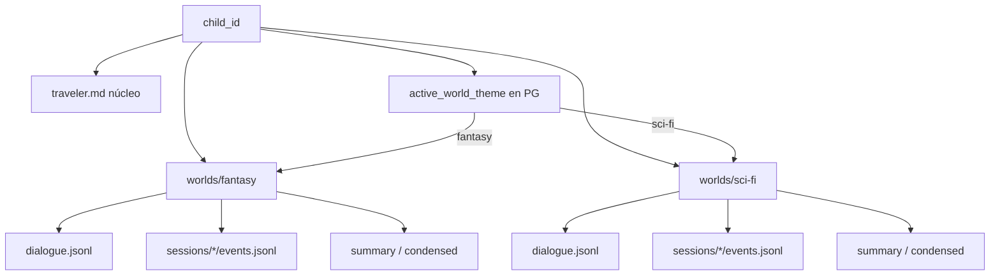
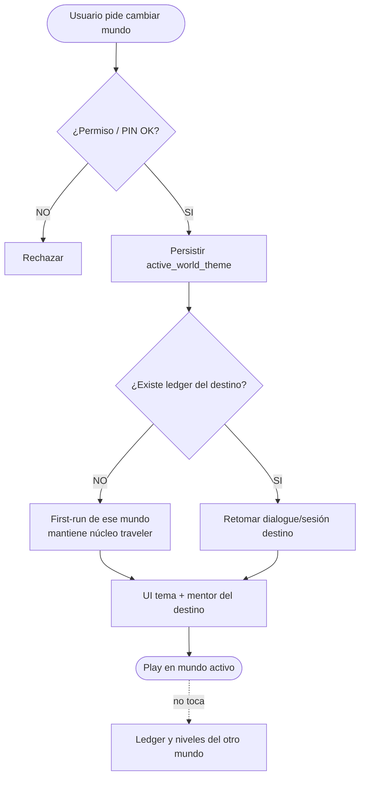
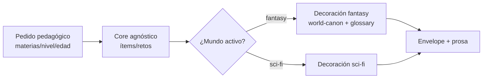

# 18 — Mundos en paralelo y cambio de tema

**Specs:** [SPEC_APP_PARALLEL_WORLDS.md](../specify/SPEC_APP_PARALLEL_WORLDS.md), [SPEC_AI_JOURNEY_FILE_LEDGER.md](../specify/SPEC_AI_JOURNEY_FILE_LEDGER.md), [SPEC_WORLD_LAYERS_PERSISTENCE.md](../specify/SPEC_WORLD_LAYERS_PERSISTENCE.md)

## Ledger por mundo

## Decisión: cambiar de mundo

## Generación agnóstica + decoración

## Anti-errores

- No mezclar turnos fantasy y sci-fi en el mismo `dialogue.jsonl`.
- Subir nivel en un mundo no muta `user_subject_levels` del otro.
