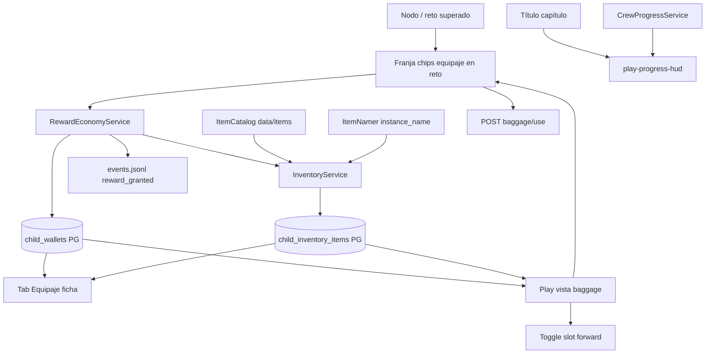

# 19 — Recompensas, moneda y equipaje

**Specs canónicas (propuesta ago 2026):** [SPEC_APP_REWARDS_ECONOMY.md](../specify/SPEC_APP_REWARDS_ECONOMY.md), [SPEC_APP_INVENTORY_BAGGAGE.md](../specify/SPEC_APP_INVENTORY_BAGGAGE.md), [SPEC_APP_ITEM_CATALOG.md](../specify/SPEC_APP_ITEM_CATALOG.md), [SPEC_APP_REWARD_EFFECTS.md](../specify/SPEC_APP_REWARD_EFFECTS.md), [SPEC_APP_REWARD_SPENDING.md](../specify/SPEC_APP_REWARD_SPENDING.md), [SPEC_APP_CREW_BAGGAGE_TAB.md](../specify/SPEC_APP_CREW_BAGGAGE_TAB.md), [SPEC_APP_PLAY_BAGGAGE_TOGGLE.md](../specify/SPEC_APP_PLAY_BAGGAGE_TOGGLE.md), [SPEC_APP_PLAY_PROGRESS_HUD.md](../specify/SPEC_APP_PLAY_PROGRESS_HUD.md)

## Capas

| Dato | Dónde |
| --- | --- |
| Saldo moneda | Supabase `child_wallets` |
| Posesión ítems | Supabase `child_inventory_items` |
| Definiciones | `data/items/*.json` + `ItemCatalog` |
| Narrativa grant | Ledger `reward_granted` |
| Gasto / tienda | Futuro — SPEC_APP_REWARD_SPENDING |

## Anti-errores

- No mezclar wallets fantasy ↔ sci-fi.
- LLM no inventa `item_def_id` ni cantidades; sí nombra la instancia (`instance_name`) o cae a `ItemNamer`.
- Un arquetipo puede ligarse a **varias** materias (`subject_ids[]`); usable si ∩ activas ≠ ∅.
- Placement no otorga economía en MVP.
- Slot derecha en play = toggle equipaje, no forward.
