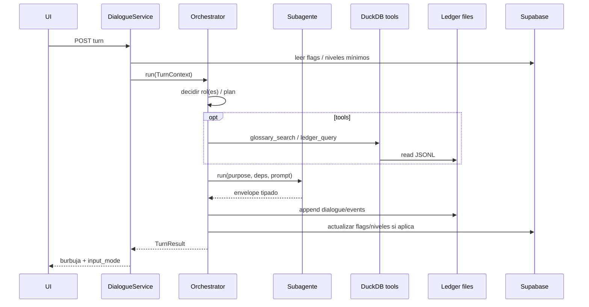

# Spec: Orquestador central de agentes (FastAPI)

> Estado: **aprobada** (ago 2026)  
> Relacionado: [SPEC_AI_PYDANTIC_AGENTS.md](SPEC_AI_PYDANTIC_AGENTS.md), [SPEC_AI_AGENT_SKILLS.md](SPEC_AI_AGENT_SKILLS.md), [SPEC_AI_GEMINI_GATEWAY.md](SPEC_AI_GEMINI_GATEWAY.md), [SPEC_APP_JOURNEY_MECHANICS.md](SPEC_APP_JOURNEY_MECHANICS.md), [SPEC_APP_WORLD_GLOSSARY.md](SPEC_APP_WORLD_GLOSSARY.md), [SPEC_DATA_STORAGE_LAYERS.md](SPEC_DATA_STORAGE_LAYERS.md)  
> **Diagrama:** [15-ai-orchestrator-agents.md](../diagrams/15-ai-orchestrator-agents.md)

## Contexto

Hasta ahora cada service FastAPI elegía un `purpose` e invocaba un agente ([SPEC_AI_PYDANTIC_AGENTS](SPEC_AI_PYDANTIC_AGENTS.md) A6). El producto pide un **agente orquestador central** que lance subagentes por rol, use tools (DuckDB/glosario/ledger) y devuelva envelopes listos para la UI.

## Objetivo

1. Un orquestador único por turno / compose de play.
2. Subagentes especializados (un modelo por rol vía gateway).
3. Definición de cada agente en `.md` con frontmatter cargable.
4. Tools: ledger, glosario DuckDB, lectura de estado PG mínimo.

---

## 1. Decisiones

| # | Decisión | Valor |
| --- | --- | --- |
| O1 | Patrón | **Orquestador central** + subagentes por rol |
| O2 | Framework | Pydantic AI (sin LangGraph/LangChain) |
| O3 | Definición de agente | Un `.md` por rol con YAML frontmatter + instrucciones |
| O4 | Skills | Capabilities / `backend/skills/`; el rol declara qué skills carga |
| O5 | Modelo | Cada rol cerrado a su lista Gemini (quality vs lite) |
| O6 | Cuotas agotadas | Error de producto estructurado (`AiProductError`); no inventar copy |
| O7 | Independencia de mundo | Instrucciones de rol **agnósticas**; tono mundo/edad vía skills + deps |
| O8 | Entrada play | `DialogueService` / compose → `Orchestrator.run(turn_context)` |

Sustituye A6 de [SPEC_AI_PYDANTIC_AGENTS](SPEC_AI_PYDANTIC_AGENTS.md): los services **no** llaman `run_purpose` sueltos salvo caminos de debug; pasan por el orquestador.

---

## 2. Layout

```
backend/app/ai/
  orchestrator/
    __init__.py
    orchestrator.py      # Orchestrator
    turn_context.py
    tools.py             # ledger + glossary_search + …
  agents/
    loader.py            # carga agents/*.md → AgentSpec
    registry.py
    envelopes.py
    runner.py            # run subagente
backend/agents/          # defs .md (o backend/app/ai/agents/defs/)
  orchestrator.md
  onboarding_host.md
  mentor_guide.md
  character_coach.md
  placement_composer.md
  path_composer.md
  challenge_writer.md
  journey_summarizer.md
  tutor_report.md
  …
backend/skills/
```

---

## 3. Frontmatter de agente (contrato)

```yaml
---
id: mentor_guide
role: mentor
purpose: mentor_guide
model_tier: quality   # quality | lite
skills:
  - mentor-voice
  - audience-language
  - safety-tone
  - world-canon
output: DialogueEnvelope
tools: []             # o [glossary_search, ledger_query]
---
Instrucciones del rol (agnósticas al mundo)…
```

El loader valida `id`, `purpose`, `output`, `model_tier`. Skills inexistentes → error de arranque en tests.

---

## 4. Flujo de un turno



---

## 5. Responsabilidades

| Componente | Hace | No hace |
| --- | --- | --- |
| Orchestrator | Planifica, llama subagentes/tools, valida envelopes, escribe ledger | Prosa larga propia salvo rol orquestador mínimo |
| Subagente | Cumple un rol + skills + output_type | Persistir por su cuenta; no saltarse envelope |
| DialogueService | Authz, cargar child, mapear HTTP ↔ TurnContext | Elegir modelo Gemini a mano |
| Gateway | Fallback de modelos por tier | Conocer mecánicas de juego |

---

## 6. Criterios de aceptación

1. Un turno de play feliz pasa por `Orchestrator.run`.
2. Al menos un subagente se carga desde `.md` con frontmatter.
3. Tool `glossary_search` disponible para roles que lo declaren.
4. Sin cuotas → `AiProductError` visible/reintentable según producto.
5. Actualizar [SPEC_AI_PYDANTIC_AGENTS](SPEC_AI_PYDANTIC_AGENTS.md) A6 al aprobar esta spec.

## Fuera de alcance

- UI del panel debug (sigue [SPEC_APP_DEBUG_MODE](SPEC_APP_DEBUG_MODE.md)).
- Implementación LangGraph.
