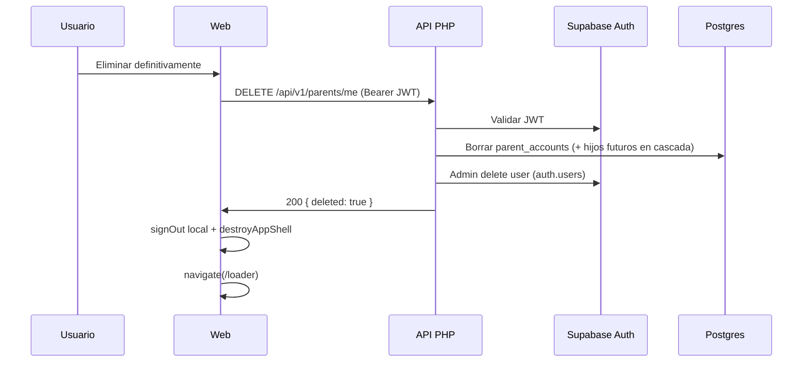

# Spec: Sección Cuenta (padre / madre / tutor)

> Estado: **aprobada** (julio 2026)  
> Relacionado: [SPEC_APP_SECTION_FRAME.md](SPEC_APP_SECTION_FRAME.md), [SPEC_APP_SHELL_CHROME.md](SPEC_APP_SHELL_CHROME.md), [SPEC_APP_AUTH.md](SPEC_APP_AUTH.md), [SPEC_APP_AUTH_GOOGLE_IMPLEMENTATION.md](SPEC_APP_AUTH_GOOGLE_IMPLEMENTATION.md), [SPEC_LEGAL_AUTHENTICATED_SESSION.md](SPEC_LEGAL_AUTHENTICATED_SESSION.md)

## Contexto

Hoy `#/account` es un **stub** (welcome placeholder). El login MVP es **solo Google**; existe `parent_accounts` y `POST /api/v1/parents/bootstrap`, pero no hay UI de gestión ni endpoints de lectura/actualización/borrado.

El padre/tutor necesita ver los datos de su cuenta, elegir un **nombre para mostrar (alias)** y, si lo desea, **eliminar la cuenta** con aviso claro de pérdida irreversible.

## Objetivo

Definir la sección **Cuenta** autenticada:

1. Layout según [SPEC_APP_SECTION_FRAME.md](SPEC_APP_SECTION_FRAME.md) (bandas compactas + marco glass).
2. Datos de la cuenta vinculada a Google.
3. Edición y persistencia del alias / nombre para mostrar.
4. Flujo de eliminación con confirmación (sin undo).

**No se implementa código de producto hasta aprobación explícita.**

---

## Alcance

### Incluido

| Requisito | Detalle |
| --- | --- |
| Ruta | `#/account` (ya registrada; deja de ser stub) |
| Guard | Sin sesión → `#/loader` (igual que home/account stub) |
| Shell | Montado; FAB cuenta / ítem drawer «Cuenta» navegan aquí |
| Marco | `mountSectionFrame` + contenido de cuenta |
| Datos cuenta | Email, proveedor Google, avatar (si hay), alias editable |
| Guardar alias | Persistencia en `parent_accounts.display_name` vía API |
| Eliminar cuenta | Confirmación modal + borrado servidor + fin de sesión → loader |
| Tema UI | Tipografía/iconos según `uiTheme` sticky |

### Excluido

| Tema | Notas |
| --- | --- |
| Email/contraseña u otros OAuth | Fuera de MVP ([SPEC_APP_AUTH.md](SPEC_APP_AUTH.md)) |
| Desvincular Google sin borrar cuenta | No en esta fase |
| Perfiles de niño / tripulación | Ver [SPEC_APP_CREW_SECTION.md](SPEC_APP_CREW_SECTION.md); el modal de borrado de cuenta debe mencionar pérdida de tripulación y progreso |
| Cambio de email | El email lo aporta Google; solo lectura |
| Avatar upload propio | Solo mostrar avatar del proveedor si existe |
| Cerrar sesión | Sigue en el drawer (`signOut`); no duplicar CTA primario en cuenta |

---

## Principios UX

| Principio | Decisión |
| --- | --- |
| Cuenta = adulto | Copy «Cuenta de padre, madre o tutor» |
| Google = identidad | Proveedor visible; no simular otros métodos |
| Alias opcional | Si vacío, fallback amable (nombre Google o parte local del email) |
| Borrado consciente | Doble paso: aviso explícito + Continuar / Cancelar; sin undo |
| Errores humanos | Mensajes en español; sin códigos técnicos |
| Touch ≥ 48 px | Botones y campos |

---

## 1. Anatomía de la sección

Dentro del marco glass ([SPEC_APP_SECTION_FRAME.md](SPEC_APP_SECTION_FRAME.md)):

```
┌─────────────────────────────────┐
│         [ logo K pequeño ]      │
│─────────────────────────────────│
│  Cuenta de padre, madre o tutor │  ← subtítulo
│                                 │
│  ┌─ Avatar (opcional) ────────┐ │
│  │  (foto Google o inicial)   │ │
│  └────────────────────────────┘ │
│                                 │
│  Nombre para mostrar            │
│  [______________] [💾 Guardar]  │  ← misma fila; wrap en estrecho
│                                 │
│  Nombre en Google               │
│  Eduardo Serna                  │  ← solo lectura (metadata Google)
│                                 │
│  Correo                         │
│  padre@ejemplo.com              │  ← solo lectura
│                                 │
│  Inicio de sesión               │
│  Google                         │  ← solo lectura + icono
│                                 │
│  ─────────────────────────────  │
│  Zona peligrosa                 │
│  [ Eliminar cuenta ]            │  ← destructivo
└─────────────────────────────────┘
```

Orden vertical fijo (una sola columna). Scroll interno del marco si no cabe en 390×844.

---

## 2. Datos mostrados

### 2.1 Fuente de verdad

| Campo UI | Origen preferente | Fallback |
| --- | --- | --- |
| Email | `parent_accounts.email` vía API; si no, `session.user.email` | «—» + error suave de carga |
| **Nombre en Google** | `user_metadata.full_name` o `name` de la sesión Supabase | «—» si no hay metadata |
| Nombre para mostrar (alias) | `parent_accounts.display_name` | Vacío en input; saludo usa fallback |
| Avatar | `parent_accounts.avatar_url` o `user_metadata.avatar_url` / `picture` | Inicial del alias/email en círculo glass |
| Proveedor | Fijo MVP: **Google** | — |
| `parent_id` | API (uso interno; no mostrar UUID al usuario) | — |

### 2.2 Carga

1. Guard de sesión.
2. Asegurar bootstrap lazy si aún no hay fila (`bootstrapParentIfNeeded`) — no bloquear UI más de lo necesario.
3. `GET /api/v1/parents/me` → pintar formulario.
4. Mientras carga: skeleton o placeholders dentro del marco (estilo acorde a legal skeleton / glass), no pantalla en blanco.

### 2.3 Estado vacío / error

| Condición | UI |
| --- | --- |
| Red / 503 | Mensaje «No hemos podido cargar tu cuenta. Inténtalo de nuevo.» + botón Reintentar |
| 401 | `signOut` + `#/loader` |
| Sin email en sesión | Mensaje genérico; no inventar datos |

---

## 3. Nombre para mostrar (alias)

### 3.1 Comportamiento

| Regla | Valor |
| --- | --- |
| Label | «Nombre para mostrar» |
| Helper (opcional) | «Así te saludaremos en la app. Puedes usar un alias.» |
| Longitud | 1–40 caracteres tras trim; vacío permitido (vuelve a fallback de saludo) |
| Caracteres | Letras Unicode, números, espacios, guion `-`, apóstrofo `'`; sin URLs ni `@` de handle libre (evitar confusión con email) |
| Guardado | Botón «Guardar» **a la derecha del input** en la misma fila (`flex` + `wrap`); icono `save` del generador |
| Éxito | Toast/texto inline «Guardado» ~2 s |
| Error validación | Inline bajo el campo |
| Error red | «No hemos podido guardar. Inténtalo de nuevo.» |

### 3.2 Efectos

- Tras guardar OK, home welcome / saludos que usen display name deben leer el valor actualizado en la siguiente visita a home (misma sesión: cache en memoria o re-fetch).
- No cambia el email de Google ni el `auth.users` metadata de forma obligatoria (solo `parent_accounts.display_name`).

### 3.3 API

`PATCH /api/v1/parents/me`

**Auth:** `Authorization: Bearer <access_token>`

**Body:**

```json
{ "display_name": "Ada" }
```

`display_name: null` o `""` → guardar `NULL` en BD (usar fallback en UI).

**Response 200:**

```json
{
  "parent_id": "uuid",
  "auth_user_id": "uuid",
  "email": "padre@ejemplo.com",
  "display_name": "Ada",
  "avatar_url": "https://…",
  "provider": "google"
}
```

**Errores:** 401 / 422 (validación) / 503 / 500 — mismos criterios que bootstrap.

---

## 4. Eliminar cuenta

### 4.1 Entrada

- Botón «Eliminar cuenta» en zona peligrosa: **mismo estilo glass** que «Guardar» + icono `danger` rojo (sci-fi/fantasy) — ver [SPEC_APP_SECTION_FRAME.md](SPEC_APP_SECTION_FRAME.md) §2.6b.
- Tap → abre **modal de confirmación** (no navega aún).

### 4.2 Modal de confirmación

| Elemento | Contenido |
| --- | --- |
| Título | «¿Eliminar tu cuenta?» |
| Cuerpo | Lista de consecuencias (§4.3) |
| Aviso undo | «Esta acción no se puede deshacer.» |
| Primario destructivo | «Eliminar definitivamente» |
| Secundario | «Cancelar» (cierra modal; sin efecto) |
| Accesibilidad | `role="dialog"`, `aria-modal="true"`, foco inicial en Cancelar (evitar borrado accidental), Escape = cancelar |
| z-index | Por encima del shell |

### 4.3 Qué se pierde (copy ES — aprobado a confirmar)

Texto base del cuerpo (MVP actual + futuro cercano):

> Si continúas, se eliminará de forma permanente:
>
> - Tu cuenta de padre, madre o tutor en KidepiK  
> - El enlace con tu cuenta de Google en esta app  
> - Tu nombre para mostrar y preferencias de la cuenta  
> - Los perfiles de niños/as y su progreso, cuando existan en tu familia  
>
> No podrás recuperar estos datos. Tendrás que volver a registrarte con Google si quieres usar KidepiK otra vez.

Notas:

- Aunque aún no existan perfiles de niño en producto, el aviso **debe** mencionarlos para no sorprender cuando existan.
- No listar secretos técnicos (UUIDs, tablas).

### 4.4 Flujo técnico tras confirmar



| Paso | Detalle |
| --- | --- |
| 1 | Deshabilitar botones del modal; spinner en CTA destructivo |
| 2 | `DELETE /api/v1/parents/me` |
| 3 | Éxito: limpiar sesión cliente (`signOut`), desmontar shell, `#/loader` |
| 4 | Error: mensaje en modal «No hemos podido eliminar la cuenta…»; re-habilitar botones |

**Idempotencia:** si la fila ya no existe pero el JWT es válido, intentar borrar usuario Auth igual y devolver 200.

**Cascada futura:** FK `ON DELETE CASCADE` desde `parent_accounts` a tablas de niños cuando existan; documentar en migración.

### 4.5 API

`DELETE /api/v1/parents/me`

**Auth:** Bearer JWT del propio usuario.

**Response 200:**

```json
{ "deleted": true }
```

**Errores:** 401 / 503 / 500.

**Seguridad:**

- Solo el `sub` del JWT; nunca borrar por email libre en body.
- `service_role` / Admin API **solo en servidor** (PHP); nunca en `web/`.
- Tras borrado, tokens cliente quedan inválidos; `signOut` limpia storage local.

### 4.6 Lectura de cuenta

`GET /api/v1/parents/me`

**Response 200:** mismo DTO que el PATCH (§3.3). Si no hay fila, el handler puede invocar bootstrap interno o devolver 404 → cliente llama bootstrap y reintenta una vez.

---

## 5. Modelo de datos

Tabla existente `parent_accounts` (migración `20260725180000_create_parent_accounts.sql`):

| Columna | Uso en esta spec |
| --- | --- |
| `id` | `parent_id` |
| `auth_user_id` | Vínculo Auth |
| `email` | Solo lectura UI |
| `display_name` | Alias editable |
| `avatar_url` | Solo lectura UI |
| `created_at` / `updated_at` | `updated_at` al PATCH |

Sin columnas nuevas obligatorias en MVP de cuenta. Reserva futura (no bloquear):

```
parent_accounts.settings jsonb  -- p.ej. { "ui_theme": "fantasy" }
```

El tema UI sticky sigue en `localStorage` hasta spec de sync; la sección Cuenta **consume** el tema, no lo edita (el toggle del shell permanece la única entrada).

---

## 6. Copy (español de España)

| ID | Texto |
| --- | --- |
| `account.subtitle` | Cuenta de padre, madre o tutor |
| `account.displayName.label` | Nombre para mostrar |
| `account.displayName.helper` | Así te saludaremos en la app. Puedes usar un alias. |
| `account.displayName.save` | Guardar |
| `account.displayName.saved` | Guardado |
| `account.displayName.error.length` | Usa entre 1 y 40 caracteres, o déjalo vacío. |
| `account.email.label` | Correo |
| `account.provider.label` | Inicio de sesión |
| `account.provider.google` | Google |
| `account.delete.cta` | Eliminar cuenta |
| `account.delete.title` | ¿Eliminar tu cuenta? |
| `account.delete.noUndo` | Esta acción no se puede deshacer. |
| `account.delete.confirm` | Eliminar definitivamente |
| `account.delete.cancel` | Cancelar |
| `account.load.error` | No hemos podido cargar tu cuenta. Inténtalo de nuevo. |
| `account.save.error` | No hemos podido guardar. Inténtalo de nuevo. |
| `account.delete.error` | No hemos podido eliminar la cuenta. Inténtalo de nuevo. |
| `account.retry` | Reintentar |

Cuerpo del modal: §4.3.

---

## 7. Estilos e interacción

| Elemento | Spec |
| --- | --- |
| Labels | Display font según `uiTheme`; color blanco / alto contraste sobre glass |
| Inputs | Fondo `rgba(255,255,255,0.10)`, borde `1px solid rgba(255,255,255,0.28)`, texto blanco, min-height 48 px, radius ~12 px |
| Botón Guardar | Primario glass o sólido claro coherente con CTA auth; min-height 48 |
| Botón Eliminar | Texto/borde de peligro (p. ej. tono coral/rojo suave sobre glass; no flat Material genérico) |
| Avatar | Círculo ~64 px; si imagen, `object-fit: cover`; si no, inicial |
| Separador zona peligrosa | Línea `rgba(255,255,255,0.12)` + margen vertical generoso |

Motion: aparición del modal fade+scale corto ≤ 200 ms; reduced-motion = instantáneo.

---

## 8. Módulos previstos

| Fichero | Responsabilidad |
| --- | --- |
| `web/js/scenes/account.js` | Escena real (sustituye stub) |
| `web/js/components/account-panel.js` | Formulario + modal dentro del frame |
| `web/js/lib/parent-account.js` | Extender: `fetchParentMe`, `updateParentDisplayName`, `deleteParentAccount` |
| `web/css/scenes/account.css` | Estilos del panel (frame en `section-frame.css`) |
| `api/src/Controllers/ParentsController.php` | `me`, `updateMe`, `deleteMe` |
| `api/src/Services/ParentAccountService.php` | get / update display_name / delete + Auth admin |
| `api/src/Router.php` | Rutas GET/PATCH/DELETE `/api/v1/parents/me` |
| `api/tests/ParentsMeTest.php` (o similar) | PHPUnit contratos |
| `web/tests/parent-account.test.js` | Helpers cliente (mock fetch) |

---

## 9. Criterios de aceptación

1. Con sesión, FAB cuenta o menú «Cuenta» → `#/account` con bandas compactas + marco glass + logo pequeño.
2. Se muestran email y «Google» como proveedor; avatar o inicial.
3. El campo «Nombre para mostrar» refleja `display_name` (o fallback); Guardar persiste y muestra confirmación.
4. Validación de longitud/caracteres impide guardar basura.
5. «Eliminar cuenta» abre modal con lista de pérdidas, aviso de no-undo, Continuar y Cancelar.
6. Cancelar cierra el modal y deja la cuenta intacta.
7. Confirmar elimina en servidor, cierra sesión y vuelve al loader; un nuevo login crea cuenta fresca (bootstrap).
8. Sin sesión, `#/account` redirige a loader.
9. Toggle sci-fi/fantasía cambia tipografía del panel al instante.
10. Playwright 390×844: flujo feliz (cargar + editar alias mock/API) + borde (abrir modal y cancelar); capturas en `tmp/playwright-output/account-*.png`.

---

## 10. Tests

| Capa | Casos |
| --- | --- |
| PHPUnit | GET me 200/401; PATCH display_name OK/422; DELETE 200 y cascada; JWT ajeno no aplica |
| Web unit | Helpers parent-account parsean DTO; validación alias |
| Playwright | Ver §9; no usar secretos reales en informe |

---

## 11. Relación con specs existentes

| Spec | Relación |
| --- | --- |
| SPEC_APP_SECTION_FRAME | Layout obligatorio de esta sección |
| SPEC_APP_SHELL_CHROME | Entradas de navegación (FAB + drawer); stub → sección real |
| SPEC_APP_AUTH / GOOGLE_IMPLEMENTATION | Identidad Google; bootstrap; `parent_accounts` |
| SPEC_LEGAL_AUTHENTICATED_SESSION | Misma familia de rutas shell; bandas compactas compartidas |

---

## 12. Decisiones a confirmar en aprobación

- [ ] Copy del modal §4.3 (incluir mención a perfiles infantiles futuros)
- [ ] Alias: guardado explícito con «Guardar» (no autosave)
- [ ] Longitud alias 1–40 o vacío
- [ ] DELETE vía API PHP + Admin Auth (no solo `signOut`)
- [ ] No duplicar «Cerrar sesión» como CTA principal en la sección

## Aprobación

- [x] Usuario aprueba anatomía y datos mostrados
- [x] Usuario aprueba edición de nombre para mostrar + contratos API
- [x] Usuario aprueba flujo de eliminación (modal, copy, sin undo)
- [x] Usuario aprueba dependencia de SPEC_APP_SECTION_FRAME

Siguiente tras aprobación conjunta con el marco de sección: Plan → Task → Implement (TDD API + UI) → Validate Playwright.
