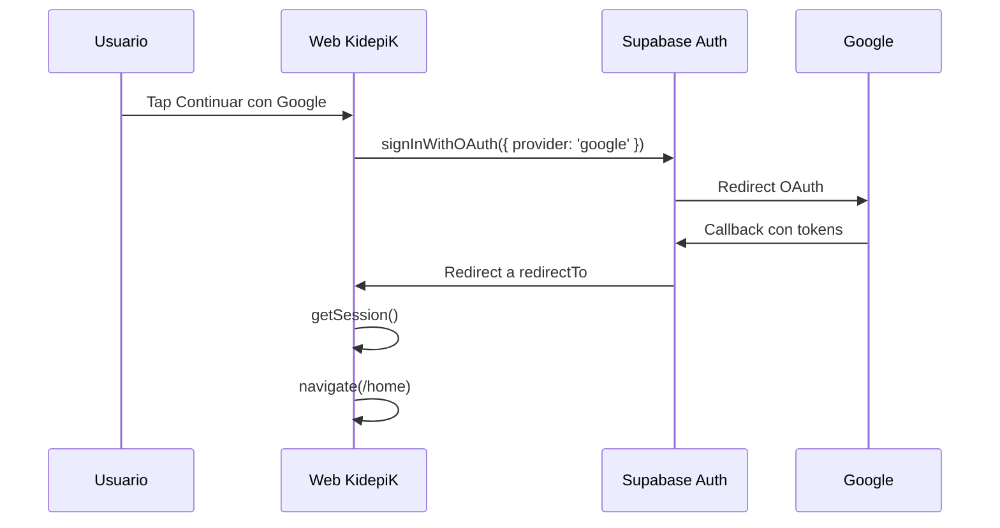

# Spec: Autenticación de cuenta padre/tutor (Supabase Auth)

> Estado: **aprobada** (julio 2026)  
> Relacionado: [SPEC_LOADER_APP_GATE.md](SPEC_LOADER_APP_GATE.md), [SPEC_WEB_FRONTEND_ARCHITECTURE.md](SPEC_WEB_FRONTEND_ARCHITECTURE.md), [SPEC_FASTAPI_BACKEND_MIGRATION.md](SPEC_FASTAPI_BACKEND_MIGRATION.md), [docs/kidepik.md](../../docs/kidepik.md) §9–10.8

## Contexto

KidepiK es una app educativa para niños **7–9 años** con cuenta gestionada por un **padre, madre o tutor** (`parent_accounts` en el modelo de datos). La autenticación identifica al adulto responsable; el perfil del niño se crea **después** en onboarding (fuera de esta spec).

El stack acordado usa **Supabase Auth** (JWT) con validación en API PHP (`SupabaseAuthService`).

## Objetivo

Definir la pantalla y el flujo de **registro e inicio de sesión con Google** que aparece tras el morph del loader ([SPEC_LOADER_APP_GATE.md](SPEC_LOADER_APP_GATE.md)), persistencia de sesión y criterios legales mínimos para menores.

## Decisión de producto — proveedores (cerrada)

### MVP (fase 1) — aprobado

| Método | ¿Incluir? |
| --- | --- |
| **Google** | **Sí — único proveedor en MVP** |

Registro e inicio de sesión son el **mismo flujo**: el primer acceso con Google crea la cuenta padre en Supabase; accesos posteriores reutilizan la sesión.

### Fases posteriores (fuera de MVP)

| Método | Cuándo |
| --- | --- |
| **Email + contraseña** | Fase 1.1 si hay demanda de padres sin Google |
| **Apple** | Obligatorio antes de publicar en App Store (Capacitor iOS) |
| **Magic link** | Opcional junto con email |
| Facebook, Microsoft, SMS | No previstos |
| **Cuenta de tripulante (Google)** | **Sí — propuesta** [SPEC_APP_CREW_MEMBER_ACCOUNT.md](SPEC_APP_CREW_MEMBER_ACCOUNT.md): el tutor asigna un Gmail distinto; ese login **no** crea `parent_accounts` |

## Principios UX

| Principio | Decisión |
| --- | --- |
| Una pantalla | Un solo CTA OAuth; sin rutas separadas registro/login |
| Google único | Botón primario «Continuar con Google» (brand guidelines Google) |
| Legal visible | Texto «Al continuar aceptas…» con enlaces (placeholders hasta legal) |
| Errores humanos | Mensajes en español, sin códigos técnicos |
| Menores | Copy del panel auth genérico (tutor y tripulante comparten CTA). Cuenta tutor: «Cuenta de padre, madre o tutor» en `#/account`. Tripulante: [SPEC_APP_CREW_MEMBER_ACCOUNT.md](SPEC_APP_CREW_MEMBER_ACCOUNT.md) |

## Composición visual (estado `auth-idle`)

Continúa el layout del morph del loader (logo + eslogan recto arriba). Bloque auth centrado en tercio inferior seguro (`safe-area-inset-bottom`).

```
┌─────────────────────────────┐
│      [Logo KidepiK]         │
│      Dos mundos.            │
│      Un viaje épico.        │
│                             │
│  Cuenta de padre o tutor    │  ← Nunito 14px, opacity 0.85
│                             │
│  ┌───────────────────────┐  │
│  │ G  Continuar con Google│  │  ← único CTA, min-height 48px
│  └───────────────────────┘  │
│                             │
│  Al continuar aceptas los   │
│  Términos y la Privacidad   │
└─────────────────────────────┘
```

## Flujos

### Flujo A — Google OAuth (único en MVP)



| Requisito | Valor |
| --- | --- |
| `redirectTo` | `{origin}/#/auth/callback` (hash router compatible) |
| PKCE | Activado (default Supabase JS v2) |
| Primera vez | Supabase crea usuario; backend creará `parent_accounts` en onboarding/API (fase posterior) |
| Loading | Botón Google deshabilitado + spinner mientras redirige |

### Flujo B — Sesión existente (desde loader gate)

Si el loader detecta sesión válida, **no muestra** esta pantalla; va directo a `#/home` (SPEC_LOADER_APP_GATE).

### Flujo C — Cierre de sesión (dev)

`signOut()` + `navigate("/loader")` — implementado en home como **«Cerrar sesión (temporal)»**. Tras cerrar sesión, el siguiente login con Google dispara de nuevo OAuth y Google puede enviar un correo de notificación de datos compartidos; es **comportamiento esperado**. Detalle: [GOOGLE_OAUTH_LOCAL_SETUP.md](../operations/GOOGLE_OAUTH_LOCAL_SETUP.md) § Correos de Google y re-login.

## Post-auth routing (cerrado)

| Condición | Destino |
| --- | --- |
| Sesión OK, `role=tutor` | `#/home` |
| Sesión OK, `role=crew` | `#/member` — [SPEC_APP_CREW_MEMBER_ACCOUNT.md](SPEC_APP_CREW_MEMBER_ACCOUNT.md) |
| Onboarding (futuro) | `#/onboarding` cuando exista spec de alta de niño + selector de mundo |

## Contratos técnicos

### Cliente (`web/js/lib/supabase.js`)

```javascript
// Superficie MVP
export function getSupabaseClient()
export async function getValidSession()  // null si expirada
export async function signInWithGoogle()
export async function signOut()
export function onAuthStateChange(callback)
```

- Dependencia: `@supabase/supabase-js` (CDN o `web/package.json`).
- Config: `config.supabaseUrl`, `config.supabaseAnonKey` ([config.sample.js](../../web/js/config.sample.js)).

### Supabase proyecto (local / prod)

| Setting | Valor |
| --- | --- |
| Site URL | `http://localhost:8082` (dev), dominio DreamHost (prod) |
| Redirect URLs | `{origin}/**`, hash callback incluido |
| Google provider | Client ID/Secret en dashboard Supabase (no en git) |

### API PHP (fase posterior a UI)

| Endpoint | Uso |
| --- | --- |
| `POST /api/v1/parents/bootstrap` | Tras primer login, crear fila `parent_accounts` si no existe |
| Cabecera `Authorization: Bearer <jwt>` | Rutas protegidas |

No bloquea la UI de auth; la UI navega a `#/home` con JWT en cliente hasta exista el endpoint.

## Seguridad y cumplimiento

| Tema | Requisito MVP |
| --- | --- |
| Tokens | Solo `anon` key en cliente; nunca `service_role` |
| Almacenamiento | `localStorage` Supabase (default) |
| Menores | Mismo CTA Google; el rol (tutor vs crew) se decide en bootstrap. Ver [SPEC_APP_CREW_MEMBER_ACCOUNT.md](SPEC_APP_CREW_MEMBER_ACCOUNT.md) |
| RGPD | Texto «Al continuar aceptas…» con enlaces placeholder |
| COPPA / LOPDGDD | Cuenta del tutor verificada vía Google antes de crear perfil menor; el Gmail del tripulante lo asigna el tutor (consentimiento del responsable) |

## Copy (español)

| ID | Texto |
| --- | --- |
| `auth.subtitle` | Entra con Google |
| `auth.subtitle.helper` | Tutores y tripulantes usan el mismo botón. Si tu tutor te asignó un Gmail, entra con ese correo. |
| `auth.google` | Continuar con Google |
| `auth.legal` | Al continuar, aceptas los [Términos] y la [Política de privacidad]. |
| `auth.error.generic` | No hemos podido iniciar sesión. Inténtalo de nuevo. |
| `auth.error.offline` | Necesitas conexión para continuar con Google. |

## Estilos

- Tokens [SPEC_APP_VISUAL_DESIGN_V3.md](SPEC_APP_VISUAL_DESIGN_V3.md): Nunito cuerpo, botón ≥ 48 px alto.
- Botón Google: fondo blanco, borde sutil, logo G oficial (SVG inline o asset).

## Criterios de aceptación

1. Tras morph del loader, CTA Google visible y accesible en 390×844.
2. Google OAuth completa login en Supabase local con proyecto configurado.
3. Tras login exitoso → `#/home` (placeholder) sin errores consola.
4. Error OAuth u offline muestra mensaje en español sin romper layout.
5. `signOut` (manual en dev) vuelve a mostrar auth al pasar por loader; re-login con Google puede generar correo de notificación de Google (esperado).
6. Playwright: captura `tmp/playwright-output/auth-google-cta.png`.

## Fuera de alcance (MVP)

- Email, contraseña, magic link.
- Apple y otros OAuth.
- Alta de perfil del niño, selector de mundo, examen de acceso.
- Panel familiar, gestión multi-hijo.
- Textos legales definitivos.

## Implementación prevista

| Fichero | Cambio |
| --- | --- |
| `web/js/lib/supabase.js` | Cliente y helpers Google |
| `web/js/components/auth-panel.js` | CTA Google + legal (montado desde gate / chrome) |
| `web/js/components/loader-gate.js` / `loader-auth-morph.js` | Entrada a auth embebido |
| `web/js/scenes/auth-callback.js` | Callback OAuth → home o loader |
| `web/js/scenes/home.js` | Placeholder post-login |
| `web/js/main.js` | Rutas `auth/callback`, `home`; `#/auth` → loader |
| `web/css/scenes/loader.css` | Estilos `.auth-panel*` |
| `web/css/scenes/auth.css` | Callback + home |
| `web/package.json` | `@supabase/supabase-js` |
| `supabase/config.toml` | Redirect URLs + Google provider |

## Aprobación

- [x] Usuario aprueba MVP: **Google solamente**.
- [x] Usuario aprueba destino post-login placeholder `#/home` hasta onboarding.
- [x] Morph auth **in-place** en `#/loader` (ver SPEC_LOADER_APP_GATE).
