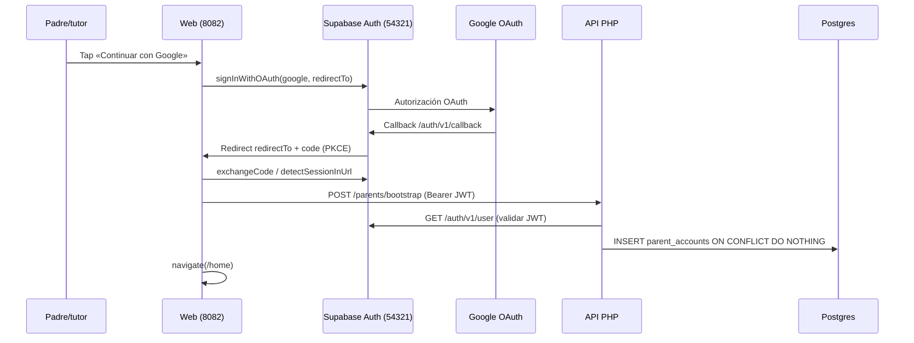

# Spec de implementación: Registro / login con Google + Supabase Auth

> Estado: **aprobada e implementada** (julio 2026)  
> Spec de producto padre: [SPEC_APP_AUTH.md](SPEC_APP_AUTH.md) (**aprobada**)  
> Relacionado: [SPEC_LOADER_APP_GATE.md](SPEC_LOADER_APP_GATE.md), [SPEC_FASTAPI_BACKEND_MIGRATION.md](SPEC_FASTAPI_BACKEND_MIGRATION.md), [SPEC_POC_DOCKER_LOCAL_DEV.md](SPEC_POC_DOCKER_LOCAL_DEV.md), [SPEC_HOSTING_FREE_TIER_STACK.md](SPEC_HOSTING_FREE_TIER_STACK.md), [docs/kidepik.md](../../docs/kidepik.md) §9

## Propósito

Este documento es la **guía de implementación** (infra, cliente, API, BD, tests y validación) del flujo **«Continuar con Google»** descrito en [SPEC_APP_AUTH.md](SPEC_APP_AUTH.md). No sustituye la spec de producto: la concreta en pasos ejecutables, contratos HTTP/SQL y criterios verificables.

**Registro = login en MVP:** el primer acceso con Google crea el usuario en `auth.users` (Supabase); accesos posteriores reutilizan la sesión.

**Delta (propuesta):** el bootstrap **no** crea siempre `parent_accounts`. Si el email canónico coincide con `children.invite_email_canonical`, la sesión es `role=crew`. Ver [SPEC_APP_CREW_MEMBER_ACCOUNT.md](SPEC_APP_CREW_MEMBER_ACCOUNT.md).

---

## Alcance por fases

| Fase | Contenido | Bloquea UI |
| --- | --- | --- |
| **A — OAuth cliente** | Config Google + Supabase, CTA, callback PKCE, sesión, `#/home` placeholder | Sí (flujo feliz) |
| **B — Bootstrap padre** | Tabla `parent_accounts`, `POST /api/v1/parents/bootstrap`, llamada desde callback | No (home funciona sin fila PHP) |
| **C — Endurecimiento** | Tests PHPUnit/Playwright, errores mapeados, prod DreamHost | No |

**Esta spec cubre A + B + C.** Onboarding del niño, Apple OAuth y email/contraseña quedan fuera ([SPEC_APP_AUTH.md](SPEC_APP_AUTH.md) § Fuera de alcance).

---

## Estado actual del código (gap analysis)

| Área | Estado | Gap |
| --- | --- | --- |
| `web/js/lib/supabase.js` | Implementado (MVP) | Falta `exchangeCodeForSession` explícito si `?code=` cae fuera del hash; falta init `onAuthStateChange` global |
| `web/js/components/auth-panel.js` | Implementado | OK según spec producto |
| `web/js/scenes/auth-callback.js` | Implementado (básico) | Sin reintento ni bootstrap API |
| `web/js/components/loader-gate.js` | Implementado | OK |
| `web/js/scenes/home.js` | Placeholder | Sin llamada bootstrap; sin comprobar `parent_accounts` |
| `supabase/config.toml` | Parcial | **Falta** bloque `[auth.external.google]` |
| Google Cloud OAuth | Plantilla en `.secrets.sample/` | Credenciales reales en `.secrets/` (gitignored) |
| `parent_accounts` | **No existe** migración | Crear en Fase B |
| `POST /api/v1/parents/bootstrap` | **No existe** | Crear en Fase B |
| Tests auth | **No existen** | Crear en Fase C |

---

## Arquitectura del flujo



### URLs canónicas

| Entorno | App (`redirectTo`) | Callback Supabase (Google Console) |
| --- | --- | --- |
| Local | `http://localhost:8082/#/auth/callback` | `http://localhost:54321/auth/v1/callback` |
| Prod | `https://{dominio}/#/auth/callback` | `https://{project-ref}.supabase.co/auth/v1/callback` |

> **Importante:** en Google Cloud Console el **Authorized redirect URI** es siempre el de **Supabase**, no el de la app. La app solo aparece en `redirectTo` y en la allow list de Supabase.

---

## Fase A — Infraestructura y OAuth cliente

### A.1 Google Cloud Console

1. Proyecto GCP (p. ej. `kidepik`) con **OAuth consent screen** en modo *Testing* o *Production*.
2. Crear credencial **OAuth 2.0 Client ID** tipo **Web application**.
3. **Authorized JavaScript origins:**
   - `http://localhost:8082`
   - `https://{dominio-prod}` (cuando exista)
4. **Authorized redirect URIs:**
   - `http://localhost:54321/auth/v1/callback` (dev local)
   - `https://{project-ref}.supabase.co/auth/v1/callback` (prod)
5. Guardar `client_id` y `client_secret` en `kidepik/.secrets/gcp-oauth.env` (plantilla: [.secrets.sample/gcp-oauth.env.sample](../../.secrets.sample/gcp-oauth.env.sample)).

| Variable | Uso |
| --- | --- |
| `GCP_OAUTH_CLIENT_ID` | `client_id` en Supabase |
| `GCP_OAUTH_CLIENT_SECRET` | `secret` en Supabase (nunca en cliente web) |

### A.2 Supabase — configuración local

#### `supabase/config.toml` (añadir)

```toml
[auth.external.google]
enabled = true
client_id = "env(GOOGLE_CLIENT_ID)"
secret = "env(GOOGLE_CLIENT_SECRET)"
skip_nonce_check = false
```

#### Variables para `supabase start`

Crear `supabase/.env` (gitignored) o exportar en shell antes de `supabase start`:

```env
GOOGLE_CLIENT_ID=<desde gcp-oauth.env>
GOOGLE_CLIENT_SECRET=<desde gcp-oauth.env>
```

#### Redirect URLs (ya parcialmente en config)

Verificar en `[auth]`:

| Clave | Valor requerido |
| --- | --- |
| `site_url` | `http://localhost:8082` |
| `additional_redirect_urls` | Incluir `http://localhost:8082/#/auth/callback`, variantes `127.0.0.1`, y en prod el dominio real |
| `enable_signup` | `true` |
| `enable_anonymous_sign_ins` | `false` |
| `jwt_expiry` | `3600` (1 h; refresh automático vía SDK) |

Tras cambiar `config.toml`: `supabase stop && supabase start` (o vía `./scripts/poc-up.ps1`).

### A.3 Supabase — proyecto cloud (prod)

En **Authentication → Providers → Google**: activar y pegar Client ID/Secret de GCP (credencial prod con redirect al dominio `.supabase.co`).

En **Authentication → URL Configuration**:

| Campo | Valor |
| --- | --- |
| Site URL | `https://{dominio}` |
| Redirect URLs | `https://{dominio}/**`, `https://{dominio}/#/auth/callback` |

### A.4 Cliente web — `config.js`

Generado por `scripts/poc-write-config.ps1` al arrancar POC:

```javascript
export const config = {
  apiUrl: "/api/v1",
  mediaBaseUrl: "/media",
  supabaseUrl: "http://localhost:54321",      // prod: https://xxx.supabase.co
  supabaseAnonKey: "<publishable anon key>",  // nunca service_role
};
```

**Reglas:**

- Solo `supabaseAnonKey` en cliente.
- `config.js` no se commitea (gitignore); `config.sample.js` sí.

### A.5 Cliente — `web/js/lib/supabase.js`

Superficie obligatoria (alineada a [SPEC_APP_AUTH.md](SPEC_APP_AUTH.md)):

| Función | Contrato |
| --- | --- |
| `getSupabaseClient()` | Singleton; `createClient` con `flowType: 'pkce'`, `detectSessionInUrl: true`, `persistSession: true` |
| `getValidSession()` | `Session \| null`; sin token o error → `null` |
| `signInWithGoogle()` | Si `!navigator.onLine` → `{ error: Error('offline') }`; si no, `signInWithOAuth({ provider: 'google', options: { redirectTo } })` |
| `signOut()` | `auth.signOut()`; ignora errores de red |
| `onAuthStateChange(cb)` | Wrapper de `supabase.auth.onAuthStateChange` |
| `exchangeCodeFromUrl()` | **Ver § A.6** |

`redirectTo` cerrado:

```javascript
const redirectTo = `${window.location.origin}/#/auth/callback`;
```

Dependencia: `@supabase/supabase-js@2` vía CDN ESM (actual) o `web/package.json` si se migra a bundle.

### A.6 Callback OAuth + hash router (detalle crítico)

El router de KidepiK es **hash-based** (`#/ruta`). Con PKCE, Supabase puede devolver el usuario a:

- `http://localhost:8082/?code=...&state=...#/auth/callback`, o
- `http://localhost:8082/#/auth/callback?code=...` (menos frecuente según versión)

**Implementación requerida en `exchangeCodeFromUrl()`:**

1. Leer `code` de `window.location.search` **y** del fragmento hash (`#/auth/callback?code=...`).
2. Si hay `code` y aún no hay sesión: llamar `supabase.auth.exchangeCodeForSession(code)`.
3. Limpiar query params sensibles con `history.replaceState` (solo `code`, `state`, `error`, `error_description`) para no re-procesar en refresh.
4. Si `detectSessionInUrl` ya resolvió la sesión, `getSession()` basta (comportamiento actual).

**Escena `auth-callback.js`:**

| Paso | Acción |
| --- | --- |
| 1 | Mostrar «Completando acceso…» |
| 2 | `await exchangeCodeFromUrl()` |
| 3 | `session = await getValidSession()` |
| 4a | Sin sesión → `navigate('/loader')` |
| 4b | Con sesión → `await bootstrapParentIfNeeded(session)` (Fase B) → `navigate('/home')` |
| 5 | Timeout seguridad 15 s → loader + mensaje genérico si sigue colgado |

### A.7 Panel auth y gate

Sin cambios funcionales respecto a [SPEC_APP_AUTH.md](SPEC_APP_AUTH.md) y [SPEC_LOADER_APP_GATE.md](SPEC_LOADER_APP_GATE.md):

- CTA montado en `loader-auth-stack` tras morph.
- `deferredReveal: true` hasta fin de animación.
- Estados de botón: normal → `is-loading` + `disabled` → redirect (navegador sale de la página).
- Errores inline en `.auth-panel__error` (`role="alert"`).

### A.8 Home placeholder

`#/home`:

- Guard: sin sesión → `navigate('/loader')`.
- Muestra email de `session.user.email`.
- Botón «Cerrar sesión» → `signOut()` + `navigate('/loader')`.
- Tras bootstrap (Fase B), opcional: indicador «Cuenta lista» si API devuelve `created: true`.

---

## Fase B — Bootstrap `parent_accounts`

### B.1 Migración SQL

Nuevo fichero: `supabase/migrations/{timestamp}_create_parent_accounts.sql`

```sql
-- parent_accounts: cuenta padre/tutor vinculada a auth.users (Supabase)
create table if not exists public.parent_accounts (
  id uuid primary key default gen_random_uuid(),
  auth_user_id uuid not null unique,
  email text not null,
  display_name text,
  avatar_url text,
  created_at timestamptz not null default now(),
  updated_at timestamptz not null default now(),
  constraint parent_accounts_auth_user_id_fkey
    foreign key (auth_user_id) references auth.users (id) on delete cascade
);

create index if not exists parent_accounts_email_idx on public.parent_accounts (email);

comment on table public.parent_accounts is 'Cuenta adulta responsable; 1:1 con auth.users';

-- RLS: el usuario solo lee su fila (API PHP usa service role o BYPASS según fase;
-- en MVP el cliente NO escribe directo — solo vía API PHP con JWT validado)
alter table public.parent_accounts enable row level security;

create policy "parent_select_own"
  on public.parent_accounts
  for select
  to authenticated
  using (auth.uid() = auth_user_id);

-- Inserts/updates solo vía API con service role o función security definer (MVP: API PHP con DATABASE_URL)
revoke insert, update, delete on public.parent_accounts from anon, authenticated;
grant select on public.parent_accounts to authenticated;
```

**Campos derivados del primer login Google:**

| Campo | Origen |
| --- | --- |
| `auth_user_id` | JWT `sub` / `user.id` |
| `email` | `user.email` (requerido por Google) |
| `display_name` | `user.user_metadata.full_name` o `name` |
| `avatar_url` | `user.user_metadata.avatar_url` o `picture` |

### B.2 API PHP — `POST /api/v1/parents/bootstrap`

**Autenticación:** cabecera `Authorization: Bearer <access_token>` (mismo patrón que [StorageController](../../api/src/Controllers/StorageController.php)).

**Request:** cuerpo vacío o `{}` (idempotente).

**Response 200:**

```json
{
  "parent_id": "uuid",
  "auth_user_id": "uuid",
  "email": "padre@ejemplo.com",
  "created": true
}
```

`created: false` si la fila ya existía.

**Errores:**

| Código | Condición |
| --- | --- |
| 401 | Token ausente, inválido o Supabase rechaza |
| 503 | Postgres no disponible |
| 500 | Error inesperado (log servidor, mensaje genérico al cliente) |

**Lógica (`ParentsController::bootstrap`):**

1. `SupabaseAuthService::validateBearer()` → `sub`, `email`.
2. `SELECT id FROM parent_accounts WHERE auth_user_id = :sub`.
3. Si existe → 200 con `created: false`.
4. Si no → `INSERT ... ON CONFLICT (auth_user_id) DO NOTHING RETURNING id`.
5. Devolver DTO.

**Router** (`api/src/Router.php`): añadir ruta `POST /api/v1/parents/bootstrap`.

### B.3 Cliente — `bootstrapParentIfNeeded(session)`

Nuevo helper en `web/js/lib/parent-account.js` (o dentro de `supabase.js` si se prefiere un solo módulo auth):

```javascript
/**
 * @param {import('@supabase/supabase-js').Session} session
 * @returns {Promise<{ ok: boolean; created?: boolean }>}
 */
export async function bootstrapParentIfNeeded(session) {
  const { config } = await import('../config.js');
  const res = await fetch(`${config.apiUrl}/parents/bootstrap`, {
    method: 'POST',
    headers: {
      Authorization: `Bearer ${session.access_token}`,
      'Content-Type': 'application/json',
    },
    body: '{}',
  });
  if (!res.ok) return { ok: false };
  const data = await res.json();
  return { ok: true, created: Boolean(data.created) };
}
```

**Política de fallo:** si bootstrap falla (red/5xx), **igual** navegar a `#/home` y registrar `console.warn`; reintento lazy en siguiente arranque con sesión. No bloquear login por fallo de fila PHP en MVP.

---

## Fase C — Errores, seguridad y tests

### C.1 Matriz de errores (UI)

| Origen | Condición | Copy (`AUTH_COPY`) |
| --- | --- | --- |
| Cliente | `!navigator.onLine` | `auth.error.offline` |
| OAuth | Usuario cancela / popup bloqueado | `auth.error.generic` |
| OAuth | `access_denied` | `auth.error.generic` |
| Supabase | Provider no configurado | `auth.error.generic` (+ log dev) |
| Callback | Sin sesión tras 15 s | Redirigir loader (sin mensaje persistente) |
| Bootstrap | API 401/5xx | Silencioso en UI; warn consola |

No mostrar códigos técnicos (`invalid_grant`, `pkce`, etc.) al usuario.

### C.2 Seguridad (checklist)

| # | Requisito |
| --- | --- |
| 1 | `service_role` solo servidor; nunca en `web/` |
| 2 | Validar JWT siempre vía `GET {SUPABASE_URL}/auth/v1/user` en PHP |
| 3 | `parent_accounts`: sin INSERT directo desde cliente Supabase |
| 4 | Redirect URLs allow list cerrada (sin `*` en prod salvo path documentado) |
| 5 | HTTPS obligatorio en prod (DreamHost) |
| 6 | Texto legal visible antes del CTA ([SPEC_APP_AUTH.md](SPEC_APP_AUTH.md)) |
| 7 | Cuenta Google = adulto; copy «padre, madre o tutor» |

### C.3 Tests PHPUnit

| Test | Escenario |
| --- | --- |
| `ParentsBootstrapTest::test_requires_auth` | POST sin Bearer → 401 |
| `ParentsBootstrapTest::test_creates_parent` | Bearer mock válido + DB test → 200 `created: true` |
| `ParentsBootstrapTest::test_idempotent` | Segunda llamada → `created: false` |
| `SupabaseAuthServiceTest` | (opcional) mock Guzzle 200/401 |

Ejecutar con stack Docker:

```powershell
docker compose --env-file .env.poc -f docker/compose.yaml exec php vendor/bin/phpunit --filter Parents
```

### C.4 Tests cliente (unit / integración ligera)

| Módulo | Caso |
| --- | --- |
| `supabase.js` | `setSupabaseClientFactory` mock: `signInWithGoogle` offline → error |
| `supabase.js` | `exchangeCodeFromUrl` con `?code=` en search → llama exchange |
| `auth-panel.js` | Click dispara `signInWithGoogle`; error muestra alert |
| `auth-callback.js` | Sesión mock → navigate home |

Si no hay runner JS en repo, documentar casos en checklist Playwright (mínimo viable MVP).

### C.5 Validación Playwright (obligatoria)

Servidor: `./scripts/poc-up.ps1` → `http://localhost:8082`, viewport **390×844**.

| # | Flujo | Resultado esperado |
| --- | --- | --- |
| 1 | Loader → tap → auth visible | CTA Google + legal; captura `tmp/playwright-output/auth-google-cta.png` |
| 2 | Login Google (cuenta test) | Llega a `#/home` con email visible |
| 3 | Reload en `#/home` | Sigue autenticado |
| 4 | Cerrar sesión → loader | Auth visible de nuevo tras morph; nuevo login con Google puede disparar correo de notificación de Google (comportamiento esperado — ver [GOOGLE_OAUTH_LOCAL_SETUP.md](../operations/GOOGLE_OAUTH_LOCAL_SETUP.md) § Correos de Google y re-login) |
| 5 | Offline + tap Google | Mensaje offline en panel |
| 6 | `#/auth/callback` sin sesión | Redirige loader |

**Nota:** el flujo 2 requiere Google OAuth configurado (Fase A.1–A.2). Sin credenciales, marcar como *skipped* con evidencia de config pendiente.

---

## Ficheros a tocar (checklist implementación)

| Fichero | Fase | Acción |
| --- | --- | --- |
| `supabase/config.toml` | A | `[auth.external.google]` |
| `supabase/.env` (local, gitignored) | A | `GOOGLE_CLIENT_*` |
| `.secrets/gcp-oauth.env` | A | Credenciales reales |
| `web/js/lib/supabase.js` | A | Endurecer `exchangeCodeFromUrl` |
| `web/js/lib/parent-account.js` | B | Nuevo — bootstrap |
| `web/js/scenes/auth-callback.js` | A+B | Bootstrap + timeout |
| `supabase/migrations/*_parent_accounts.sql` | B | Esquema |
| `api/src/Controllers/ParentsController.php` | B | Nuevo |
| `api/src/Services/ParentAccountService.php` | B | Nuevo (opcional) |
| `api/src/Router.php` | B | Ruta bootstrap |
| `api/tests/ParentsBootstrapTest.php` | C | Tests |
| Dashboard Supabase cloud | A | Google provider prod |

---

## Criterios de aceptación (implementación completa)

1. **Config:** Google OAuth operativo en local (`supabase start`) con redirect a `localhost:54321/auth/v1/callback`.
2. **UI:** CTA Google tras morph del loader; legal enlazado; targets ≥ 48 px.
3. **OAuth:** Flujo completo crea sesión Supabase y navega a `#/home`.
4. **Callback:** Maneja `code` en query y hash; limpia URL; timeout 15 s.
5. **BD:** Tras primer login, existe fila en `parent_accounts` vía bootstrap API.
6. **Idempotencia:** Segundo login no duplica fila (`created: false`).
7. **API:** Bootstrap sin token → 401; con token válido → 200.
8. **Sesión:** Reload mantiene login; `signOut` limpia y vuelve a auth.
9. **Errores:** Offline y OAuth fallido muestran copy español sin romper layout.
10. **Tests:** `ParentsBootstrapTest` verde; Playwright flujos 1, 4 y 5 como mínimo.
11. **Secretos:** Ningún `client_secret` ni `service_role` en git.

---

## Fuera de alcance

- Email/contraseña, magic link, Apple, Facebook.
- Onboarding niño, selector de mundo, examen de acceso.
- Panel familiar multi-hijo.
- Textos legales definitivos (enlaces ya apuntan a `#/legal/*`).
- Sincronización bidireccional de perfil Google → `parent_accounts` en cada login (solo primer bootstrap).

---

## Plan de ejecución

Ver [tasks/APP_AUTH_GOOGLE_IMPLEMENTATION_PLAN.md](../tasks/APP_AUTH_GOOGLE_IMPLEMENTATION_PLAN.md).

---

## Aprobación

- [x] Usuario aprueba esquema `parent_accounts` y FK a `auth.users`.
- [x] Usuario aprueba `POST /api/v1/parents/bootstrap` idempotente.
- [x] Usuario aprueba política «bootstrap fallido no bloquea home».
- [x] Usuario aprueba configuración Google local vía `supabase/.env` + `config.toml`.
- [x] Usuario aprueba matriz de errores y criterios Playwright.

Tras marcar las casillas, pasar estado a **aprobada** y ejecutar Fase A → B → C según el plan de tareas.
