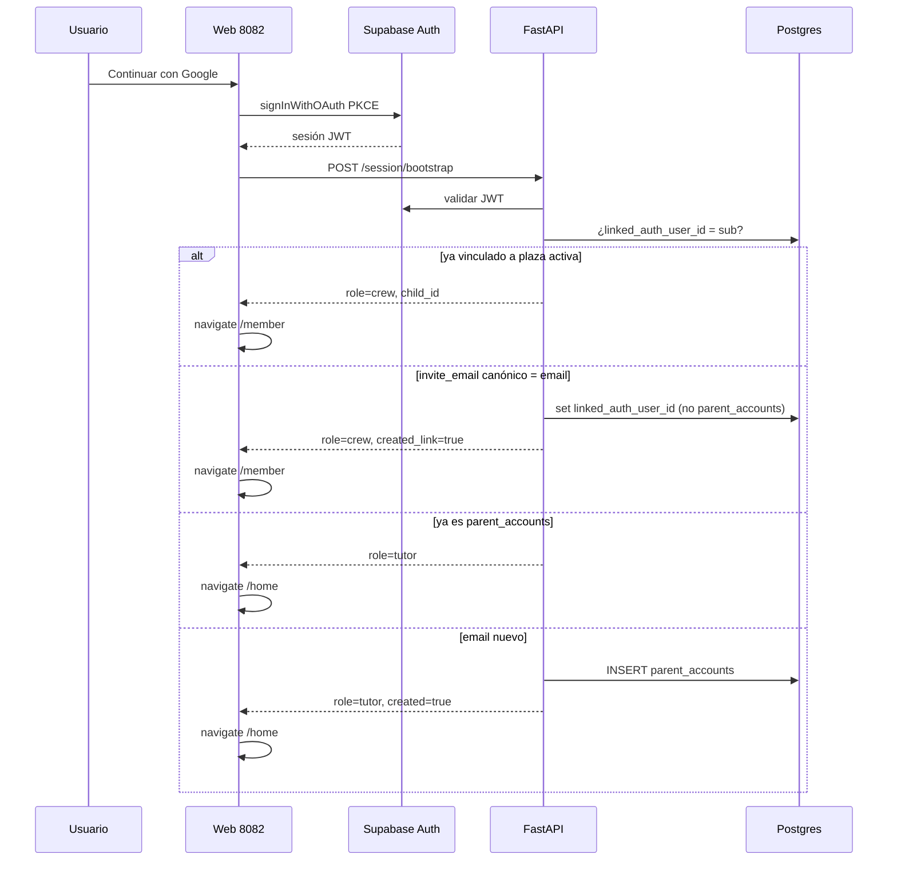

# Spec: Cuenta de tripulante (Gmail propio + rol crew)

> Estado: **implementada** (21 ago 2026) — D4: desvincular **no** borra el Gmail invitado  
> Relacionado: [SPEC_APP_AUTH.md](SPEC_APP_AUTH.md), [SPEC_APP_AUTH_GOOGLE_IMPLEMENTATION.md](SPEC_APP_AUTH_GOOGLE_IMPLEMENTATION.md), [SPEC_APP_CREW_SECTION.md](SPEC_APP_CREW_SECTION.md), [SPEC_APP_CREW_MEMBER_DETAIL.md](SPEC_APP_CREW_MEMBER_DETAIL.md), [SPEC_APP_CREW_MEMBER_SETTINGS.md](SPEC_APP_CREW_MEMBER_SETTINGS.md), [SPEC_APP_ACCOUNT_SECTION.md](SPEC_APP_ACCOUNT_SECTION.md), [SPEC_APP_SHELL_CHROME.md](SPEC_APP_SHELL_CHROME.md), [SPEC_APP_SECTION_FRAME.md](SPEC_APP_SECTION_FRAME.md), [SPEC_APP_SETTINGS_SECTION.md](SPEC_APP_SETTINGS_SECTION.md), [SPEC_APP_DEBUG_MODE.md](SPEC_APP_DEBUG_MODE.md), [SPEC_DEV_LOCAL_AUTH_PLAYWRIGHT.md](SPEC_DEV_LOCAL_AUTH_PLAYWRIGHT.md), [SPEC_LOADER_APP_GATE.md](SPEC_LOADER_APP_GATE.md), [DESIGN.md](../DESIGN.md)  
> Diagramas: [05-data-auth-model.md](../diagrams/05-data-auth-model.md), [07-routing-navigation.md](../diagrams/07-routing-navigation.md), [09-loader-gate-auth.md](../diagrams/09-loader-gate-auth.md), [10-parent-surfaces.md](../diagrams/10-parent-surfaces.md)

Aprobada e implementada (D1–D17; D4: unlink conserva invite).

---

## Contexto

Hoy **todo** login Google crea o reutiliza una fila `parent_accounts` (tutor). Los niños son plazas `children` bajo ese tutor; el JWT de play es siempre el del adulto ([SPEC_APP_CREW_SECTION.md](SPEC_APP_CREW_SECTION.md), [SPEC_APP_AUTH.md](SPEC_APP_AUTH.md) § «cuenta del niño: no prevista»).

El tutor necesita **invitar un Gmail distinto** al suyo en cada plaza. Quien entre con ese Gmail **no** debe convertirse en tutor: se asocia a esa plaza como **cuenta de tripulante** (`role=crew`).

Esta spec **sustituye** la línea de [SPEC_APP_AUTH.md](SPEC_APP_AUTH.md) «Facebook, Microsoft, SMS, cuenta del niño — No previstos» en lo relativo a cuenta de tripulante con Google.

---

## Objetivo

1. El tutor asigna, edita o quita un **correo Gmail** por plaza (nunca el mismo que el suyo).
2. El login Google con ese correo **vincula** `auth.users` a esa plaza y emite sesión `role=crew`.
3. El tripulante ve menú **Tripulante** (no Tripulación ni Ajustes del hogar), ficha propia con lectura de progreso / materias / diario / equipaje, edición limitada del personaje, y **entrada al viaje**.
4. En Cuenta, el tripulante puede **desvincular el Gmail**; **no** puede eliminar la plaza.

---

## Alcance

### Incluido

| Área | Detalle |
| --- | --- |
| Modelo | Columnas en `children` + unicidad global del Gmail invitado |
| Bootstrap | Resolver rol **antes** de crear `parent_accounts` |
| Tutor UI | Campo Gmail en ficha (pestaña Ajustes) + badges de vínculo |
| Shell | Catálogo de drawer según `role` |
| Tripulante | Ruta `#/member` (ficha propia) |
| Play | JWT crew solo sobre su `child_id` |
| Cuenta crew | Desvincular Gmail; sin borrar plaza ni cuenta tutor |
| Auth panel | Copy válido para tutor y tripulante (mismo CTA Google) |
| Tests | pytest contratos + Playwright 390×844 |

### Excluido / no en esta iniciativa

| Tema | Notas |
| --- | --- |
| Email/contraseña de producto | Sigue fuera de MVP; email GoTrue solo en [SPEC_DEV_LOCAL_AUTH_PLAYWRIGHT.md](SPEC_DEV_LOCAL_AUTH_PLAYWRIGHT.md) |
| Apple / otros OAuth | Sin cambio |
| Multi-plaza por un mismo Gmail | Un correo = una plaza en todo el producto |
| Convertir tutor existente en tripulante | Prohibido (conflicto 409) |
| Panel familiar / chat tutor↔niño | Fuera |
| Cambio de textos legales definitivos | Flag de cumplimiento §12; no reescribir Términos aquí |
| HUD play full-bleed | Sin cambio; play sigue en section-frame |

---

## Principios

| Principio | Decisión |
| --- | --- |
| Un Gmail, un rol | Nunca a la vez `parent_accounts` y plaza vinculada |
| El tutor abre la puerta | Sin `invite_email` no hay cuenta crew; un login Google desconocido sigue siendo tutor |
| La plaza es del hogar | Desvincular o borrar el `auth.users` del niño **no** borra `children` |
| Mundo = tutor | El tripulante **no** cambia `world_theme` (ni con `lock_world_theme=false`) |
| Chrome ≠ mundo | El FAB de tema UI (`uiTheme`) sigue permitido; no altera el mundo de juego |
| Mismo Google, distinto destino | Un solo CTA «Continuar con Google»; el rol se decide en bootstrap |
| Autorización en servidor | El front oculta menús; el API **exige** el rol. Deep-links `#/crew` con sesión crew → 403 |

---

## Decisiones de producto (para aprobación)

| # | Decisión | Valor propuesto |
| --- | --- | --- |
| D1 | Dominios aceptados | Solo `@gmail.com` y `@googlemail.com` (no Google Workspace de dominio propio) |
| D2 | Canonicalización | Lowercase; en Gmail: quitar puntos del local-part y sufijo `+alias` antes de comparar/guardar |
| D3 | Unicidad | `invite_email` canónico **único** entre plazas `status <> 'deleted'` (todas las familias) |
| D4 | Desvincular (cuenta crew) | Borra `linked_auth_user_id` y `linked_at`; **conserva** `invite_email` / `invite_email_canonical`; `signOut`; la plaza permanece. El mismo Gmail puede volver a vincularse |
| D5 | Re-login | Si el tutor **no** ha quitado el correo, el mismo Gmail vuelve a vincular (`linked_auth_user_id` nuevo o el mismo `auth.users`) |
| D6 | `allow_solo_start` | **No** bloquea play con sesión crew: el Gmail asignado **es** el permiso de acceso propio |
| D7 | PIN de salida | **No** se pide al tripulante con sesión propia; sí en dispositivo del tutor |
| D8 | Ruta de ficha propia | `#/member` (no reutilizar `#/crew/:id` como destino de menú) |
| D9 | Post-login crew | `#/member` (no `#/home` de tutor). Inicio del drawer crew sí puede ir a `#/home` reducido |
| D10 | Edad | Solo lectura para el tripulante |
| D11 | Sexo del explorador | Editable por el tripulante (campo de personaje) |
| D12 | Materias | Solo lectura (quién está activa); el tutor activa/desactiva |
| D13 | Progreso en `#/member` | Rango `label_child` + barras; **sin** `L*` crudos (alineado a [SPEC_APP_PROGRESSION_RANKS.md](SPEC_APP_PROGRESSION_RANKS.md)) |
| D14 | Perfil tutor (`is_tutor_profile`) | Sin campo Gmail; no se puede invitar |
| D15 | Soft-delete de plaza | Limpia `invite_email` + `linked_auth_user_id`. Un login posterior con ese Gmail crea **tutor** nuevo (no hay plaza) |
| D16 | Debug IA / rewind | 403 para `role=crew` |
| D17 | Ajustes del hogar | Ocultos y 403 para crew |

---

## 1. Roles y ciclo de vida

### 1.1 Roles de sesión

```ts
type SessionRole = "tutor" | "crew";

interface SessionMe {
  role: SessionRole;
  auth_user_id: string;
  email: string;
  /** Solo tutor */
  parent_id?: string;
  display_name?: string | null;      // alias tutor o display_name de la plaza
  avatar_url?: string | null;
  provider: "google";
  /** Solo crew */
  child_id?: string;
  parent_display_name?: string | null; // opcional, no PII extra del tutor
  link_status?: "linked";
}
```

No existe rol mixto. Si un JWT aparece en ambas tablas, es **bug de integridad**: el resolver prioriza `children.linked_auth_user_id` y **no** crea `parent_accounts`.

### 1.2 Estados de vínculo (plaza)

| Estado UI | Condición |
| --- | --- |
| Sin correo | `invite_email` null y `linked_auth_user_id` null |
| Invitación pendiente | `invite_email` set y `linked_auth_user_id` null |
| Vinculado | `linked_auth_user_id` set |
| En pausa | `status=paused` (independiente del vínculo; play bloqueado) |

### 1.3 Diagrama de login



---

## 2. Modelo de datos

Migración nueva: `supabase/migrations/{timestamp}_children_crew_account.sql`

```sql
alter table public.children
  add column if not exists invite_email text null,
  add column if not exists invite_email_canonical text null,
  add column if not exists linked_auth_user_id uuid null,
  add column if not exists linked_at timestamptz null;

alter table public.children
  add constraint children_linked_auth_user_id_fkey
    foreign key (linked_auth_user_id) references auth.users (id) on delete set null;

alter table public.children
  add constraint children_invite_email_canonical_check
    check (
      invite_email_canonical is null
      or invite_email_canonical ~ '^[^@]+@(gmail\.com|googlemail\.com)$'
    );

-- Un Gmail canónico por plaza no borrada
create unique index if not exists children_invite_email_canonical_uidx
  on public.children (invite_email_canonical)
  where invite_email_canonical is not null and status <> 'deleted';

-- Un auth user solo puede estar vinculado a una plaza
create unique index if not exists children_linked_auth_user_id_uidx
  on public.children (linked_auth_user_id)
  where linked_auth_user_id is not null;

comment on column public.children.invite_email is
  'Gmail mostrado al tutor (tal como lo escribió, trim).';
comment on column public.children.invite_email_canonical is
  'Gmail normalizado para match de login (ver spec §3).';
```

| Columna | Quién escribe |
| --- | --- |
| `invite_email` | Tutor (`PATCH` crew) o se limpia al quitar el correo / soft-delete. **No** se limpia al desvincular (D4) |
| `invite_email_canonical` | Servidor, derivado |
| `linked_auth_user_id` | Servidor en bootstrap / unlink (`ON DELETE SET NULL` si Google borra el user) |
| `linked_at` | Servidor al vincular; null al desvincular |

**No** se crea tabla `child_accounts`. La plaza sigue siendo `children`; el Gmail es un atributo de acceso.

**Invariantes (API, no solo SQL):**

1. `invite_email_canonical` ≠ email canónico del tutor dueño (`parent_accounts.email`).
2. `invite_email_canonical` ∉ `parent_accounts.email` canónico de **ningún** tutor.
3. `is_tutor_profile = true` ⇒ ambas columnas email y `linked_auth_user_id` son null (rechazar PATCH).
4. Un `auth.users.id` no puede estar en `parent_accounts.auth_user_id` y en `children.linked_auth_user_id`.

---

## 3. Canonicalización de Gmail

Función pura (testeable) `canonicalize_gmail(raw: str) -> str`:

1. `trim` + lowercase.
2. Split `@`; dominio debe ser `gmail.com` o `googlemail.com` (si no → error de validación, no match).
3. Local-part: eliminar todo desde el primer `+`; eliminar `.`.
4. Reconstruir `{local}@{gmail.com}` (unificar `googlemail.com` → `gmail.com`).

Guardar en `invite_email` el texto recortado original (para UI tutor); en `invite_email_canonical` el resultado.

Comparar login contra `invite_email_canonical` usando el email del JWT pasado por la misma función. Si el JWT no es Gmail, **nunca** matchea una invitación (ese usuario, si no es tutor ya, se convierte en tutor — edge raro).

---

## 4. Contratos API

Todas las rutas: `Authorization: Bearer <access_token>`. Backend canónico FastAPI (`backend/app/`).

### 4.1 Sesión unificada

Sustituye la semántica de «bootstrap = siempre padre». `POST /parents/bootstrap` y `GET /parents/me` **delegan** en el mismo resolver: si el JWT es crew, **no** insertan `parent_accounts` y responden según la tabla de abajo.

| Método | Ruta | Tutor | Crew |
| --- | --- | --- | --- |
| `POST` | `/api/v1/session/bootstrap` | 200 tutor DTO | 200 crew DTO |
| `GET` | `/api/v1/session/me` | 200 tutor DTO | 200 crew DTO |
| `POST` | `/api/v1/parents/bootstrap` | Igual que session (compat) | 200 crew DTO (**no** 2xx de padre) |
| `GET` | `/api/v1/parents/me` | 200 | **403** `{ "detail": "crew_role" }` |
| `PATCH` | `/api/v1/parents/me` | 200 alias | **403** |
| `DELETE` | `/api/v1/parents/me` | 200 borra hogar | **403** (el niño no borra al tutor ni la plaza) |
| `GET/PATCH` | `/api/v1/parents/me/settings` | 200 | **403** |

**Response 200 `session/bootstrap` y `session/me`:**

```json
{
  "role": "crew",
  "auth_user_id": "uuid",
  "email": "nina@gmail.com",
  "child_id": "uuid",
  "display_name": "Nora",
  "avatar_url": "https://…",
  "provider": "google",
  "link_status": "linked",
  "created_link": true
}
```

Tutor:

```json
{
  "role": "tutor",
  "auth_user_id": "uuid",
  "parent_id": "uuid",
  "email": "padre@gmail.com",
  "display_name": "Ada",
  "avatar_url": "https://…",
  "provider": "google",
  "created": false
}
```

`created_link: true` solo en el primer vínculo. `created: true` solo en el primer `parent_accounts`.

**Errores bootstrap:**

| Código | Condición |
| --- | --- |
| 401 | JWT inválido |
| 409 | Email canónico es tutor **y** hay invitación crew (datos corruptos); o intento de vincular a plaza `deleted` |
| 422 | JWT sin email |
| 503 | BD caída |

Política de fallo de red en cliente: igual que hoy (no bloquear navegación infinita; timeout callback 15 s). Si bootstrap 403/409: toast + `signOut` + loader.

### 4.2 Tutor — asignar Gmail

Ampliar `PATCH /api/v1/crew/:childId` (solo rol tutor, dueño de la plaza).

**Body adicional:**

```json
{ "invite_email": "nina.viajera@gmail.com" }
```

- `invite_email: null` o `""` → limpia correo **y** desvincula si había `linked_auth_user_id` (el niño deja de poder entrar; no borra la plaza).
- Cambio a otro Gmail distinto: limpia el vínculo anterior (`linked_auth_user_id = null`) y deja estado «Invitación pendiente» al nuevo correo.

**Errores 422 (detail estable, testeable):**

| `detail` | Causa |
| --- | --- |
| `invite_email_not_gmail` | Dominio no Gmail |
| `invite_email_same_as_tutor` | Igual al email canónico del tutor autenticado |
| `invite_email_is_tutor` | Ese canónico ya existe en `parent_accounts` |
| `invite_email_taken` | Otra plaza no deleted ya lo tiene |
| `invite_email_tutor_profile` | `is_tutor_profile` |

DTO de ficha y de lista: añadir

```ts
{
  invite_email: string | null;          // valor mostrado
  invite_link_status: "none" | "pending" | "linked";
}
```

No devolver `linked_auth_user_id` al cliente.

### 4.3 Tripulante — ficha propia

| Método | Ruta | Efecto |
| --- | --- | --- |
| `GET` | `/api/v1/member` | Ficha propia (`viewer=self`). 403 si rol ≠ crew |
| `PATCH` | `/api/v1/member` | Allowlist §5.3. 403/422 en resto |
| `POST` | `/api/v1/member/unlink` | Desvínculo D4 + 200 `{ "unlinked": true }` |

`GET /api/v1/member` **no** incluye: `tutor_label`, permisos, PIN, `learning.subject_notes`, `learning.general_note`, zona peligrosa, `invite_email` (el correo lo ve en Cuenta desde el JWT).

Sí incluye: identidad visible §5, `progress` (DTO niño: rango `label_child`, barras, materias activas **sin** switch), `journey` resumido, timeline via el mismo contrato que la ficha (o embebido), `baggage` lectura.

### 4.4 Autorización de superficies existentes

Resolver común `AccountContext`:

```ts
type AccountContext =
  | { role: "tutor"; auth_user_id: string; parent_id: string }
  | { role: "crew"; auth_user_id: string; child_id: string; parent_id: string };
```

`parent_id` en crew = dueño de la plaza (para ledger `data/journey/{parent}/{child}` y storage). El niño **no** lista hermanos.

| Superficie | Tutor | Crew |
| --- | --- | --- |
| `GET/POST /crew` | OK | **403** |
| `GET /crew/:id` | Dueño | **403** (usar `/member`) |
| `PATCH /crew/:id` (perfil tutor) | Dueño | **403** |
| `PATCH /crew/:id/permissions` | Dueño | **403** |
| `DELETE /crew/:id` | Dueño | **403** |
| `GET /crew/:id/baggage` | Dueño | **403** (sí `GET /member` o play) |
| Play ` /play/:childId/*` | Dueño de la plaza | Solo si `:childId === context.child_id` y `status=active` |
| Rewind debug | Tutor + debug | **403** |
| Settings padre | OK | **403** |

Implementación: extraer `_child(auth_user_id, child_id)` para que el join sea:

- tutor: `children.parent_id = parent_accounts.id AND parent_accounts.auth_user_id = :sub`
- crew: `children.linked_auth_user_id = :sub AND children.id = :childId AND status <> 'deleted'`

Pausa (`status=paused`): GET member OK; open/turn play → **403** `{ "detail": "child_paused" }`.

### 4.5 Cuenta — desvincular

`POST /api/v1/member/unlink`

1. Validar `role=crew`.
2. `linked_auth_user_id = null`, `linked_at = null`. **No** tocar `invite_email` ni `invite_email_canonical` (D4).
3. **No** `DELETE` de la fila `children`.
4. **Sí** borrar `auth.users` de ese `sub` (Admin/service, mismo patrón que delete tutor) para invalidar el JWT. El próximo login con el mismo Gmail vuelve a vincular por `invite_email_canonical`.
5. 200 `{ "unlinked": true }`.
6. Cliente: `signOut` + destroy shell + `#/loader`.

Idempotencia: si ya no hay vínculo, 200 igual + signOut.

---

## 5. UI

Chrome: [DESIGN.md](../DESIGN.md) § Nuevas superficies autenticadas + [SPEC_APP_SECTION_FRAME.md](SPEC_APP_SECTION_FRAME.md). Skeleton glass hasta datos; guardados con `runGlassButtonAction` + `showGlassToast`.

### 5.1 Tutor — campo en ficha

Ubicación: pestaña **Ajustes** de `#/crew/:id` ([SPEC_APP_CREW_MEMBER_SETTINGS.md](SPEC_APP_CREW_MEMBER_SETTINGS.md)), bloque **nuevo** «Acceso del tripulante», **encima** de Permisos.

```
Correo Gmail del tripulante
[  nina@gmail.com           ] [💾 Guardar]
Helper: Debe ser un Gmail distinto al tuyo. Quien entre con él
verán su viaje, no tu cuenta de tutor.
Estado: Sin correo | Invitación pendiente | Vinculado
```

Lista `#/crew`: badge discreto en carta no-tutor (`pending` / `linked`); sin mostrar el email completo en la carta (privacidad en capturas / hombro). El email vive en Ajustes.

Perfil `is_tutor_profile`: bloque oculto.

### 5.2 Auth panel (loader)

Mismo botón Google. Copy:

| ID | Texto |
| --- | --- |
| `auth.subtitle` | Entra con Google |
| `auth.subtitle.helper` | Tutores y tripulantes usan el mismo botón. Si tu tutor te asignó un Gmail, entra con ese correo. |
| `auth.google` | Continuar con Google |
| `auth.legal` | (sin cambio de enlaces) |

Se **retira** el copy exclusivo «Cuenta de padre, madre o tutor» del panel (sigue existiendo en `#/account` del tutor).

Callback: `bootstrapSessionIfNeeded` → si `role=crew` navegar `#/member`; si tutor `#/home`.

Gate con sesión ya válida: mismo split.

### 5.3 Shell — catálogo por rol

| id | Tutor | Crew |
| --- | --- | --- |
| `home` | Inicio → `#/home` | Inicio → `#/home` (welcome reducido) |
| `crew` | Tripulación → `#/crew` | **oculto** |
| `member` | **oculto** | Tripulante → `#/member` |
| `legal` | accordion | accordion (igual) |
| `settings` | Ajustes | **oculto** |
| `account` | Cuenta | Cuenta |
| `signout` | Cerrar sesión | Cerrar sesión |

Icono nuevo `member` (una silueta de explorador, no grupo). FAB cuenta → `#/account` en ambos roles.

Guards de router (además del API):

| Hash | Crew |
| --- | --- |
| `#/crew`, `#/crew/new`, `#/crew/:id` | Redirect `#/member` |
| `#/settings` | Redirect `#/member` |
| `#/play/:id` | Si `id !== child_id` → `#/member` |
| `#/member` | Tutor → redirect `#/crew` |

### 5.4 Home crew

`#/home` con `role=crew`: sin CTA de gestión de tripulación. Saludo con `display_name` de la plaza. CTA primario **«Entrar al viaje»** → `#/play/:childId`. CTA secundario **«Mi ficha»** → `#/member`.

### 5.5 Sección Tripulante `#/member`

Marco compacto; título fijo **«Tripulante»**. Hero carta TCG (misma pieza que ficha tutor). Pestañas:

| Tab | Modo |
| --- | --- |
| **Detalles** | Nombre de tripulación editable; sexo editable; mundo **solo lectura**; edad solo lectura; `character_summary` / rasgos de personaje editables; **sin** `tutor_label` |
| **Viaje** | Mapa + diario solo lectura; CTA **«Entrar al viaje»** (si `active` y first-run/play permitido) |
| **Progreso** | Materias activas + barras + rango niño; **sin** switches de activar materia |
| **Equipaje** | Lectura (mismo grid); el uso de objetos sigue en play |
| **Ajustes** | **No existe** |

Entrar al viaje también desde el drawer: el ítem **Tripulante** abre la ficha; el CTA de Viaje y el de Home lanzan play. El usuario pidió «entrar al viaje directamente desde el menú»: el ítem `member` del drawer, **si** `onboarding` ya puede jugar, puede ser un accordion:

- Tripulante → `#/member`
- Entrar al viaje → `#/play/:childId`

Decisión cerrada en esta spec: **accordion** `member` con dos hijos (`Mi ficha`, `Entrar al viaje`). Fila padre abre accordion; no navega sola.

First-run incompleto: CTA play sigue existiendo (el diálogo completa mundo/nombre/edad). Mundo: el niño lo elige **solo** en first-run play, no en Detalles.

### 5.6 Campos: quién edita

| Campo | Tutor ficha | Tripulante `#/member` |
| --- | --- | --- |
| `display_name` | Sí | Sí |
| `age_years` | Sí | No (RO) |
| `explorer_gender` | Sí | Sí |
| `world_theme` | Sí (respeta lock) | **No** (RO; ni unlock) |
| `tutor_label` | Sí | Oculto |
| `character_summary` / `traveler_profile` textual | Sí | Sí |
| `achievements` | RO | RO |
| `learning.active_subjects` | Sí | RO |
| Permisos / PIN / pausa / borrar | Sí | Oculto / 403 |
| `invite_email` | Sí | Oculto (Cuenta muestra el email de sesión) |

PATCH `/member` allowlist: `display_name`, `explorer_gender`, `character_summary`, `traveler_profile` (mismas validaciones que crew tutor). Cualquier otro key → 422 `field_forbidden`.

### 5.7 Cuenta — variante crew

Misma ruta `#/account`, mismo marco. Contenido:

```
Cuenta de tripulante
Avatar / inicial
Nombre en Google (RO)
Correo (RO) — el Gmail de la sesión
Inicio de sesión: Google (RO)

────────────────
Zona de acceso
[ Desvincular Gmail ]
```

**No** hay «Eliminar cuenta» ni «Eliminar tripulante».

Modal desvincular:

> ¿Salir de esta sesión de Gmail?  
> Seguirás en la tripulación. Podrás volver a entrar con el mismo correo.  
> Esta acción no elimina tu viaje.

Primario: «Desvincular». Foco inicial en Cancelar.

### 5.8 Copy (extracto)

| ID | Texto |
| --- | --- |
| `shell.menu.member` | Tripulante |
| `shell.menu.member.sheet` | Mi ficha |
| `shell.menu.member.play` | Entrar al viaje |
| `member.title` | Tripulante |
| `crew.invite.label` | Correo Gmail del tripulante |
| `crew.invite.helper` | Tiene que ser un Gmail distinto al de esta cuenta de tutor. |
| `crew.invite.status.none` | Sin correo |
| `crew.invite.status.pending` | Invitación pendiente |
| `crew.invite.status.linked` | Vinculado |
| `crew.invite.saved` | Correo guardado |
| `crew.invite.cleared` | Correo quitado |
| `account.crew.subtitle` | Cuenta de tripulante |
| `account.unlink.cta` | Desvincular Gmail |
| `account.unlink.title` | ¿Desvincular este Gmail? |
| `account.unlink.confirm` | Desvincular |
| `member.world.readonly` | Tu mundo lo eliges en el viaje; no se cambia desde aquí. |
| `member.paused` | Tu viaje está en pausa. Pregunta a tu tutor. |

---

## 6. Cliente previsto

| Fichero | Cambio |
| --- | --- |
| `web/js/lib/session-account.js` | Nuevo: bootstrap/me, cache de `role` |
| `web/js/lib/parent-account.js` | Delega en session; `/parents/me` solo tutor |
| `web/js/lib/member-api.js` | Nuevo: GET/PATCH `/member`, unlink |
| `web/js/lib/crew-api.js` | `invite_email` en PATCH tutor |
| `web/js/scenes/auth-callback.js` | Split navigate member/home |
| `web/js/components/loader-gate.js` | Idem con sesión existente |
| `web/js/components/auth-panel.js` | Copy §5.2 |
| `web/js/components/app-shell.js` | Catálogo por rol; accordion member |
| `web/js/components/shell-ui-icons.js` | `member` |
| `web/js/scenes/member.js` | Nuevo — reutiliza piezas de crew-panel en modo `viewer=self` |
| `web/js/scenes/home.js` | Welcome crew |
| `web/js/scenes/account.js` | Variante crew |
| `web/js/main.js` | Ruta `member`; guards |
| `web/css/scenes/member.css` | Mínimo; reutilizar crew-panel |

Preferencia de implementación UI: extraer de `crew-panel.js` un render de ficha parametrizado `viewer: "tutor" | "self"` en lugar de duplicar tabs.

---

## 7. Backend previsto

| Fichero | Cambio |
| --- | --- |
| `backend/app/services/gmail_canonical.py` | Puro |
| `backend/app/services/session_accounts.py` | Resolver rol (`SessionAccountService`) |
| `backend/app/services/parents.py` | Bootstrap no crea padre si match invite |
| `backend/app/routers/session.py` | `bootstrap` + `me` |
| `backend/app/routers/parents.py` | Compat + 403 crew |
| `backend/app/routers/member.py` | GET/PATCH/unlink |
| `backend/app/routers/crew.py` | PATCH invite; 403 crew |
| `backend/app/services/crew.py` | Invite + invariantes; `_child` dual |
| `backend/app/services/dialogue.py` | `_child` acepta crew |
| `backend/app/services/auth.py` | Sin cambio de validación JWT |
| `backend/tests/unit/test_gmail_canonical.py` | Canonicalización |
| `backend/tests/contract/test_session_bootstrap.py` | Roles |
| `backend/tests/contract/test_member_routes.py` | Allowlist + unlink |
| `backend/tests/contract/test_crew_invite.py` | 422 matriz |

Playwright local: usuario `playwright-crew@gmail.com` no es viable en GoTrue sin Google. Extender [SPEC_DEV_LOCAL_AUTH_PLAYWRIGHT.md](SPEC_DEV_LOCAL_AUTH_PLAYWRIGHT.md):

- Crear user email GoTrue `playwright-crew@kidepik.local` **solo en tests** que **saltan** el check de dominio **si** `APP_ENV=local` **y** el invite se guarda ya canónico de test **o** flag `ALLOW_NON_GMAIL_INVITE_IN_LOCAL=true` en `.env.poc.sample` (default false).
- Camino recomendado de contrato: pytest con email `nina@gmail.com` mockeando JWT claims (sin OAuth real).
- Playwright UI del campo Gmail: con sesión **tutor**, asignar correo, ver badge; el login crew real se marca skipped sin Google de prueba.

---

## 8. Criterios de aceptación

1. Tutor no puede guardar su propio Gmail ni un no-Gmail (422 + inline).
2. Tutor no puede guardar un Gmail que ya es `parent_accounts` u otra plaza (422).
3. Login Google con Gmail invitado **no** crea `parent_accounts`; `session.me.role === "crew"`.
4. Login Google desconocido sigue creando tutor.
5. Login Google que ya es tutor no se convierte en crew aunque alguien escriba ese correo (el PATCH tutor ya lo impidió).
6. Drawer crew: **Tripulante** (accordion ficha + viaje), Legal, Cuenta, Salir. Sin Tripulación ni Ajustes.
7. `#/crew` con sesión crew redirige a `#/member`; API `/crew` 403.
8. `#/member` muestra progreso, materias RO, diario, equipaje; CTA viaje → `#/play/:ownId`.
9. Tripulante edita nombre y personaje; no edita mundo ni edad; PATCH mundo → 422.
10. Cuenta crew: desvincular con modal; no hay eliminar plaza; tras OK vuelve al loader; la fila `children` sigue `active`.
11. Tras desvincular, el mismo Gmail **vuelve a entrar como crew** mientras el tutor no quite el correo de la ficha. Si el tutor borra `invite_email`, un login libre crea tutor.
12. Plaza pausada: ficha visible, play 403, copy de pausa.
13. Perfil tutor de tripulación: sin campo Gmail.
14. Debug rewind / settings padre: 403 crew.
15. Playwright 390×844: tutor asigna Gmail (mock/API) + modal unlink cancelado; capturas `tmp/playwright-output/crew-invite-*.png`, `member-*.png`, `account-unlink-*.png`.
16. pytest: canonicalización, bootstrap crew vs tutor, matriz 403, allowlist PATCH, unlink no borra `children`.

---

## 9. Seguridad y menores

| Tema | Requisito |
| --- | --- |
| COPPA / LOPDGDD | El tutor asigna el correo (consentimiento del responsable). Copy helper explícito |
| Edad Google | Gmail suele exigir 13+; el producto 7–9 puede usar un correo creado/autorizado por el tutor. No bloquear por edad en API |
| Tokens | Sigue `anon` en cliente; writes solo FastAPI |
| PII | No mostrar `linked_auth_user_id`; email completo solo en Ajustes tutor y Cuenta propia |
| Cascada | Borrar cuenta **tutor** sigue borrando plazas (y por tanto vínculos) |
| RLS | Writes revocados a `authenticated`; sin cambio de modelo «cliente escribe Postgres» |

---

## 10. Fases de implementación (tras aprobación)

| Fase | Entregable | Tests primero |
| --- | --- | --- |
| **A** | Canonicalizador + migración + `AccountContext` + bootstrap split | unit + contract bootstrap |
| **B** | PATCH `invite_email` tutor + UI Ajustes + badges lista | contract 422 + Playwright campo |
| **C** | Guards API play/crew/settings + router/shell por rol | contract 403 + unit shell catalog |
| **D** | `#/member` + home crew + play self | Playwright ficha RO/edit |
| **E** | Cuenta unlink + delete auth user | contract unlink + Playwright modal |

No mezclar A–E en un único PR si se puede evitar; el orden A→E es obligatorio (sin A el login crew no existe).

---

## 11. Relación con specs (deltas)

| Spec | Delta al aprobar esta |
| --- | --- |
| AUTH | Cuenta crew **sí** prevista; copy panel genérico; post-login split |
| AUTH_GOOGLE_IMPLEMENTATION | Bootstrap deja de ser «siempre padre» |
| CREW_SECTION | Campo Gmail; JWT play ya no es solo tutor |
| CREW_MEMBER_SETTINGS | Bloque Acceso del tripulante |
| CREW_MEMBER_DETAIL | Modo `viewer=self` documentado aquí, no duplicar tabs |
| ACCOUNT_SECTION | Variante crew; «desvincular» deja de estar en «excluido» para este rol |
| SHELL_CHROME | Menú por rol; icono `member` |
| SECTION_FRAME | Ruta `#/member` compacta + glass |
| SETTINGS | 403 crew |
| DEBUG_MODE | «el niño nunca ve el panel» se refuerza con rol crew |
| DEV_LOCAL_AUTH_PLAYWRIGHT | Fixture crew opcional / skip OAuth |
| LOADER_APP_GATE | Sesión válida → home **o** member |

---

## 12. Aprobación

- [x] D1–D17 (tabla de decisiones; D4 = conservar invite al desvincular)
- [ ] Campo Gmail en Ajustes de ficha tutor + unicidad global
- [ ] Bootstrap: match invite → crew, si no → tutor
- [ ] Menú Tripulante (accordion ficha + viaje); sin Tripulación ni Ajustes
- [ ] `#/member` RO progreso/materias/diario/equipaje; edit nombre + personaje; no mundo
- [x] Cuenta crew: desvincular (conserva correo) y no eliminar plaza
- [ ] 403 de servidor en todas las superficies tutor-only

Tras marcar: Fase 2 plan en `.cursor/tasks/` → TDD (pytest) → UI → Playwright.
