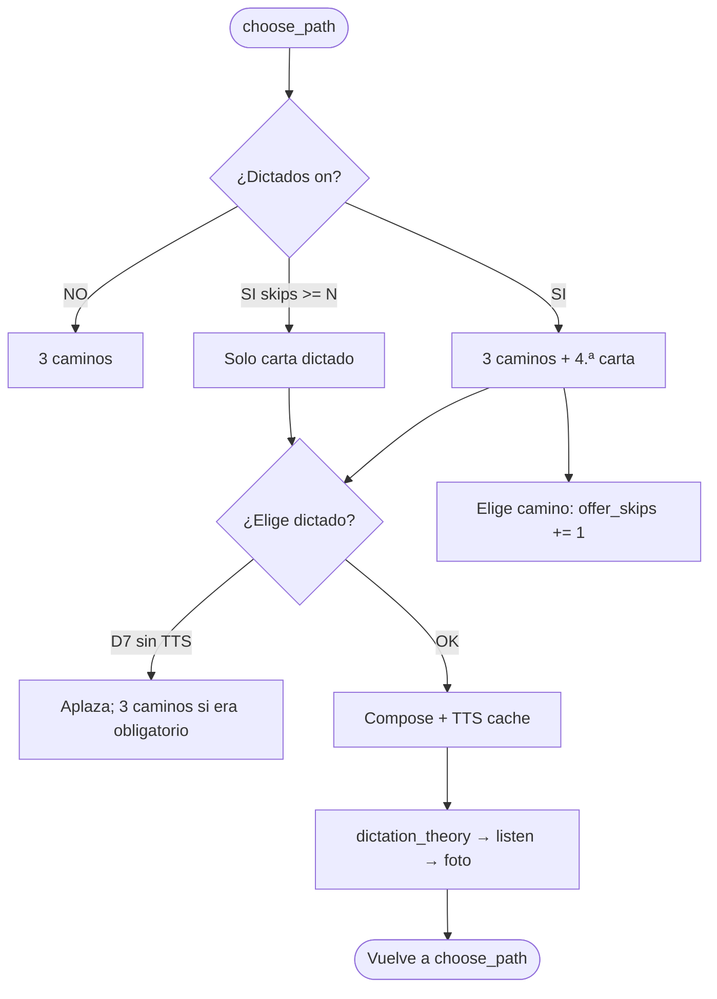

# Spec: Modo dictado (gate post-camino)

> Estado: **implementada** (6 sep 2026) — delta 4.ª carta de producto + pedagogía + voces  
> Relacionado: [SPEC_AI_GEMINI_TTS.md](SPEC_AI_GEMINI_TTS.md), [SPEC_APP_DICTATION_PEDAGOGY.md](SPEC_APP_DICTATION_PEDAGOGY.md), [SPEC_APP_DEBUG_MODE.md](SPEC_APP_DEBUG_MODE.md), [SPEC_APP_JOURNEY_MECHANICS.md](SPEC_APP_JOURNEY_MECHANICS.md), [SPEC_APP_CREW_MEMBER_DETAIL.md](SPEC_APP_CREW_MEMBER_DETAIL.md), [SPEC_APP_PATH_CHALLENGE_COUNT.md](SPEC_APP_PATH_CHALLENGE_COUNT.md), [SPEC_APP_PATH_COMPOSER_TUTOR_CONTEXT.md](SPEC_APP_PATH_COMPOSER_TUTOR_CONTEXT.md), [SPEC_APP_SUBJECT_CATALOG.md](SPEC_APP_SUBJECT_CATALOG.md), [SPEC_APP_AGE_BANDS.md](SPEC_APP_AGE_BANDS.md), [SPEC_AI_GEMINI_GATEWAY.md](SPEC_AI_GEMINI_GATEWAY.md), [SPEC_AI_CENTRAL_ORCHESTRATOR.md](SPEC_AI_CENTRAL_ORCHESTRATOR.md), [SPEC_AI_JOURNEY_FILE_LEDGER.md](SPEC_AI_JOURNEY_FILE_LEDGER.md), [SPEC_DATA_STORAGE_LAYERS.md](SPEC_DATA_STORAGE_LAYERS.md), [SPEC_MEDIA_STORAGE.md](SPEC_MEDIA_STORAGE.md), [SPEC_APP_ADVENTURE_DIALOGUE.md](SPEC_APP_ADVENTURE_DIALOGUE.md), [SPEC_APP_WAITING_PHRASES.md](SPEC_APP_WAITING_PHRASES.md), [SPEC_APP_FILE_LOGGING.md](SPEC_APP_FILE_LOGGING.md)  
> **Diagrama:** [16-journey-mechanics-flows.md](../diagrams/16-journey-mechanics-flows.md) §3b · [15-ai-orchestrator-agents.md](../diagrams/15-ai-orchestrator-agents.md)  
> **Plan:** [tasks/DICTATION_IMPLEMENTATION_PLAN.md](../tasks/DICTATION_IMPLEMENTATION_PLAN.md)

## Contexto

Hoy, al **elegir camino**, el viajero ve tres rutas ([SPEC_APP_JOURNEY_MECHANICS](SPEC_APP_JOURNEY_MECHANICS.md) §5). No hay práctica de **escritura a mano** ni de **ortografía escuchada**.

El tutor necesita, por tripulante, un modo que ofrezca un dictado en la encrucijada y, si se ignora N veces, **obligue** a copiarlo antes de seguir: teoría breve del mentor → audio → escribir en papel → foto → corrección por agente → volver a la encrucijada.

Materia pedagógica de caminos: **`language`** (Lengua y gramática). El **nivel de ortografía** del dictado es **independiente** (`orthography_level_id` en settings de dictado; no es una materia del catálogo). No sustituye caminos de `language`. `reading` no es el foco (comprensión), sí la ortografía, las reglas y la acentuación.

## Objetivo

1. Toggle tutor **on/off** por tripulante + umbral N de skips.
2. El tutor indica el **foco** (texto libre + chips de reglas).
3. Si el toggle está on: en `choose_path` hay **siempre** una 4.ª carta de dictado. Tras N encrucijadas sin elegirla, **solo** se muestra esa carta.
4. Un agente genera el **texto canónico** del dictado (nunca visible al explorador).
5. TTS Gemini genera audio **una vez** (voz masculina o femenina al azar, `es-ES`); el viajero lo **repite las veces que quiera**.
6. El viajero escribe en papel, sube **foto**; un modelo **visión** transcribe, compara y evalúa.
7. Los **fallos** se persisten y alimentan el siguiente dictado.
8. Contrato viable con el **tier free** de Gemini del proyecto kidepik.

## Veredicto de viabilidad

**Viable en POC**, con matices de cuota y de calidad de foto. Sin TTS y sin visión la feature no existe; **ambos están disponibles en el proyecto kidepik (tier free)**. Detalle de audio: [SPEC_AI_GEMINI_TTS](SPEC_AI_GEMINI_TTS.md).

| Pieza | ¿Hay modelo Google free? | Riesgo |
| --- | --- | --- |
| Texto + teoría | Sí — Flash Lite (~500 RPD) | Bajo; mismo patrón que `path_composer` |
| Audio TTS | Sí — `Gemini 2.5 Flash TTS` y `Gemini 3.1 Flash TTS` (**10 RPD c/u**, 3 RPM) en la captura de [GEMINI_API_FREE_TIER_LIMITS_KIDEPIK](../operations/GEMINI_API_FREE_TIER_LIMITS_KIDEPIK.md) | **Alto:** ~20 audios/día si rotan ambos. Mitigación: **cachear** el WAV; replay sin nueva llamada; si no hay cuota, **no bloquear** el viaje (D7) |
| Visión / letra manuscrita | Sí — los Flash de diálogo ya son **multimodales** ([image understanding](https://ai.google.dev/gemini-api/docs/vision)) | **Medio:** letra infantil, foto borrosa, sombra. Mitigación: reintento de foto, `confidence`, umbral de «no se lee». Umbral `band_early` 0.75 **aprobado** |
| Cloud TTS (Chirp / Standard) | Otro producto Google (facturación GCP) | **Fuera de POC.** Qué es: [SPEC_AI_GEMINI_TTS](SPEC_AI_GEMINI_TTS.md) §0 |

**No** usar Web Speech API del navegador como primario (no es modelo Google, calidad `es-ES` irregular, no cacheable en servidor).

---

## 1. Decisiones

| # | Decisión | Valor |
| --- | --- | --- |
| D1 | Ámbito | Por **tripulante**. Misma política en fantasy y sci-fi. |
| D2 | Master | `learning.dictation.enabled` boolean; default **`false`**. Sin clave = off. |
| D3 | Disparo | En **`choose_path`**: si `enabled`, siempre hay 4.ª carta de producto. **No** se fuerza al cerrar un camino. |
| D4 | Quién obliga | El **sistema** cuenta `offer_skips`. El mentor lo **narra**; el LLM **no** tira moneda. |
| D5 | Política | `every_n` (default **3**; tutor elige **3–10**) = encrucijadas **sin elegir** la carta hasta que el dictado sea obligatorio. Claves `trigger` / `language_paths_only` / `random` quedan en JSON por compatibilidad y **no** gobiernan la oferta. |
| D5b | Suelo (histórico) | **Superseded.** La oferta no espera un gap de caminos superados. |
| D6 | No saltar | Si es obligatorio, la única carta es el dictado. Sin chip «saltar». Debug rewind sí puede truncar. |
| D7 | Cuota TTS | Sin cuota (o TTS caído) **no hay dictado**: no se entra en teoría/listen ni se pide foto. Si era obligatorio, se muestran los **3 caminos** y se aplaza (skips **no** suben por el intento fallido). Evento `dictation_skipped_quota`; toast debug tutor. **Prohibido** dejar al viajero en una fase de dictado sin audio. |
| D8 | Texto canónico | **Nunca** en UI del explorador ni en `dialogue.jsonl` de burbujas. Solo ledger interno + corrección. |
| D9 | Replay | Ilimitado contra el fichero cacheado (`/media/audio/...`). No re-sintetiza. |
| D10 | Papel | El viajero escribe **fuera de la app**. No hay teclado de transcripción del dictado. |
| D11 | Foto | JPEG/PNG/WebP; categoría media `dictations`. Visión **solo servidor**. |
| D12 | Continuar | Hace falta **aprobado** o agotar `max_attempts` (default **3**) → continuar con debilidades registradas. |
| D13 | Progreso | Dictado aprobado: Δ rolling de `language` = **½ Δ de un acierto de camino** de ese pack **y** el mismo ½ Δ en **`orthography_level_id` / `orthography_rolling`** (independiente; no es materia del catálogo). Fallo: 0. No cuenta como camino para Linear B. |
| D14 | Foco tutor | Texto ≤ 400 + chips de reglas. Se fusiona con `weak_points` del ledger. |
| D15 | UI tutor | Pestaña **Progreso** de `#/crew/:id`, bloque «Dictados». Solo tutor. |
| D16 | Privacidad foto | Procesar en backend; **no** exponer bytes a `web/` hacia Google. Tras corrección: conservar foto **7 días** para el tutor; luego borrar fichero. Errores estructurados **sí** persisten. |
| D17 | Idioma | Castellano de España (`es-ES`) en teoría, texto y TTS. Voces masculinas y femeninas al azar (estables por `dictation_id`). |
| D18 | Placement | Fuera de alcance. |
| D19 | Debug (tutor local) | En `choose_path` con debug activo **y** producto **off**: 4.ª carta `debug_start_dictation`. Si el producto está on, esa carta **no** se añade (ya hay `start_path_dictation`). Mismas guardas que [SPEC_APP_DEBUG_MODE](SPEC_APP_DEBUG_MODE.md). Contrato UI §8.1b. |
| D20 | Pedagogía | Cada dictado cumple [SPEC_APP_DICTATION_PEDAGOGY](SPEC_APP_DICTATION_PEDAGOGY.md): banda × **nivel de ortografía independiente** × ficha tutor × mundo. |
| D21 | Carta de producto | `option_id = start_path_dictation`, `kind = dictation`, **sin** badge debug. Elegirla lanza el pipeline y pone `offer_skips = 0`. Elegir un **camino** suma 1 a `offer_skips` (tope `every_n` máx. 10). |

---

## 2. Ajuste tutor (Progreso)

### 2.1 JSON (`children.settings.learning.dictation`)

```ts
interface DictationSettings {
  enabled: boolean;                 // default false
  trigger?: "every_n_paths" | "language_paths_only" | "random"; // legado; no gobierna la oferta
  every_n?: number;                 // 3..10; default 3 — umbral de skips
  random_p?: number;                // legado
  focus_note?: string;              // ≤ 400, spellcheck off
  focus_tags?: DictationFocusTag[]; // chips, máx. 6
  max_attempts?: number;            // 2..5; default 3
  offer_skips?: number;             // runtime; 0 al activar y al lanzar dictado de producto
  orthography_level_id?: string;    // L1..L6; independiente de la materia language
  orthography_rolling?: number;     // runtime
}
```

type DictationFocusTag =
  | "accentuation"      // tildes
  | "b_v"
  | "g_j"
  | "h_muda"
  | "c_z_s"
  | "ll_y"
  | "r_rr"
  | "mayusculas"
  | "puntuacion"
  | "palabras_dificiles";
```

PATCH fusiona `learning.dictation` como `challenges_per_path`: no borra materias ni notas.

Si PATCH incluye `every_n`: debe ser entero **3–10** (no bool). Fuera de rango → **422**. Si `trigger` omite y `enabled` pasa a true, el servidor escribe `trigger: "every_n_paths"` y `every_n: 3` si faltan.

Guardado **al instante** (switch + select + chips), toast glass. Textarea foco: debounce 400 ms, mismo patrón que notas de materia.

Helper UI: «Si está activo, en cada encrucijada hay una 4.ª carta de dictado. Si el explorador no la elige N veces, el dictado pasa a ser obligatorio y solo se muestra esa carta.»

Stepper «Obligatorio si no lo elige en N encrucijadas»: **3–10**, default 3. **Siempre** visible con el bloque (no hay select de trigger).

Se muestra el **nivel de ortografía** actual (solo lectura; no es la materia Lengua).

### 2.2 Labels de chips (es-ES)

| Tag | Label tutor |
| --- | --- |
| `accentuation` | Acentuación / tildes |
| `b_v` | b / v |
| `g_j` | g / j |
| `h_muda` | h muda |
| `c_z_s` | c / z / s |
| `ll_y` | ll / y |
| `r_rr` | r / rr |
| `mayusculas` | Mayúsculas |
| `puntuacion` | Puntuación |
| `palabras_dificiles` | Palabras difíciles |

### 2.3 API

| Ruta | Campo |
| --- | --- |
| `GET /api/v1/crew/:id` | `settings.learning.dictation` (objeto; ausente = off) |
| `PATCH /api/v1/crew/:id` | `learning: { dictation: { … } }` |
| `GET /api/v1/member` | **No** incluir |
| Play `open`/`turn` | No el ajuste crudo; la fase ya viene en el envelope |

---

## 3. Cuándo hay dictado en la encrucijada

Evaluar en **`choose_path`** (no al cerrar un camino).

```
si !enabled → 3 caminos (más carta debug si D19)
si enabled y offer_skips >= every_n → solo carta start_path_dictation (obligatorio)
si enabled → 3 caminos + carta start_path_dictation
elegir un camino → offer_skips += 1 (tope 10)
elegir start_path_dictation con éxito → offer_skips = 0; entra dictation_theory
activar toggle → offer_skips = 0
```

Si D7 (sin TTS): **no** hay dictado. Se registra `dictation_skipped_quota` y se permanece en `choose_path`. Si era obligatorio, se muestran los 3 caminos y se aplaza; `offer_skips` **no** sube por ese intento fallido. No se muestra `dictation_theory`.

### 3.1 Carta de producto (D21)

Si `learning.dictation.enabled` y fase `choose_path`:

- El pack sigue teniendo **3 caminos** jugables. Se añade una **4.ª opción** que **no** es un camino: `option_id = start_path_dictation`, `kind = dictation` (sin badge debug).
- Si `offer_skips >= every_n`: **solo** esa carta. Copy del mentor: hay que copiar el recado antes de un camino nuevo.
- Al elegirla: compose pedagógico + TTS → `dictation_theory`. Al cerrar: **vuelve** a `choose_path`. No consume slot de camino.
- Eventos: `source: "path_offer"`. Síndrome weak_points, Δ `language` y Δ ortografía **sí**.

### 3.2 Cuarta carta en debug (D19)

Solo si debug activo ([SPEC_APP_DEBUG_MODE](SPEC_APP_DEBUG_MODE.md): local ∧ permiso `debug_ai` ∧ toggle tutor) **y** fase `choose_path` **y** sesión `role=tutor` **y** producto **off**.

- El pack sigue teniendo **3 caminos** jugables. Se añade una **4.ª opción**: `option_id = debug_start_dictation`, `kind = debug_dictation`.
- Visible **aunque** `learning.dictation.enabled` sea false (así se prueba el flujo).
- **Sí** aplica D7 (sin cuota → toast debug, se permanece en `choose_path`).
- Al elegirla: compose pedagógico + TTS → `dictation_theory`. Al cerrar el dictado: **vuelve** a `choose_path` con los mismos 3 caminos. No consume slot, no regenera pack, no otorga economía de cierre de camino.
- Eventos: `source: "debug_card"`. **No** resetea `offer_skips`. Síndrome weak_points y Δ `language` / ortografía **sí**.
- Prod / rol crew / debug off / producto on: la carta debug **no existe** (tampoco si alguien manda el `option_id` a mano → 422).

Título y blurb: catálogo por mundo (rotar). No LLM para la carta (ahorra cuota). Ejemplos:

| Mundo | Título (rotar) | Blurb |
| --- | --- | --- |
| `sci-fi` | Prueba de transcripción interestelar | Copia el parte de radio como un oficial de puente. |
| `sci-fi` | Bitácora de la baliza | Transcribe el mensaje que acaba de llegar. |
| `fantasy` | Recado del cronista | Escribe al dictado el aviso de la hermandad. |
| `fantasy` | Eco del pergamino | El Guía te dicta el recado; tú lo copias en papel. |

La carta usa el mismo componente glass que las de camino; badge discreto `debug` (solo tutor debug), no copy técnico en la burbuja del mentor.

---

## 4. Flujo de play



El dictado no otorga ítem extra de economía en MVP. Al cerrar, el viajero vuelve a la encrucijada.

### 4.1 Fases y `input_mode`

Extiende [SPEC_APP_ADVENTURE_DIALOGUE](SPEC_APP_ADVENTURE_DIALOGUE.md) §1.1.

| Fase `meta.phase` | `input_mode` | Controles | Texto libre |
| --- | --- | --- | --- |
| `dictation_theory` | `options_or_text` | CTA `start_dictation`: sci-fi «Sintonizar el parte» / fantasy «Escuchar el recado» | Dudas **solo** de la teoría; anti-spoiler del texto canónico |
| `dictation_listen` | `photo` **(nuevo)** | Reproductor glass en la burbuja (play/pausa, al inicio + pausa, seek + clocks) + cámara/galería icono + «Enviar foto» | Sin compose de respuesta al dictado |
| `dictation_result` | `continue` | Continuar (re-escuchar si no aprobado) | — |

Modo `photo`: no teclado. Botón captura (`capture="environment"`) + galería. Tras elegir fichero: preview glass + confirmar envío.

Placeholder teoría: «¿Alguna duda sobre esta regla?»  
Listen: sin placeholder de texto.

### 4.2 Teoría (antes del audio)

El mentor explica **qué va a practicar** (regla, ejemplos cortos, 1–2 palabras modelo **distintas** de las del dictado). Longitud: [SPEC_APP_MENTOR_PROSE_CLARITY](SPEC_APP_MENTOR_PROSE_CLARITY.md) — breve; banda `band_early` ≤ ~4 frases.

**Prohibido** recitar el texto canónico o un parafraseo que lo revele.

Fuentes de la lección (prioridad):

1. Chips + `focus_note` del tutor.
2. `weak_points[]` del ledger (top 5 por recencia × frecuencia).
3. Si vacío: regla acorde a `effective_age_band` + L* de **ortografía independiente**.

### 4.3 Texto canónico

Generado por `dictation_composer`. Constraints:

| Banda | Palabras (marco) | Ventana L* |
| --- | --- | --- |
| `band_early` | 8–15 | Recorte ~40 % del rango según `orthography_level_id` L1–L6 |
| `band_child` | 15–30 | Idem |
| `band_tween` | 30–50 | Idem |
| `band_teen` | 50–80 | Idem |
| `band_adult` | 60–100 | Idem |
| `band_senior` | 30–50 | Idem |

- Ortografía **correcta** en el canónico (es la clave de corrección).
- Banda, ficha tutor y mundo: contrato [SPEC_APP_DICTATION_PEDAGOGY](SPEC_APP_DICTATION_PEDAGOGY.md). No un párrafo neutro «de libro».
- Incluir de forma natural (no lista de palabras) los focos 1–3 más fuertes.
- Castellano ES; el mundo es envoltorio (parte, recado, bitácora…), no grafías de lore inventado.
- Números: preferir palabras («veintidós») en `band_early`/`band_child`.
- Anti-repetición: no reutilizar el mismo canónico de los últimos 10 dictados (ledger).

Campos del envelope de compose:

```ts
interface DictationComposeEnvelope {
  theory_mentor: string;          // prosa visible
  canonical_text: string;         // interno
  focus_applied: DictationFocusTag[];
  weak_points_used: string[];     // ids o labels
  tts_instruction: string;        // estilo: «lento, pausas entre oraciones, es-ES»
  word_count: number;
}
```

### 4.4 Audio

Contrato: [SPEC_AI_GEMINI_TTS](SPEC_AI_GEMINI_TTS.md).

- Una síntesis por `dictation_id`.
- UI: reproductor glass compacto **en la burbuja** (play/pausa, volver al inicio en pausa, seek + clocks); mismo `audio_url`. Ver [DESIGN.md](../DESIGN.md) §6b.
- Velocidad: una sola toma «dictado escolar» (pausas). Sin selector de velocidad en MVP.
- El explorador **no** ve waveform de texto ni subtítulos.

### 4.5 Foto y corrección

`dictation_grader` (visión + texto):

1. Comprobar que hay escritura manuscrita (no selfie, no captura de pantalla del chat).
2. Transcribir `transcription` (respetar tildes y mayúsculas percibidas).
3. `confidence` 0–1. Si `< 0.45` → `unreadable` (otra foto; **no** gasta intento de dictado).
4. Diff token-wise vs `canonical_text` (Unicode NFC). Clasificar cada error:

| `error_class` | Ejemplo |
| --- | --- |
| `accent` | `arbol` vs `árbol` |
| `grapheme` | `baca` vs `vaca` |
| `omission` / `insertion` | palabra de menos / de más |
| `order` | palabras permutadas |
| `capitalization` | `madrid` vs `Madrid` |
| `punctuation` | falta de coma / punto |
| `illegible_span` | tramo que no se lee |

5. `score` 0–1 = tokens correctos / tokens canónicos (acento cuenta). Aprobado si `score ≥ pass_threshold(band)` **y** no hay más de `max_severe` errores `grapheme`+`accent` (tabla §4.6).
6. Prosa de resultado: lista de fallos **en castellano**, 1 corrección modelo por error, sin humillar. Tono mundo.

El texto canónico **sigue oculto** en el resultado. Se muestran las **palabras falladas** y la forma correcta, no el párrafo entero, para que un reintento siga siendo dictado.

### 4.6 Umbral por banda

| Banda | `pass_threshold` | `max_severe` |
| --- | --- | --- |
| `band_early` | 0.75 | 3 |
| `band_child` | 0.80 | 3 |
| `band_tween` | 0.85 | 2 |
| `band_teen` | 0.90 | 2 |
| `band_adult` | 0.90 | 2 |
| `band_senior` | 0.85 | 2 |

---

## 5. Persistencia de fallos (siguiente dictado)

### 5.1 Ledger (fuente de verdad pedagógica)

`data/journey/{parent}/{child}/{world}/events.jsonl` — eventos:

| `type` | Cuándo | Payload (extracto) |
| --- | --- | --- |
| `dictation_started` | Gate aceptado | `dictation_id`, `path_id`, `focus_applied` |
| `dictation_audio_ready` | WAV escrito | `audio_url`, `model` |
| `dictation_skipped_quota` | D7 | `reason` |
| `dictation_attempt` | Cada foto evaluable | `attempt`, `score`, `errors[]`, `photo_url`, `transcription` |
| `dictation_unreadable` | Foto ilegible | `attempt` no incrementa |
| `dictation_passed` / `dictation_exhausted` | Cierre | `final_score`, `weak_points_delta` |

`canonical_text` vive en el evento `dictation_started` (interno). **No** copiar a `dialogue.jsonl`.

Agregado compacto (L2): `data/journey/.../dictation-weaknesses.md` o JSON `dictation_weak_points.json`:

```ts
interface WeakPoint {
  id: string;
  tag: DictationFocusTag | "custom";
  label: string;           // «tilde en esdrújulas», «vaca/baca»
  examples: string[];      // formas mal escritas
  count: number;
  last_seen_at: string;    // ISO
}
```

Decay: al **acertar** esa grafía en un dictado posterior, `count = max(0, count - 2)`. Al fallar, `count += 1` y se actualiza `last_seen_at`.

El `dictation_composer` recibe top 5 ordenados por `count * recency`.

### 5.2 Postgres

Solo el flag/config tutor (`settings.learning.dictation`). **No** tabla de intentos. Rolling `language` sí (D13).

### 5.3 Media

| Uso | Ruta |
| --- | --- |
| Audio generado | `/media/audio/{user_id}/{dictation_id}.wav` (o `.ogg`) |
| Fotos | `/media/dictations/{user_id}/{uuid}.jpg` |

TTL fotos: job o lazy-delete a los 7 días. Audio: conservar mientras exista el evento (replay en diario tutor no es MVP; se puede borrar el WAV a los 30 días).

---

## 6. Agentes y purposes

| Rol / `purpose` | Tier | Skills | Salida |
| --- | --- | --- | --- |
| `dictation_composer` | lite → quality | `dictation-orthography`, `audience-language`, `safety-tone`, `mentor-voice` | `DictationComposeEnvelope` |
| `mentor_guide` | quality (consulta en `dictation_theory`) | las de mentor | burbuja breve |
| `dictation_tts` | TTS Flash (lista propia) | — | bytes audio |
| `dictation_grader` | lite → quality **con imagen** | `dictation-orthography`, `evaluation-rubric`, `audience-language` | `DictationGradeEnvelope` |

Defs: `backend/agents/dictation_composer.md`, `dictation_grader.md`.  
Skills nuevas: `backend/skills/dictation-orthography/`.

Orquestador: al detectar gate, `compose(dictation)` **antes** de mostrar `dictation_theory`. TTS síncrono en el mismo compose (espera §2 de journey). Grader en `POST` del turno con foto (timeout cliente = compose, 180 s).

Logs `ai`: `llm_attempt` con purpose `dictation_composer` / `dictation_grader` / `dictation_tts`. Canal `compose` si el envelope falla parse.

---

## 7. Contrato HTTP play

Reutilizar `POST /api/v1/play/:childId/dialogue/turn`.

### 7.1 Empezar dictado

Carta de producto en `choose_path`:

```json
{ "kind": "option", "option_id": "start_path_dictation" }
```

CTA tras la teoría (`dictation_theory`):

```json
{ "kind": "option", "option_id": "start_dictation" }
```

Debug, desde `choose_path` (solo si producto off):

```json
{ "kind": "option", "option_id": "debug_start_dictation" }
```

Respuesta: fase `dictation_theory` o, tras CTA teoría, `dictation_listen` con `meta.audio_url`, `meta.dictation_id`, `meta.source`. Sin `canonical_text`.

### 7.2 Enviar foto

No multipart en el turn JSON. Flujo:

1. `POST /api/v1/storage/prepare-upload` `{ "filename", "category": "dictations" }`
2. `POST /api/v1/storage/upload`
3. Turn:

```json
{
  "kind": "photo",
  "dictation_id": "…",
  "photo_url": "/media/dictations/…/….jpg"
}
```

Validar: URL del mismo `user_id`, categoría `dictations`, turno en `dictation_listen`.

### 7.3 Replay

`GET {audio_url}` nginx. Sin round-trip API. El cliente no pide regenerar.

Errores: mismos `error_code` de [SPEC_AI_GEMINI_GATEWAY](SPEC_AI_GEMINI_GATEWAY.md) + `dictation_unreadable` (422, retryable) + `dictation_photo_invalid` (422).

---

## 8. UI

### 8.1 Play (`#/play/:childId`)

- Chrome existente: `mountSectionFrame` + mundo + glass. Sin pantalla aparte.
- Teoría: burbuja mentor + CTA mundo (`start_dictation`) + compose consulta. Espera de compose: frases `dictation_compose` ([SPEC_APP_WAITING_PHRASES](SPEC_APP_WAITING_PHRASES.md)), no `path_compose`.
- Listen: reproductor compacto **dentro de la burbuja** del mentor ([DESIGN.md](../DESIGN.md) §6b): play/pausa, al inicio en pausa, seek, clocks; copy `listen_prompt(world)`.
- Foto: iconos cámara/galería (`capture="environment"` + galería); preview; confirmar icono+texto. Skeleton glass mientras el grader corre ([DESIGN.md](../DESIGN.md) §11). Espera: frases `dictation_grade`.
- Resultado: burbujas con fallos; si no aprobado, CTA «Volver a escuchar».
- Equipaje: **no** se ofrece para el dictado (no hay hint de ortografía de ítem en MVP).
- **Debug:** 4.ª carta en `choose_path` (§3.1). Playwright: `?debugAi=1` + tutor eligible → 4 chips; sin debug → 3.

Viewport 390×844. Capturas en `tmp/playwright-output/` (`crew-dictation-debug-card-v1.png`).

### 8.2 Tutor (Progreso)

Bloque bajo «Retos por camino»:

1. Switch **Dictados** (`enabled`).
2. Select glass **Cuándo** (visible si enabled).
3. Stepper `every_n` (**3–10**) o slider `random_p` según trigger.
4. Chips de foco (multi, máx. 6).
5. Textarea **«Foco para los dictados»**.
6. Read-only: «Puntos débiles recientes» (top 5 de `weak_points`, si hay). Sin edición manual en MVP (se puede añadir «olvidar punto» en un delta).

`#/member` no muestra el bloque.

---

## 9. Seguridad y menores

- Foto = dato de un menor: JWT, ownership, lista blanca MIME, tamaño máx. **8 MiB**, redimensionar en servidor (lado largo ≤ 1600 px) antes de Gemini.
- No loguear `canonical_text` a nivel `info` en `client`; sí en `ai`/`compose` a `debug` con `APP_DEBUG_AI`.
- AI Studio free: Google puede usar prompts para mejorar productos según Términos vigentes. **Riesgo legal.** Mitigaciones POC: no guardar fotos más de 7 días; no incluir cara si el recorte puede evitarse (instrucción UI: «foto del papel, no de la cara»). Decisión de prod: revisar Términos + posible Vertex/paid con data-training off **antes** de producción con menores reales.
- El explorador no pega el dictado en el compose (modo `photo`).

---

## 10. Criterios de aceptación

1. `enabled=false` → 3 cartas de camino (más debug D19 si aplica).
2. `enabled=true` → 4 cartas (`start_path_dictation` la 4.ª). Tras N skips, solo esa carta.
3. Texto canónico ausente del DOM y de `dialogue.jsonl`.
4. Replay ≥3 veces usa el mismo `audio_url` (test: una sola llamada TTS mockeada).
5. Foto ilegible no consume intento; foto evaluable sí.
6. Aprobado con umbral de banda; fallos aparecen en `dictation_attempt` y suben `weak_points`.
7. Segundo dictado del mismo viajero recibe `weak_points` en el prompt del composer (test unitario).
8. PATCH `learning.dictation` no pisa `active_subjects` ni `challenges_per_path`.
9. Tutor en Progreso activa/desactiva y ve chips + stepper N; toast al guardar.
10. Pytest: merge 4 cartas / obligatorio, umbrales, diff de errores, skip por cuota TTS, voces, longitud banda×L*.
12. Debug on + producto off + `choose_path` → 4.ª opción `debug_start_dictation`; producto on → `start_path_dictation` sin badge debug.
13. Compose cumple [SPEC_APP_DICTATION_PEDAGOGY](SPEC_APP_DICTATION_PEDAGOGY.md) (tests de esa spec).

## Fuera de alcance (MVP)

- Dictado a mitad de camino o como reto MCQ.
- Teclado / stylus in-app (solo papel).
- TTS Cloud Chirp / facturación GCP (reserva en spec TTS).
- Voz del mentor en toda la aventura (solo este gate).
- Informe tutor dedicado (los fallos pueden entrar luego en `tutor_report`).
- Edición manual de `weak_points`.
- Varias fotos por intento.
- Subtítulos / texto a pantalla.

## Aprobación

- [x] Gate post-camino + toggle por tripulante *(6 sep 2026)*
- [x] Teoría visible / canónico oculto
- [x] Foco tutor + weak_points
- [x] Gemini TTS cacheado (no Cloud TTS en POC) — ver glosario en spec TTS
- [x] Corrección por foto + visión Flash
- [x] D7: sin cuota TTS **no hay dictado**, pero se **continúa** el viaje *(confirmado 6 sep 2026)*
- [x] Privacidad foto 7 días / riesgo Términos AI Studio aceptado para POC
- [x] Frecuencia: 4.ª carta siempre si on; obligatorio a las N skips (3–10)
- [x] Umbral `band_early` 0.75 sin relajar más
- [x] D21: 4.ª carta producto en `choose_path`; D19 debug solo si producto off
- [x] Pedagogía: [SPEC_APP_DICTATION_PEDAGOGY](SPEC_APP_DICTATION_PEDAGOGY.md) (banda × ortografía independiente)
