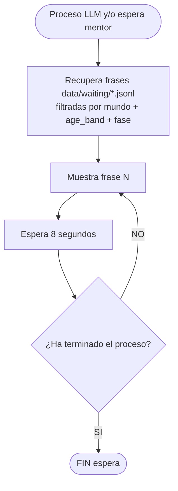
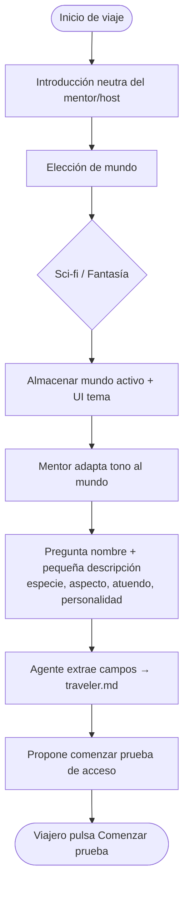
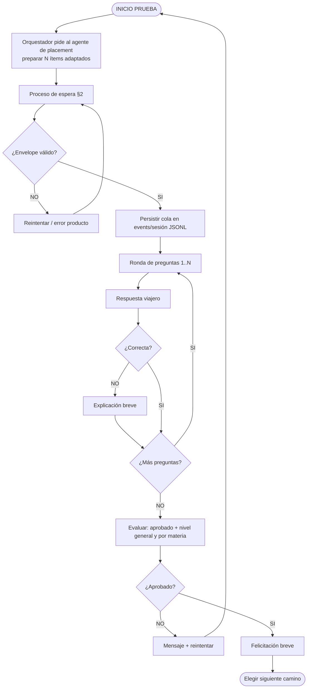
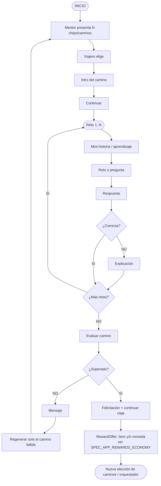
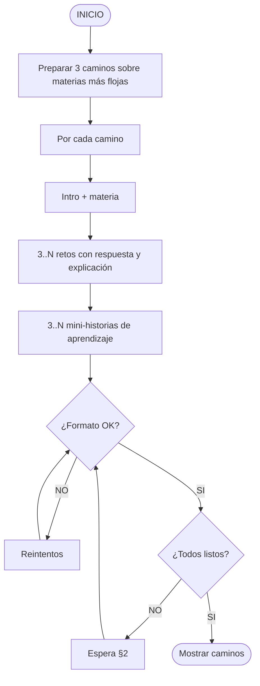
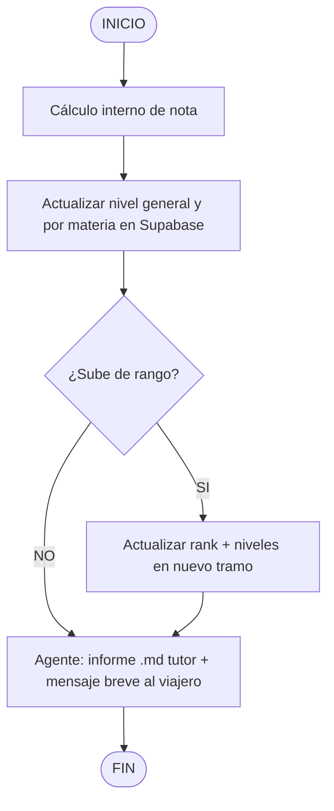

# Spec: Mecánicas de viaje (flujos de juego)

> Estado: **aprobada** (ago 2026)  
> Fuente: notas de producto (ago 2026) + decisiones de almacenamiento  
> Relacionado: [SPEC_DATA_STORAGE_LAYERS.md](SPEC_DATA_STORAGE_LAYERS.md), [SPEC_APP_PLAY_FIRST_RUN.md](SPEC_APP_PLAY_FIRST_RUN.md), [SPEC_APP_WAITING_PHRASES.md](SPEC_APP_WAITING_PHRASES.md), [SPEC_AI_CENTRAL_ORCHESTRATOR.md](SPEC_AI_CENTRAL_ORCHESTRATOR.md), [SPEC_APP_PARALLEL_WORLDS.md](SPEC_APP_PARALLEL_WORLDS.md), [SPEC_APP_PROGRESSION_RANKS.md](SPEC_APP_PROGRESSION_RANKS.md), [SPEC_APP_SUBJECT_CATALOG.md](SPEC_APP_SUBJECT_CATALOG.md)  
> **Diagrama:** [16-journey-mechanics-flows.md](../diagrams/16-journey-mechanics-flows.md)

## Contexto

La mecánica actual es lenta: mentor demasiado extenso, esperas poco claras, repetición de bancos. Se redefine el **flujo de juego** para que sea ágil, con prosa breve adaptada a mundo/edad/nivel, y contenido generado por agentes (sin PlacementBank ni plantillas largas).

## Objetivo

1. Diagramas normativos de: espera, inicio de viaje, prueba de acceso, elección de caminos, niveles/rango.
2. Reglas de tono/longitud del mentor.
3. Encaje con capas de almacenamiento (examen/retos en archivos).

---

## 1. Decisiones

| # | Decisión | Valor |
| --- | --- | --- |
| M1 | Mentor | Tono del mundo elegido; **breve y dinámico**; no prosa larga |
| M2 | Esperas | Frases desde **JSONL** `data/waiting/`; rotación cada **8 s**; sin spoilear lugares/personajes de la escena actual |
| M3 | Prueba de acceso | LLM prepara N preguntas + respuestas + explicaciones; **sin banco estático** |
| M4 | Caminos | 3 propuestas sobre materias flojas; pitch + NPC + `lesson_narrative` (teoría antes de retos) + 3 MCQ limpios en **un batch** `path_composer`; sin reenseñar en cada pregunta |
| M5 | Fallo de camino | Se puede regenerar **solo el camino fallido**; los otros dos se reutilizan |
| M6 | Persistencia de examen/retos | Ledger archivos ([SPEC_DATA_STORAGE_LAYERS](SPEC_DATA_STORAGE_LAYERS.md) D5) |
| M7 | Subida de nivel/rango | Tras cerrar examen o camino; informe `.md` tutor + mensaje breve al viajero |
| M8 | First-run personaje | Nombre + descripción (especie/aspecto/atuendo/personalidad); 1 paso si cabe, varios si hace falta |

---

## 2. Proceso de espera (mentor)

Reglas:

- Copy de espera **no** menciona lugares, NPCs ni spoilers del hilo actual.
- Fuente: [SPEC_APP_WAITING_PHRASES](SPEC_APP_WAITING_PHRASES.md) (JSONL), no LLM en caliente salvo regeneración de catálogo offline.
- UI: rotación ≥ 8 s entre frases distintas cuando haya stock.

---

## 3. Comenzar un viaje

Tras crear miembro de tripulación:

Notas:

- Si un solo turno de descripción es frágil, partir en N turnos (nombre → descripción).
- Con mundos paralelos, el primer viaje elige el mundo activo; el otro puede iniciarse después ([SPEC_APP_PARALLEL_WORLDS](SPEC_APP_PARALLEL_WORLDS.md)).

---

## 4. Prueba de acceso

Reglas:

- Ítems **generados** (materia, dificultad, age_band, mundo); anti-repetición consultando JSONL reciente del viajero.
- Scores y cola viven en **archivos de sesión**, no en `placement_exams`.
- Niveles oficiales resultantes se escriben en **Supabase** (fuente UI).

---

## 5. Elección de caminos

### 5.1 Interacción

> Delta ago 2026: al superar un camino (o nodos con offer), el servidor puede otorgar recompensas de **equipaje** y/o **moneda del mundo** — [SPEC_APP_REWARDS_ECONOMY](SPEC_APP_REWARDS_ECONOMY.md), [SPEC_APP_INVENTORY_BAGGAGE](SPEC_APP_INVENTORY_BAGGAGE.md). Placement (§4) **no** otorga economía en MVP.

### 5.2 Generación (orquestador → subagentes)

Adaptación obligatoria: mundo + edad + nivel del viajero (dificultad y prosa).

Estado del pack de caminos (textos, retos, progreso) → **ledger**; no `narrative_quests` en PG.

### 5.3 Batch enriquecido + NPCs (ago 2026)

El `path_composer` genera en **una sola llamada** el pack completo:

| Campo | Cuándo se muestra | Contenido |
| --- | --- | --- |
| `title` + `learning_blurb` | Elección (`choose_path`) | Chip + hint «de qué va» cada camino |
| `path_narrative` + `lesson_narrative` + `npc` | Al elegir (`path_intro`) | Escena breve + **lección completa** (teoría con NPC) **antes** de cualquier reto |
| `prompt_text` + opciones | Cada reto (`path_challenge`) | Solo pregunta MCQ (sin reenseñar); la opción marcada debe ser factualmente correcta |

Sin segunda llamada LLM por reto. La UI de elección muestra hints como en mundos/zonas.

**Calidad:** prioridad en **instrucciones** del `path_composer` (títulos en castellano distintos, lección → MCQ → explicación de la regla). Los rechazos duros del compose son **solo estructurales** (conteo de caminos/retos, `correct_option_id` ausente / prompt vacío). Avisos suaves (título cliché o copiado del mapa, lección/wrapper cortos, paleta, leak, explanation poco alineada) se registran en logs **sin** forzar reintentos ni el pack plantilla «Ruta de …».

---

## 6. Niveles y rango

Desencadenantes: fin de examen; fin de turnos de un camino.

---

## 7. Criterios de aceptación

1. Mentor en play no supera longitud objetivo documentada en [SPEC_APP_MENTOR_PROSE_CLARITY](SPEC_APP_MENTOR_PROSE_CLARITY.md) (actualizar si hace falta: “breve por defecto”).
2. Esperas usan solo `waiting_phrases` + ciclo 8 s.
3. Ningún flujo de placement lee `PlacementBank` / `default.json`.
4. Cola de examen y retos de camino aparecen en JSONL de sesión.
5. Diagramas de esta spec son la referencia de producto; [11-child-adventure-pipeline](../diagrams/11-child-adventure-pipeline.md) se alinea al aprobar.

## Fuera de alcance

- Copy exacto de cada frase de espera (seed en spec de waiting phrases).
- Rediseño completo UI ficha tripulante (tabs Detalles/Viaje/Ajustes — ver delta crew si se aprueba aparte).
