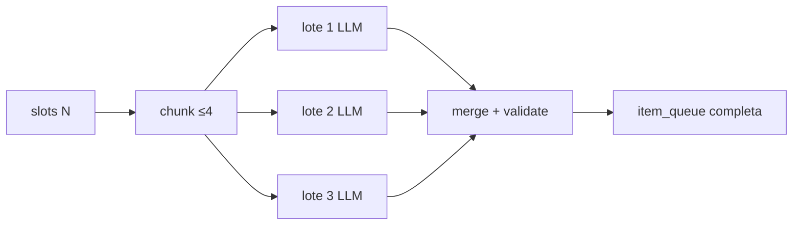

# Spec: Placement adaptado por edad y prosa narrativa del mentor

> Estado: **implementada** (31 jul 2026) — **delta A2** (1 ago 2026) compose paralelo; **delta 19 ago 2026:** suelo de banda + nivel de materia (`ChallengeDifficultyService`); **delta 20 ago 2026:** instrucciones anti-tautología, sin reintento pedagógico.  
> Relacionado: [SPEC_APP_SUBJECT_CATALOG.md](SPEC_APP_SUBJECT_CATALOG.md), [SPEC_APP_PLACEMENT_EXAM.md](SPEC_APP_PLACEMENT_EXAM.md), [SPEC_APP_AGE_BANDS.md](SPEC_APP_AGE_BANDS.md), [SPEC_APP_MENTOR.md](SPEC_APP_MENTOR.md), [SPEC_AI_PLAY_ORCHESTRATION.md](SPEC_AI_PLAY_ORCHESTRATION.md), [SPEC_APP_CREW_SECTION.md](SPEC_APP_CREW_SECTION.md), [SPEC_AI_GEMINI_GATEWAY.md](SPEC_AI_GEMINI_GATEWAY.md), [SPEC_APP_PATH_COMPOSER_TUTOR_CONTEXT.md](SPEC_APP_PATH_COMPOSER_TUTOR_CONTEXT.md)  
> Diagrama: [11-child-adventure-pipeline.md](../diagrams/11-child-adventure-pipeline.md)  
> **Delta** — catálogo y activación: [SPEC_APP_SUBJECT_CATALOG.md](SPEC_APP_SUBJECT_CATALOG.md).

## Contexto

El placement MVP usa banco JSON fijo + strings PHP. Esta spec define el **objetivo de producto**: agente contextual + pedagogía PHP + catálogo amplio configurable por tutor.

Ver [SPEC_APP_SUBJECT_CATALOG.md](SPEC_APP_SUBJECT_CATALOG.md) para el listado completo de materias, pesos y UI de activación en ficha tripulante.

## Objetivo

1. Placement con **1 reto por materia activa** del tripulante; dificultad por `age_band`.
2. Prosa del mentor generada por agente; complejidad del habla por banda.
3. Agente genera retos dentro de restricciones PHP; scoring en servidor.

---

## 1. Arquitectura: agente con matices

### 1.1 División de responsabilidades

| Capa | Responsable |
| --- | --- |
| Qué materias entran | `children.settings.learning.active_subjects` (tutor) ∩ catálogo |
| Dificultad / tipo ítem | PHP según `age_band` |
| Texto narrativo y reto | Agente + `PlayerState` |
| Respuesta correcta | Agente propone → PHP valida → persistir |
| Niveles / banda efectiva | PHP |

### Fallback (A1 — 1 ago 2026)

**Prohibido** degradar a banco seed (`default.json` / `pickQueue`) en el examen real. Si el agente no compone una cola completa tras reintentos: mensaje de reintento al explorador, sin ítems plantilla.

`PlacementBank` permanece para scoring helpers y tests; no rellena `item_queue` de producción.

### 1.2 Qué materias entran en el examen

```
materias_del_examen = active_subjects del tripulante
  (validadas contra SubjectCatalog)
```

No hay recorte por edad: un niño de 8 años con `politics` activo por el tutor **sí** recibe un reto de política con dificultad `band_child`.

Las **materias base por banda** ([SPEC_APP_SUBJECT_CATALOG.md](SPEC_APP_SUBJECT_CATALOG.md) §2) son sugerencia al declarar edad, no techo.

### 1.3 Carga del examen

| Regla | Valor |
| --- | --- |
| Retos por materia | 1 (default) |
| Retos extra | math y language: +1 reto si `band_teen` \| `band_adult` \| `band_senior` |
| Máximo materias | 14 (tamaño catálogo) |
| Reanudación | Obligatoria si `item_queue` no completada |
| Aviso tutor | Si `active_subjects.length > 10` |

### 1.4 Dificultad y tipo por banda

| `age_band` | `difficulty` | Tipos permitidos |
| --- | --- | --- |
| `band_early` | 1 | `mcq` |
| `band_child` | 1–2 | `mcq`, `short_text` corto |
| `band_tween` | 2–3 | mixto |
| `band_teen` | 2–4 | mixto; comprensión lectora en `reading` |
| `band_adult` | 3–5 | mixto; razonamiento |
| `band_senior` | 2–4 | como adult; léxico claro |

Aplica a **todas** las materias activas, incluidas `finance`, `politics`, `mythology`, etc.

### 1.4.1 Suelo de banda + nivel de materia (19 ago 2026)

`difficulty` de la tabla §1.4 es el **rango permitido** (`floor`–`ceil`), no un valor suelto que el LLM elige a ojo.

En **placement** (aún no hay `level_id`): el compositor recibe `floor`, `ceil` y `target` = punto medio del rango. El contenido curricular sigue la banda (p. ej. `math` + `band_teen` ≠ suma `10+5`).

En **caminos**: `target` se calcula en servidor (`ChallengeDifficultyService`) con `effective_age_band` + `level_id` + `accuracy_rolling` + `difficulty_modifier`. Fórmula y criterios: [SPEC_APP_PATH_COMPOSER_TUTOR_CONTEXT.md](SPEC_APP_PATH_COMPOSER_TUTOR_CONTEXT.md) § Calibración pedagógica.

**Invariante:** L1 no autoriza bajar del suelo de la banda. Un teen en refuerzo practica contenido de 14–17 años simplificado, no currículo de `band_early`.

### 1.5 Conocimiento previo vs lore del mundo (18 ago 2026)

El examen de ingreso **viste** el currículo con prosa del mundo; no convierte el canon inventado en temario.

| Superficie | Qué puede preguntarse |
| --- | --- |
| Placement | Solo **conocimiento escolar previo** (edad/banda + materia). Prohibido examinar mitos, héroes o lugares inventados del mundo. En `mythology`: mitos reales (p. ej. Prometeo), no «¿quién trajo el fuego en Binar Star?». |
| Caminos post-placement | Lore del mundo **solo** si acaba de enseñarse en `lesson_narrative` o en el `narrative_wrapper` de ese reto; si no, conocimiento escolar. |

Contrato de skills: `backend/skills/placement-exam/SKILL.md`, `subject-pedagogy`, `challenge-design`. Prompt de compose: `PLACEMENT_PRIOR_KNOWLEDGE_RULE` / `PATH_LORE_ONLY_IF_TAUGHT_RULE` / `MEANING_QUESTION_NO_ECHO_RULE`.

### 1.6 Instrucciones primero, sin reintento pedagógico (20 ago 2026)

La calidad MCQ (alineación pregunta↔opciones, anti-tautología de significado) se gobierna **solo** por skills y reglas inyectadas en el prompt. El compose **no** rechaza ni reintenta por avisos pedagógicos: eso duplicaba latencia del mentor.

Siguen en pie, porque rompen el envelope o el scoring:

- Schema Pydantic (`mcq_needs_options`, `correct_option_id` ausente).
- Conteo de ítems/caminos del lote.
- Inferencia de `correct_option_id` si el modelo pone el texto en vez del id.
- Filtro de franquicias conocidas.

Anti-tautología normativa: si la pregunta pide el significado/sinónimo de una palabra, ninguna opción puede ser esa palabra (p. ej. «inefable» → «que no se puede explicar», nunca el chip «Inefable»).

---

## 2. Prosa narrativa del mentor

### 2.1 Registro por mundo

Fantasy épica / space opera; sin jerga de «examen escolar».

### 2.2 Complejidad del habla por banda

| Dimensión | early | child | tween | teen | adult | senior |
| --- | --- | --- | --- | --- | --- | --- |
| Tono | Muy cálido | Aventura clara | Cercano | Respetuoso | Colega-mentor | Paciente, digno |
| Vocabulario | Concreto | + imágenes | Metáforas moderadas | Rico | Abstracto preciso | Como adult, sin jerga |
| Palabras/turno | 20–45 | 30–60 | 40–80 | 50–100 | 55–120 | 45–100 |

`band_teen` ≠ `band_adult` en sintaxis y registro.

### 2.3 Generación (no plantilla nominal)

Intro, cada reto, feedback, cierre: agente con `PlayerState` (edad, banda, traits, materia actual, mundo, mentor). Validador PHP de longitud y tono. Plantillas solo en degradación.

---

## 3. Criterios de aceptación

1. Placement incluye todas las `active_subjects` del tripulante (1 reto c/u).
2. Tutor añade `mythology` a un niño de 7 años → reto con `difficulty` 1, prosa `band_early`.
3. Teen y adult: prosa distinguible en fixtures.
4. Sin wrapper seco «Prueba N de M en la Escuela» en flujo nominal.
5. Agente + validador PHP; scoring sin LLM.
6. Integración con [SPEC_APP_SUBJECT_CATALOG.md](SPEC_APP_SUBJECT_CATALOG.md).

---

## Aprobación (v3)

- [x] Examen = materias activas del tripulante (catálogo 14)
- [x] Base por banda = sugerencia, no límite
- [x] Tutor configura materias en ficha
- [x] Dificultad/prosa por `age_band` (teen ≠ adult en habla)
- [x] Agente genera narrativa y retos (validación PHP); plantillas solo en degradación

**Decisión titular (31 jul 2026):** aprobado para implementación futura; esperar OK antes de codificar.

---

## Estado de implementación

| Fase | Estado |
| --- | --- |
| Specify | Cerrada (aprobada) |
| Plan / Task | [SUBJECT_CATALOG_PLACEMENT_ADAPTIVE_PLAN.md](../tasks/SUBJECT_CATALOG_PLACEMENT_ADAPTIVE_PLAN.md) |
| Implement | **Hecha** — `PlacementExamComposer` genera el examen completo vía agente; **sin banco seed** (A1 ago 2026); fallo → reintento UI; **A2** lotes ≤4 + paralelismo + sticky + copy espera por edad/mundo |
| Validate | PHPUnit `PlacementAdaptiveTest` + `PlacementAgentOnlyAndQueuesTest` |

### Entregado

1. `SubjectCatalog` + tests
2. `children.settings.learning` + API PATCH + UI checklist
3. `PlacementExamComposer` + `PlacementItemValidator` (agente primero)
4. ~~`PlacementBank` como fallback seed~~ **retirado del camino feliz (A1)**
5. `PlacementNarrator` + feedback con explicación
6. Prompts `shared/Ai/prompts/placement_exam_composer.es.md` (castellano ES)
7. Colas de modelo por purpose en BD (`ai_purpose_model_queues`, B1)

---

## A2 — Compose paralelo por lotes + priorización de modelos (1 ago 2026)

> Estado: **implementada** (1 ago 2026) — aprobada e implementada.  
> Motivación (logs locales): con `slot_count=16` un único `complete()` produce `json_invalid` o agota wall budget; modelos free fiables (p. ej. `ling-3.0-flash`) responden mejor a payloads pequeños.

### A2.1 Problema

Hoy `PlacementExamComposer` pide **todos los slots en una sola llamada** LLM. Con muchas materias activas:

1. El JSON es demasiado grande → `json_invalid` / truncado.
2. Un solo intento lento + reintentos → UX lenta y riesgo de 504 / wall budget.
3. La cola BD prioriza modelos «grandes» que timeout; no favorece modelos con **éxito reciente** en este purpose.

### A2.2 Objetivo

1. Partir el plan de slots en **lotes pequeños** que cualquier modelo free razonable pueda completar.
2. Ejecutar lotes en **paralelo** (concurrency acotada) para reducir latencia wall-clock.
3. **Priorizar modelos válidos** (éxito reciente, no en cooldown) al resolver la cola de `placement_exam_composer`.
4. UX: mensajes de espera del mentor **sin** «armar un examen» / jerga de «examen» escolar; rotación **lenta** para poder leer.

### A2.3 Partición de slots

| Parámetro | Default | Env |
| --- | --- | --- |
| `COMPOSE_BATCH_MAX_SLOTS` | **4** | `AI_COMPOSE_BATCH_MAX_SLOTS` |
| Umbral «pocos slots» (una sola petición) | ≤ `COMPOSE_BATCH_MAX_SLOTS` | — |
| Concurrencia máx. de lotes | **3** | `AI_COMPOSE_BATCH_CONCURRENCY` |
| Reintentos por lote (tras fallo JSON/slots) | **2** | `AI_COMPOSE_BATCH_RETRIES` |

Algoritmo:

```
slots = examSubjectSlots(band, active_subjects)   # orden barajado como hoy
if count(slots) <= COMPOSE_BATCH_MAX_SLOTS:
  batches = [slots]                                 # camino actual (1 LLM)
else:
  batches = chunk(slots, COMPOSE_BATCH_MAX_SLOTS)  # p. ej. 16 → 4+4+4+4
```

Cada lote llama al mismo purpose `placement_exam_composer` con **solo** los `slots` del chunk (misma schema JSON, menos ítems). El prompt indica `slot` local 0..n-1 **o** conserva el índice global del plan — **decisión:** conservar **índice global** del plan original en el campo `slot` para merge trivial.

### A2.4 Paralelismo (PHP)

| Regla | Valor |
| --- | --- |
| Runtime | `curl_multi` / Guzzle Pool **dentro** de `PlacementExamComposer` (no N requests HTTP del cliente) |
| Aislamiento | Cada lote = 1 `AiGateway::complete` independiente (propia traza / call_id) |
| Fallo de un lote | Reintentar ese lote (hasta `AI_COMPOSE_BATCH_RETRIES`); si sigue fallando → compose fallido completo (mensaje reintento al explorador, A1) |
| Merge | Concatenar ítems por `slot` ascendente; `requireCompleteSlots` sobre la cola unida |
| Wall budget | Presupuesto **por lote** = `AI_GATEWAY_WALL_BUDGET_SECONDS`; wall-clock total esperado ≈ ceil(n_batches / concurrency) × latencia_media_lote |
| Timeout nginx | Ya 300 s en `/api/v1/play/*`; objetivo UX: **&lt; 45 s** típico con 3×4 slots en paralelo |



### A2.5 Priorización de modelos «válidos»

Complementa cooldown ([SPEC_AI_GEMINI_GATEWAY.md](SPEC_AI_GEMINI_GATEWAY.md)):

| Señal | Efecto en resolución de cola |
| --- | --- |
| Cooldown activo | Omitir |
| Éxito reciente en `placement_exam_composer` (p. ej. última ventana 24–72 h en `ai_call_attempts` o contador en `ai_runtime_state` / tabla ligera) | **Subir** al frente de la cola resuelta |
| Fallo `json_invalid` / `empty` reciente (sin cooldown duro) | **Bajar** prioridad (soft demote), no ban permanente |
| Orden BD `position` | Desempate tras score de éxito |

Detalle de persistencia: ver gateway §4.6 (delta). Composer y gateway siguen **solo free**.

Para lotes en paralelo: preferible **reutilizar el mismo modelo ganador** del primer lote exitoso en los lotes restantes de la misma compose (opcional, env `AI_COMPOSE_STICKY_WINNER=true` default **true**) para homogeneidad y menos fallos JSON.

### A2.6 Contrato de debug / logs

| Canal | Eventos nuevos |
| --- | --- |
| `compose` | `placement_compose_batch` (batch_index, slot_count, model, ok, latency_ms) |
| `compose` | `placement_compose_failed` incluye `batches: [{index, outcome, call_id}]` |
| `ai` | Un `llm_attempt` por lote (como hoy) |
| Panel debug | `compose_debug.batches[]` |

### A2.7 Copy de espera (cliente `#/play`) — UX

Problema anterior (`web/js/scenes/play.js` `thinkingLines('preparing_exam')`):

- Usaba «**arma un examen**» / «diseña un **examen**» (prohibido en producto narrativo; el prompt del composer ya lo evita).
- Rotación cada **3,2 s** en `preparing_exam` — demasiado rápido para leer.
- No diferenciaba tono por **edad** del explorador.

| Regla | Valor |
| --- | --- |
| Léxico | Preferir **prueba de ingreso / umbral / protocolo de acceso**; **prohibido** «armar» y preferible evitar «examen» en burbujas de espera |
| Rotación `preparing_exam` | **≥ 8 s** entre frases (default **9000** ms) |
| Rotación otros kinds | Sin cambio obligatorio (mantener ≥ 4,5 s) |
| Mundo | Variantes **fantasy** y **sci-fi** |
| Edad (`age_band`) | Variantes de tono: `early` (suave/corto), `child` (aventura clara), `teen`/`tween` (directo), `adult`/`senior` (más denso/literario) |
| API | `openSession` / `submitTurn` exponen `age_band` (+ `age_years`) para que el cliente elija el tono |

Ejemplos fantasy (orientativos):

- early: «{mentor} prepara tu prueba de ingreso: busca retos divertidos en la biblioteca…»
- child: «{mentor} prepara tu prueba de ingreso: busca las mejores preguntas en la biblioteca…»
- teen: «{mentor} prepara tu prueba de ingreso entre los anaqueles de la Escuela…»
- adult: «{mentor} compone tu prueba de ingreso con criterio en la biblioteca de la Escuela…»

### A2.8 Criterios de aceptación

1. Con `slot_count ≤ 4`: una sola llamada LLM (regresión del camino actual).
2. Con `slot_count = 16`: ≥ 2 lotes; concurrency ≤ 3; merge completa todos los slots o fallo A1.
3. Modelos en cooldown no se usan; modelos con éxito reciente aparecen antes en la cola resuelta.
4. Logs `compose` muestran batches; fallo parcial de un lote no entrega cola incompleta al niño.
5. UI espera: sin «armar»; sin «examen» en las frases de `preparing_exam`; intervalo ≥ 8 s; tono según `age_band` + mundo.
6. PHPUnit: chunk/merge; mock gateway con N completes; soft-rank por éxito.
7. Latencia wall-clock esperada menor que un monolito de 16 slots (medible en logs `duration_ms` del turn).

### A2.9 Fuera de alcance

- Cambiar el número de materias del tutor o recortar el catálogo.
- Streaming token-a-token al cliente.
- Modelos de pago.
- Generar lotes desde el **navegador** (todo el paralelismo es servidor).

### A2.10 Aprobación

- [x] Partición ≤ 4 slots + paralelismo servidor (concurrency 3)
- [x] Sticky winner opcional entre lotes de la misma compose
- [x] Prioridad por éxito + cooldown (gateway §4.6)
- [x] Copy espera sin «armar» / sin «examen»; rotación ≥ 8 s; variantes por `age_band` + mundo
- [x] OK explícito del usuario (1 ago 2026) → implementada
