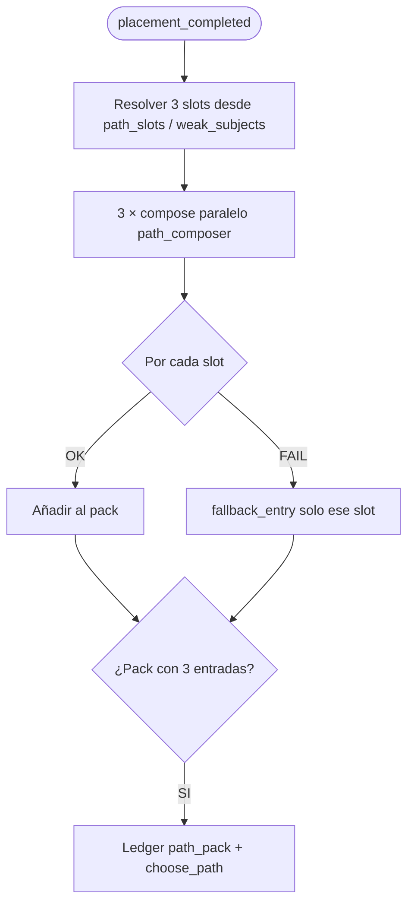
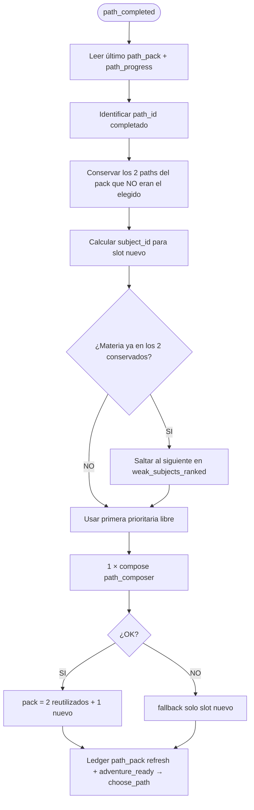

# Spec: Path composer — slots paralelos y reutilización de pack

> Estado: **aprobada — implementada** (fases 0–2, 20 ago 2026)  
> Relacionado: [SPEC_APP_JOURNEY_MECHANICS.md](SPEC_APP_JOURNEY_MECHANICS.md) §5, [SPEC_APP_PATH_COMPOSER_TUTOR_CONTEXT.md](SPEC_APP_PATH_COMPOSER_TUTOR_CONTEXT.md), [SPEC_AI_GEMINI_GATEWAY.md](SPEC_AI_GEMINI_GATEWAY.md), [SPEC_AI_JOURNEY_FILE_LEDGER.md](SPEC_AI_JOURNEY_FILE_LEDGER.md), [SPEC_APP_FILE_LOGGING.md](SPEC_APP_FILE_LOGGING.md), [SPEC_APP_PATH_CHALLENGE_COUNT.md](SPEC_APP_PATH_CHALLENGE_COUNT.md) *(implementada: `path_challenge_count_short` = &lt; N)*  
> **Diagrama:** [16-journey-mechanics-flows.md](../diagrams/16-journey-mechanics-flows.md) §5 (actualizar al implementar)

## Contexto

Hoy `path_composer` genera **3 caminos en una sola llamada** (`PathPackEnvelope`, `paths.length = 3`). Si un camino del JSON falla la validación estructural, **se descarta el pack entero** y, tras agotar reintentos, cae en plantilla «Práctica de {materia}».

Incidente real (20 ago 2026): 4 respuestas LLM OK (`gemini-3.1-flash-lite`), pero `path_parse_failed` → fallback con `path_1/2/3` sin `model_used`.

Además, al **superar un camino** (`adventure_ready`), el servidor vuelve a componer **3 caminos nuevos**, aunque el jugador solo consumió uno y los otros dos del pack anterior siguen siendo válidos.

## Objetivo

1. **Componer por slot** (3 llamadas paralelas, 1 camino cada una) para aislar fallos y reducir JSON gigante.
2. **Reutilizar** los 2 caminos no elegidos al cerrar un camino; componer **solo 1** camino nuevo.
3. Mantener priorización tutor + diversidad de materias ([SPEC_APP_PATH_COMPOSER_TUTOR_CONTEXT](SPEC_APP_PATH_COMPOSER_TUTOR_CONTEXT.md)).
4. **Observabilidad:** loguear motivo estructural de rechazo por slot (implementado 20 ago 2026).

---

## 1. Decisiones

| # | Decisión | Valor |
| --- | --- | --- |
| P1 | Unidad de compose | **1 camino = 1 llamada LLM** (`PathSingleEnvelope` o `PathPackEnvelope` con `paths.length = 1`) |
| P2 | Paralelismo | 3 slots en `asyncio.gather` con concurrencia acotada (`AI_COMPOSE_BATCH_MAX_SLOTS`, default 3) |
| P3 | Reintentos | **Por slot**, no por pack; mismos `AI_COMPOSE_BATCH_RETRIES` |
| P4 | Éxito parcial | Si ≥1 slot OK → pack jugable; slots fallidos → `fallback` **solo ese slot** |
| P5 | Pack vacío | Si los 3 slots fallan → pack plantilla completo (comportamiento actual) |
| P6 | Tras completar camino | Reutilizar 2 no elegidos + 1 compose nuevo → nuevo `path_pack` |
| P7 | Materia del slot nuevo | Primera de `weak_subjects_ranked` **no presente** en los 2 reutilizados |
| P8 | Sin materia libre | Si las 2 reutilizadas ya cubren las 3 materias prioritarias → elegir siguiente en ranking aunque repita materia (caso raro; log `path_reuse_subject_collision`) |
| P9 | Post-placement | Primera encrucijada: **3 composes paralelos** (sin reutilización previa) |
| P10 | Rewind / reemit | Sigue leyendo último `path_pack` del ledger; no recompone salvo retry explícito |
| P11 | Batch legacy | Retirar compose monolítico de 3 caminos cuando P1–P6 estén en prod |

---

## 2. Modelo de datos

### 2.1 Envelope (nuevo contrato agente)

```ts
interface PathSingleEnvelope {
  agent_text: string;
  path: PathDetail;  // path + challenges[3]
  meta?: Record<string, unknown>;
}
```

Alternativa compatible: seguir `PathPackEnvelope` con `paths.length === 1` en cada llamada (menos cambio en registry).

### 2.2 Entrada de pack (sin cambio)

Cada entrada del array `pack[]` en evento ledger `path_pack` conserva el shape actual (`path_id`, `subject_id`, `title`, `lesson_narrative`, `challenges[]`, `model_used`, …).

### 2.3 Metadatos de reutilización (ledger)

Nuevo evento opcional `path_pack_refresh` o ampliar payload de `path_pack`:

```json
{
  "pack": [ "...3 entries..." ],
  "compose_mode": "full_parallel | refresh_after_complete",
  "reused_path_ids": ["path_reading_01", "path_geo_02"],
  "composed_slots": [{ "slot_index": 2, "subject_id": "geography", "model": "gemini-3.1-flash-lite" }],
  "fallback_slots": []
}
```

---

## 3. Flujo A — Primera elección (post-placement)



**Prompt por slot:** el actual `_path_compose_prompt` acotado a `path_count = 1` + bloque del slot (`subject_id`, `target`, nota tutor).

---

## 4. Flujo B — Tras superar un camino



**Reglas:**

- Los 2 caminos reutilizados conservan `path_id`, títulos y retos **tal cual** (no se reescriben).
- El camino **completado** sale del pack; no vuelve a mostrarse.
- El orden en UI: conservar orden relativo de los 2 reutilizados; insertar el nuevo en la posición del completado o al final (decisión UI: **al final** para no confundir chips ya vistos).
- `adventure_ready` + continue → presenta `choose_path` **sin** recomponer los 3.

---

## 5. Selección de materia para el slot nuevo

Entrada: `PathComposerContextService.build_context` → `weak_subjects_ranked`, `path_slots`, `learning.subject_priorities`.

Algoritmo:

```
reused_subjects = {p.subject_id for p in reused_paths}
candidates = [s for s in weak_subjects_ranked if s.subject_id not in reused_subjects]
if candidates empty:
  log path_reuse_subject_collision
  candidates = weak_subjects_ranked  # permite repetir materia
pick = candidates[0].subject_id
```

Invariante preferente (T6 tutor context): si hay ≥3 materias activas y las 2 reutilizadas ocupan 2 materias distintas, el slot nuevo **debe** ser una tercera materia cuando exista en ranking.

---

## 6. Paralelismo y gateway

| Parámetro | Valor |
| --- | --- |
| Concurrencia | `min(3, AI_COMPOSE_BATCH_MAX_SLOTS)` |
| Modelo | Misma cadena `path_composer` en [SPEC_AI_GEMINI_GATEWAY](SPEC_AI_GEMINI_GATEWAY.md) (lite primero) |
| Timeout | Hereda gateway; un slot lento no bloquea a los otros |
| Coste RPD | 3× llamadas por encrucijada completa; **1×** tras cada camino superado (ahorro neto en sesiones largas) |

Reutilizar patrón de `ParallelLlmBatch` / placement batch donde aplique; cada slot llama `run_purpose("path_composer", …, expect_type=PathSingleEnvelope)`.

---

## 7. Logging (implementado 20 ago 2026)

Canal `compose` — eventos:

| message | Cuándo | Campos clave |
| --- | --- | --- |
| `path_compose_path_parse_failed` | Rechazo estructural de un camino | `path_index`, `subject_id`, `issue`, `model`, `challenges_received` |
| `path_compose_challenge_unscorable` | MCQ no puntuable | + `path_index`, `subject_id`, `prompt` (120 chars) |
| `path_compose_batch_exhausted` | Agotados reintentos (modo batch legacy) | + `path_index`, `subject_id`, `model` |
| `path_compose_slot_ok` | *(nuevo)* Slot paralelo OK | `slot_index`, `subject_id`, `model`, `latency_ms` |
| `path_compose_slot_fallback` | *(nuevo)* Slot → plantilla | `slot_index`, `subject_id`, `issue` |
| `path_pack_refresh` | *(nuevo)* Reutilización tras complete | `reused_path_ids`, `new_subject_id`, `compose_mode` |

Códigos `issue` estructurales:

| issue | Significado |
| --- | --- |
| `path_challenge_count_short` | Menos de 3 retos en la respuesta. **Propuesta:** menos de N tutor ([SPEC_APP_PATH_CHALLENGE_COUNT](SPEC_APP_PATH_CHALLENGE_COUNT.md)). |
| `path_mcq_needs_options` | MCQ con &lt;2 opciones |
| `path_mcq_invalid_correct_option` | `correct_option_id` ausente o inválido |
| `franchise_violation` | Texto con franquicia prohibida |
| `pack_count_mismatch` | *(solo batch legacy)* `paths.length ≠ 3` |

---

## 8. API / fases play (sin cambio de contrato HTTP)

- `choose_path`: mismas opciones (`id`, `label`, `description`).
- `adventure_ready` → continue: dispara refresh de pack (flujo B) antes del turno `choose_path`.
- Effects: mantener `path_completed`; opcional `path_pack_refreshed` para debug.

---

## 9. Criterios de aceptación

### Logging (fase 0 — hecho)

1. Rechazo por &lt;3 retos emite `path_compose_path_parse_failed` con `issue=path_challenge_count_short`.
2. `path_compose_batch_exhausted` incluye `path_index`, `subject_id`, `model` cuando aplica.

### Compose paralelo (fase 1)

3. Post-placement: exactamente **3** llamadas `path_composer` en paralelo (test con mock de `run_purpose`).
4. Un slot inválido + dos OK → pack con 2 LLM + 1 fallback (no pack plantilla completo).
5. Tres slots inválidos → pack plantilla completo (como hoy).

### Reutilización (fase 2)

6. Tras `path_completed`, ledger registra `reused_path_ids` con 2 ids y un solo compose nuevo.
7. Materia del slot nuevo no coincide con las 2 reutilizadas cuando hay tercera materia en ranking.
8. El jugador ve en `choose_path` 2 títulos ya vistos + 1 nuevo.
9. Rewind a `choose_path` no dispara compose si `path_pack` vigente existe.

### Regresión

10. [SPEC_APP_PATH_COMPOSER_TUTOR_CONTEXT](SPEC_APP_PATH_COMPOSER_TUTOR_CONTEXT.md) T6 diversidad sigue cumpliéndose en primera encrucijada.
11. Smoke `app.scripts.smoke_placement_paths` pasa con Gemini real (o documentar skip en CI).

---

## 10. Plan de implementación sugerido

| Fase | Alcance | Riesgo |
| --- | --- | --- |
| **0** | Logging motivo parse (este PR) | Bajo |
| **1** | 3 slots paralelos post-placement; retirar batch 3-en-1 | Medio |
| **2** | Refresh pack tras `path_completed` | Medio |
| **3** | Actualizar `path_composer.md`, diagrama 16, agente envelope | Bajo |

---

## 11. Riesgos y mitigaciones

| Riesgo | Mitigación |
| --- | --- |
| 3× RPD en primera encrucijada | Compensado con 1 llamada tras cada camino; lite primero |
| Pack reutilizado «viejo» tras mucho progreso | Recalcular `target` solo en slot nuevo; opcional invalidar reutilizados si `level_id` subió (fase posterior) |
| Orden de chips confunde al niño | Copy mentor: «Siguen ahí dos rutas que dejaste; hay una nueva» |
| Carrera si el usuario pulsa muy rápido | Idempotencia: un solo `path_pack` activo por sesión+mundo; compose bajo lock lógico |

---

## 12. Fuera de alcance (esta spec)

- Regenerar **solo** el camino fallido en medio del recorrido (M5 journey) — alinear en spec aparte si difiere del refresh post-complete.
- Recompose por cambio de notas tutor entre caminos.
- UI de carga distinta por slot (sigue `waiting_hints` fase `path_compose`).
