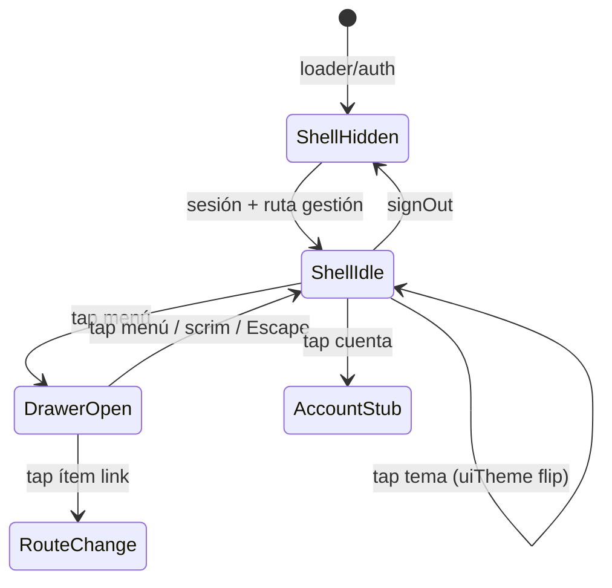

# Spec: Shell de aplicación post-login (chrome global)

> Estado: **aprobada** (julio 2026)  
> Relacionado: [SPEC_LOADER_APP_GATE.md](SPEC_LOADER_APP_GATE.md), [SPEC_APP_AUTH.md](SPEC_APP_AUTH.md), [SPEC_WORLD_LAYERS_PERSISTENCE.md](SPEC_WORLD_LAYERS_PERSISTENCE.md), [SPEC_APP_VISUAL_DESIGN_V3.md](SPEC_APP_VISUAL_DESIGN_V3.md), [SPEC_WEB_FRONTEND_ARCHITECTURE.md](SPEC_WEB_FRONTEND_ARCHITECTURE.md), [docs/kidepik.md](../../docs/kidepik.md) §5–6, §9

## Contexto

Tras un login válido, la app entra en rutas autenticadas (hoy `#/home` placeholder). El fondo sigue siendo el **mundo dual procedural** del loader (mitad sci-fi + mitad fantasía), persistente entre escenas ([SPEC_WORLD_LAYERS_PERSISTENCE.md](SPEC_WORLD_LAYERS_PERSISTENCE.md)).

Falta el **chrome de producto**: elementos de UI que permanecen visibles en **todas** las secciones autenticadas (home, futuras cuentas de niño, ajustes, etc.) **antes** de entrar en una sesión de juego de un perfil infantil.

## Objetivo

Definir, con detalle de diseño y comportamiento, el **shell global post-login**:

1. Tres botones circulares fijos (menú, toggle tema, cuenta).
2. Un menú lateral desplegable desde la izquierda.
3. Un **modo visual de UI** sci-fi ↔ fantasía que gobierna tipografía e iconografía del chrome (y del resto de secciones que lo consuman).
4. Estética **glass** (fondo blanco semitransparente + blur) sobre el mundo animado.

Esta spec es el contrato para implementación SDD/TDD. **No se implementa código de producto hasta aprobación explícita.**

---

## Alcance

### Incluido

| Superficie | Descripción |
| --- | --- |
| Top chrome | Iconos menú (izq.), toggle tema (der.), cuenta (der. extremo) |
| Drawer | Panel lateral izquierdo con logo + ítems placeholder (algunos expandibles) |
| Tema UI padre | Persistencia y aplicación de `sci-fi` \| `fantasy` al chrome y al shell |
| Estilo glass | Tokens, botones redondos, superficie del drawer |
| Iconografía | Extensión del generador procedural existente (`loader-world-arrows.js` → catálogo UI dual) |
| Integración mundo | Chrome como overlay; capas procedurales siguen animándose debajo |

### Excluido (specs futuras)

| Tema | Notas |
| --- | --- |
| Contenido real del menú (rutas, deep-links) | Solo placeholders en esta fase |
| Pantalla de gestión de cuenta padre | El botón cuenta abre placeholder o stub navegable |
| Perfiles de niño y su tema propio | Solo se reserva el modelo de datos / API de tema |
| HUD de sesión de juego | Distinto del chrome de gestión |
| Sustituir FABs legales actuales | Legal **pre-login** sigue con flechas procedurales; con sesión ver [SPEC_LEGAL_AUTHENTICATED_SESSION.md](SPEC_LEGAL_AUTHENTICATED_SESSION.md) |
| Onboarding alta de niño / selector de mundo de juego | Fuera de shell |

---

## Principios

| Principio | Decisión |
| --- | --- |
| Un solo chrome | Misma instancia (o mismo contrato visual) en todas las rutas autenticadas de “gestión” |
| Mundo debajo, UI encima | El fondo dual nunca se sustituye por un color sólido en estas secciones |
| Glass, no paneles opacos | Controles y drawer dejan ver el mundo con blur |
| Tema UI ≠ mundo de juego del niño | El toggle del shell afecta la **UI general del adulto** (y futuras pantallas de gestión); cada cuenta de niño tendrá su propia preferencia sci-fi/fantasía al entrar en juego |
| Iconos legibles | Siluetas blancas sólidas, semántica clara sin depender del color |
| Tipografía dual | Sci-fi → Bruno Ace / Orbitron; Fantasía → Uncial Antiqua / Cinzel (mismas familias que loader/auth) |
| Touch ≥ 48 px | Área táctil mínima; el círculo visual puede ser 40–44 px si el hit-area es ≥ 48 |
| Safe-area | Respetar `env(safe-area-inset-*)` en notch / home indicator |
| Reduced motion | Abrir/cerrar drawer y cambio de tema sin animaciones largas |

---

## Anatomía (viewport 390×844)

### Estado cerrado (solo chrome)

```
┌─────────────────────────────────────┐
│ [≡]              [◐] [☺]            │  ← top chrome (glass FABs)
│                                     │
│         [ mundo dual animado ]      │
│         (sci-fi arriba /            │
│          fantasía abajo)            │
│                                     │
│         [ contenido de sección ]    │  ← home, etc. (debajo z-index chrome)
│                                     │
└─────────────────────────────────────┘
```

Orden horizontal superior:

| Posición | Control | ID |
| --- | --- | --- |
| Arriba **izquierda** | Menú general | `shell-fab-menu` |
| Arriba **derecha**, **izquierda** del de cuenta | Toggle sci-fi ↔ fantasía | `shell-fab-theme` |
| Arriba **derecha**, extremo | Cuenta de gestión (padre/tutor) | `shell-fab-account` |

### Estado drawer abierto

```
┌──────────────────┬──────────────────┐
│                  │                  │
│   [ logo K ]     │   (scrim)        │
│                  │                  │
│  🏠 Inicio       │   mundo visible  │
│  👨‍👩‍👧 Familia  ▾  │   atenuado       │
│     · Perfiles   │                  │
│     · Ajustes…   │                  │
│  ⚙  Ajustes      │                  │
│  📜 Legal     ▾  │                  │
│     · Términos   │                  │
│     · Privacidad │                  │
│  🚪 Salir        │                  │
│                  │                  │
└──────────────────┴──────────────────┘
     ↑ drawer glass
```

---

## 1. Top chrome — botones circulares

### 1.1 Geometría y layout

| Token / valor | Spec |
| --- | --- |
| Diámetro visual | **44 px** (`--shell-fab-size: 44px`) |
| Hit-area | Mínimo **48×48** (padding invisible o `min-width/height` en el botón) |
| Forma | Círculo perfecto (`border-radius: 999px`) |
| Margen superior | `max(12px, env(safe-area-inset-top))` |
| Margen lateral izq. (menú) | `max(12px, env(safe-area-inset-left))` |
| Margen lateral der. (cuenta) | `max(12px, env(safe-area-inset-right))` |
| Gap entre toggle y cuenta | **10 px** |
| z-index | Por encima del contenido de sección y del mundo; por debajo de modales futuros (`--z-shell-chrome`) |
| **Responsive** | El chrome y el drawer se anclan al **rect real de `#app`** (`shell-frame.js` + `ResizeObserver`). Con shell activo, `#app` es **ancho completo**; solo `.section-frame` limita su ancho en viewports anchos ([SPEC_APP_SECTION_FRAME.md](SPEC_APP_SECTION_FRAME.md) §2.2c) |

Los tres botones viven en una capa fija alineada con `#app` que **no scrollea** con el contenido de la sección.

### 1.2 Estilo glass (botones)

| Propiedad | Valor |
| --- | --- |
| Fondo | `rgba(255, 255, 255, 0.14)` — blanco con **alta transparencia** (nunca gris/negro semitransparente) |
| Blur | `backdrop-filter: blur(10px)` — **menos** que el drawer |
| Borde | `1px solid rgba(255, 255, 255, 0.30)` — blanco puro, opacidad **mayor** que el fondo |
| Sombra | `0 4px 14px rgba(0, 0, 0, 0.18)` (sutil; sin borde doble por `inset`) |
| Icono | Relleno **blanco puro** `#FFFFFF`, sin stroke de color |
| Pressed | `scale(0.94)` + fondo `rgba(255,255,255,0.22)` |
| Focus visible | Anillo `2px solid rgba(255,255,255,0.85)` offset 2 px |
| Hover (desktop) | Fondo `rgba(255,255,255,0.20)` |

**Prohibido:** overlays oscuros (`rgba(0,0,0,…)`) en el relleno glass de botones o drawer.

### 1.3 Iconos de los tres FABs

Todos generados con el **generador procedural de iconos UI** (§5), variante según tema activo del shell.

| FAB | Semántica | Glifo (concepto) | `aria-label` (ES) |
| --- | --- | --- | --- |
| Menú | Abrir navegación | Tres líneas horizontales (hamburguesa) estilizadas sci-fi o fantasía | «Abrir menú» / «Cerrar menú» según estado |
| Tema | Alternar modo UI | **Dual:** en modo sci-fi mostrar glifo de **castillo / escudo** (destino fantasía); en modo fantasía mostrar glifo de **nave / órbita** (destino sci-fi). Alternativa aceptable: un único glifo “yin dual” con dos mitades, siempre que se entienda el cambio | «Cambiar a modo fantasía» / «Cambiar a modo ciencia ficción» |
| Cuenta | Gestión padre | Silueta de persona / busto adulto (no monstruo/avatar niño) | «Cuenta» |

Reglas de glifo:

- Fill sólido blanco; sin degradados en el path.
- ViewBox canónico **100×100** (como flechas actuales); render a ~22–26 px dentro del FAB 44.
- Variante `sci-fi`: ángulos, chevrones, geometría “HUD”.
- Variante `fantasy`: curvas heráldicas / orgánicas, misma silueta semántica.

### 1.4 Comportamiento de cada FAB

#### Menú (`shell-fab-menu`)

- Tap → abre drawer (§2) si cerrado; cierra si abierto.
- `aria-expanded` refleja estado.
- `aria-controls` apunta al id del drawer.

#### Toggle tema (`shell-fab-theme`)

- Tap → alterna `uiTheme`: `sci-fi` ↔ `fantasy`.
- Efectos inmediatos (sin esperar red):
  1. `document.documentElement.dataset.shellTheme = uiTheme` (o token acordado).
  2. Regenerar / sustituir SVG de **todos** los iconos del chrome + drawer al tema nuevo.
  3. Aplicar familia tipográfica del tema a textos del drawer y a consumidores del shell.
  4. Persistir preferencia (§6).
- El **mundo procedural de fondo no se regenera** ni cambia de mitad por este toggle (el dual permanece; solo cambia la UI overlay).
- Animación de cambio: crossfade de iconos ≤ 200 ms; con `prefers-reduced-motion`, swap instantáneo.

#### Cuenta (`shell-fab-account`)

- Tap → en esta fase: navegar a stub `#/account` **o** abrir un panel placeholder “Cuenta (próximamente)” + acción “Cerrar sesión”.
- Sustituye el botón temporal “Cerrar sesión” del home welcome cuando el shell esté montado.
- Decisión de implementación (a confirmar en aprobación): **stub de ruta** preferido para no mezclar overlay de cuenta con drawer.

---

## 2. Drawer — menú general

### 2.1 Geometría

| Propiedad | Valor |
| --- | --- |
| Origen | Borde izquierdo; slide-in |
| Ancho | **78 %** del ancho del frame `#app`, máx. **320 px** |
| Alto | 100 % del frame (incl. safe-area) |
| Overlay / scrim | Capa a la derecha del drawer: `rgba(0,0,0,0.35)` + opcional `backdrop-filter: blur(2px)` |
| z-index | Por encima del top chrome al abrir (`--z-shell-drawer`) **o** chrome permanece visible encima del drawer salvo el FAB menú — **decisión cerrada:** el FAB menú permanece visible y usable; toggle y cuenta pueden quedar bajo scrim o visibles; **recomendación:** los tres FABs permanecen encima del scrim para no perder acceso |
| Cierre | Tap en scrim, tecla Escape, swipe izquierda→derecha opcional (fase 1.1), segundo tap en FAB menú |

### 2.2 Estilo glass (panel)

| Propiedad | Valor |
| --- | --- |
| Fondo | `rgba(255, 255, 255, 0.12)` — blanco transparente + glass (sin capas oscuras) |
| Blur | `backdrop-filter: blur(18px)` |
| Borde derecho | Opcional: `1px solid rgba(255, 255, 255, 0.28)` — mismo criterio que botones; si molesta visualmente, omitir |
| Sombra | `8px 0 24px rgba(0,0,0,0.16)` |
| Texto de ítems | `#FFFFFF` puro |
| Iconos de ítems | `#FFFFFF` sólido (generador) |
| Flecha expand/collapse | `#FFFFFF` sólido; rotación CSS al expandir |

### 2.3 Cabecera — logo

| Requisito | Valor |
| --- | --- |
| Asset | Mismo wordmark / ambigrama KidepiK usado en loader (`loader-logo` / asset canónico) |
| Posición | Superior del drawer, **centrado** horizontalmente |
| Tamaño | Ancho ~ **56–64 %** del drawer; altura auto |
| Margen top | `max(24px, env(safe-area-inset-top) + 8px)` |
| Margen bottom hasta lista | **20–24 px** |
| Motion | Sin órbita continua en drawer (estático o respiración muy sutil ≤ 3 % scale, off con reduced-motion) |

### 2.4 Lista de menú — placeholders

Cada fila:

| Elemento | Spec |
| --- | --- |
| Altura mínima fila | **52 px** |
| Padding horizontal | 16 px |
| Icono | 24×24 a la izquierda |
| Gap icono–texto | 12 px |
| Texto | 16–17 px, peso medium/semibold, color blanco |
| Tipografía | Según `uiTheme` activo (§4) |
| Filas expandibles | Flecha a la derecha (down/up); tap en fila padre pliega/despliega hijos |
| Sub-ítems | Indentación +24 px; altura 48 px; mismo estilo tipográfico a 15 px |
| Separadores | Opcional: línea `rgba(255,255,255,0.12)` entre grupos, no entre cada fila |
| Pressed fila | Fondo `rgba(255,255,255,0.10)` |

#### Catálogo placeholder (copy ES — aprobado)

| id | Label | Icono semántico | Tipo | Sub-ítems |
| --- | --- | --- | --- | --- |
| `home` | Inicio | Casa / portal | link → `#/home` | — |
| `crew` | Tripulación | Grupo / siluetas | stub «Próximamente» | — *(delta: solo `role=tutor`; crew ve `member` — [SPEC_APP_CREW_MEMBER_ACCOUNT.md](SPEC_APP_CREW_MEMBER_ACCOUNT.md))* |
| `legal` | Legal | Pergamino / chip | accordion | `Términos` → `#/legal/terminos`, `Privacidad` → `#/legal/privacidad` |
| `settings` | Ajustes | Engranaje / runa | stub «Próximamente» | — |
| `account` | Cuenta | Busto adulto | link → `#/account` | — |
| `signout` | Cerrar sesión | Puerta / logout | acción `signOut()` → `#/loader` | — |

Los stubs muestran toast/panel “Próximamente” o no-op documentado; no bloquean la validación visual.

### 2.5 Animación drawer

| Estado | Motion |
| --- | --- |
| Abrir | Slide **izquierda → derecha**: `translateX(-100%)` → `0` en **320 ms**, `cubic-bezier(0.4, 0, 0.2, 1)`; scrim fade 240 ms |
| Cerrar | Slide **derecha → izquierda** (inverso) **280 ms** |
| Implementación | **No** usar `hidden` en el panel (rompe la animación de cierre); solo `transform` + `visibility` |
| Reduced motion | Instantáneo o ≤ 80 ms |

### 2.5b Animación acordeones

| Estado | Motion |
| --- | --- |
| Expandir / plegar | `grid-template-rows: 0fr` ↔ `1fr` (o equivalente) en **280 ms**, `cubic-bezier(0.4, 0, 0.2, 1)` |
| Chevron | Rotación 0° → 180° sincronizada |
| Reduced motion | Sin animación de altura |

Al abrir: `document.body` (o el frame app) recibe `overflow: hidden` para no scrollear el fondo.

### 2.6 Accesibilidad drawer

- Contenedor: `role="dialog"` + `aria-modal="true"` **o** `role="navigation"` + `aria-label="Menú de la aplicación"` (preferencia: **navigation** si no es modal bloqueante; si el scrim captura foco, usar dialog).
- **Decisión propuesta:** `role="dialog"` modal con focus trap mientras abierto.
- Foco inicial: primer ítem o el logo (no enfocable) → primer link.
- Escape cierra y devuelve foco al FAB menú.
- Ítems accordion: `aria-expanded` en el botón padre; región `aria-controls`.

---

## 3. Tema UI del shell (`uiTheme`)

### 3.1 Definición

```ts
type ShellUiTheme = "sci-fi" | "fantasy";
```

Alineación con tokens existentes:

| `uiTheme` | Tipografía display | Equivalente `data-theme` legacy (si se reutiliza) |
| --- | --- | --- |
| `sci-fi` | Bruno Ace / **Orbitron** | `spaceOpera` |
| `fantasy` | Uncial Antiqua / **Cinzel** | `fantasy` |

Cuerpo de apoyo (labels secundarios, si hubiera): **Nunito** en ambos (no sustituye el display del menú).

### 3.2 Ámbito de aplicación (crítico)

| Ámbito | ¿Afecta el toggle del shell? |
| --- | --- |
| Iconos y tipografía del top chrome | Sí |
| Drawer (texto + iconos + flechas) | Sí |
| Futuras pantallas de gestión padre (home, cuenta, familia…) | Sí — consumen `uiTheme` |
| Capas procedurales del mundo (mitades) | **No** — siguen duales |
| Preferencia de mundo de **cada niño** al jugar | **No** — independiente; se define al crear/entrar en cuenta de juego |
| Legal pre-login / auth gate | **No** — fuera del shell autenticado |

### 3.3 Modelo futuro (solo reserva en esta spec)

```
parent_accounts.settings.ui_theme: "sci-fi" | "fantasy"   // chrome gestión
children[].world_theme: "sci-fi" | "fantasy"              // sesión de juego del niño
```

En MVP del shell:

- Persistencia **local** (`localStorage` key `kidepik.shell.uiTheme`) inmediata.
- Si existe API de bootstrap del padre, sincronizar cuando esté disponible (no bloquea UI).
- Default inicial: **`"fantasy"`** (aprobado).

### 3.4 Cascada CSS

Al cambiar tema:

```html
<html data-shell-theme="sci-fi|fantasy">
```

Reglas:

- `[data-shell-theme="sci-fi"] .shell-drawer__label { font-family: var(--font-shell-sci); }`
- `[data-shell-theme="fantasy"] .shell-drawer__label { font-family: var(--font-shell-fantasy); }`
- Los SVG se regeneran en JS al cambio (paths distintos), no solo via CSS filter.

---

## 4. Tipografía e iconografía del menú

| Elemento | Sci-fi | Fantasía |
| --- | --- | --- |
| Labels de menú | Orbitron / Bruno Ace, tracking ligero | Cinzel / Uncial Antiqua |
| Sub-ítems | Misma familia, peso menor o size −1 px | Igual |
| Iconos fila | Variante procedural `sci-fi` | Variante `fantasy` |
| Flecha accordion | `renderWorldArrowFabSvgInner({ theme: "sci-fi", direction: "down"|"up" })` | idem `fantasy` |

Contraste: texto blanco sobre glass + mundo oscuro/iluminado. Si en alguna zona el mundo es demasiado claro, el scrim del drawer + blur debe garantizar legibilidad (criterio: ratio aproximado AA para texto 16 px sobre el área media del drawer; validar con captura).

---

## 5. Generador de iconos UI (extensión)

### 5.1 Estado actual

`web/js/components/loader-world-arrows.js` genera flechas duales (`sci-fi` | `fantasy`) usadas en FABs legales.

### 5.2 Extensión requerida

Nuevo módulo (nombre propuesto): `web/js/components/shell-ui-icons.js`  
(o ampliar el existente a catálogo genérico `ui-icon-glyphs.js` — preferible **módulo nuevo** que reutilice helpers de path/rotate del de flechas para no mezclar API legal con shell).

API propuesta:

```js
/**
 * @typedef {"sci-fi"|"fantasy"} UiIconTheme
 * @typedef {"menu"|"theme-to-fantasy"|"theme-to-scifi"|"account"|"home"|"crew"|"member"|"settings"|"legal"|"signout"|"chevron"} UiIconId
 *
 * renderShellUiIconSvgInner({ id: UiIconId, theme: UiIconTheme, viewSize?: number, fill?: string }): string
 */
```

| `UiIconId` | Semántica visual mínima |
| --- | --- |
| `menu` | 3 barras (sci-fi: chevron-bars; fantasy: runic bars) |
| `theme-to-fantasy` | Castillo / escudo / hoja |
| `theme-to-scifi` | Nave / anillo orbital |
| `account` | Busto adulto |
| `home` | Casa / portal |
| `crew` | 2–3 siluetas (tripulación) |
| `member` | 1 silueta explorador (cuenta crew) |
| `settings` | Engranaje / runa hexagonal |
| `legal` | Documento / pergamino |
| `signout` | Puerta / flecha salida |
| `chevron` | Reexport / wrap de flecha mundo |

Tests (Node / Vitest o runner web tests existente):

- Cada `id` × cada `theme` produce ≥ 1 `path` con `d` no vacío.
- `fill` por defecto `#fff`.
- Determinismo: misma entrada → mismo HTML.

---

## 6. Persistencia y ciclo de vida

### 6.1 Cuándo montar el shell

| Condición | Acción |
| --- | --- |
| Ruta autenticada de gestión (`#/home`, futuras `#/account`, `#/family`, …) | Montar shell chrome |
| `#/loader`, `#/auth`, `#/auth/callback` | **No** montar |
| `#/legal/*` **sin** sesión | No montar (FABs legales actuales) |
| `#/legal/*` **con** sesión (desde menú) | Montar shell **o** mantener FABs legales + chrome — **propuesta:** montar shell y ocultar duplicados; el ítem Legal del drawer navega a legal **con** mundo persistente; FAB volver legal puede omitirse si el menú basta, o coexistir. **Confirmar en aprobación.** |

### 6.2 Persistencia del componente

Ideal: singleton `mountAppShell(root)` en `web/js/components/app-shell.js` que:

1. Se crea una vez al entrar en zona autenticada.
2. Sobrevive a navegación entre rutas de gestión (no se destruye en cada `renderHome`).
3. Se destruye en `signOut` / pérdida de sesión / salida a loader.

Compatible con `world-session` (el shell no posee las capas del mundo).

### 6.3 Estado

```js
{
  uiTheme: "sci-fi" | "fantasy",
  drawerOpen: boolean,
  expandedMenuIds: Set<string>, // accordions abiertos
}
```

`expandedMenuIds` puede ser efímero (no persistir) en MVP.

---

## 7. Capas z-index (propuesta)

| Capa | z-index token | Contenido |
| --- | --- | --- |
| Mundo procedural | bajo (existente loader) | Capas fantasy/space |
| Contenido de sección | medio | Welcome home, etc. |
| Scrim drawer | alto | Oscurecido |
| Drawer panel | alto+1 | Menú |
| Top chrome FABs | alto+2 | Siempre accesibles |
| Modales futuros | superior | — |

---

## 8. Módulos previstos

| Fichero | Responsabilidad |
| --- | --- |
| `web/js/components/app-shell.js` | Montaje chrome + drawer + estado |
| `web/js/components/shell-ui-icons.js` | Catálogo SVG dual |
| `web/js/lib/shell-theme.js` | get/set `uiTheme`, persistencia, `data-shell-theme` |
| `web/css/components/app-shell.css` | Glass FABs, drawer, scrim, motion |
| `web/js/scenes/home.js` | Consumir shell; retirar sign-out temporal del welcome |
| `web/js/main.js` | Garantizar shell en rutas autenticadas |
| `web/tests/shell-ui-icons.test.js` | Cobertura glifos |
| `web/tests/shell-theme.test.js` | Toggle + persistencia (jsdom/localStorage mock) |

---

## 9. Contratos de interacción (resumen)



---

## 10. Copy y i18n

| ID | ES (España) |
| --- | --- |
| `shell.menu.open` | Abrir menú |
| `shell.menu.close` | Cerrar menú |
| `shell.theme.toFantasy` | Cambiar a modo fantasía |
| `shell.theme.toSciFi` | Cambiar a modo ciencia ficción |
| `shell.account` | Cuenta |
| `shell.menu.home` | Inicio |
| `shell.menu.crew` | Tripulación |
| `shell.menu.member` | Tripulante |
| `shell.menu.member.sheet` | Mi ficha |
| `shell.menu.member.play` | Entrar al viaje |
| `shell.menu.legal` | Legal |
| `shell.menu.legal.terms` | Términos |
| `shell.menu.legal.privacy` | Privacidad |
| `shell.menu.settings` | Ajustes |
| `shell.menu.account` | Cuenta |
| `shell.menu.signout` | Cerrar sesión |
| `shell.stub.soon` | Próximamente |

---

## 11. Criterios de aceptación

1. En `#/home` (sesión válida), viewport **390×844**: visibles FAB menú (izq.), toggle tema y cuenta (der., toggle a la izquierda de cuenta).
2. Botones circulares glass: fondo blanco baja opacidad + blur; icono blanco sólido.
3. Tap menú: drawer slide desde la izquierda con logo KidepiK centrado arriba y lista placeholder con icono+texto.
4. Al menos dos ítems accordion abren/cierran sub-ítems con flecha down/up blanca del generador dual.
5. Toggle tema cambia tipografía e iconos del chrome y del drawer entre sci-fi y fantasía **sin** regenerar capas del mundo.
6. Preferencia de tema sobrevive a reload (localStorage).
7. Cerrar sesión desde menú (o cuenta) vuelve a `#/loader` y desmonta shell.
8. El mundo dual sigue animándose visible detrás del glass.
9. `prefers-reduced-motion`: drawer y swap de tema sin motion larga.
10. Playwright: flujo feliz (abrir menú, toggle tema, cerrar) + borde (Escape / scrim); capturas en `tmp/playwright-output/`.

---

## 12. Verificación

- Stack: `./scripts/poc-up.ps1` → `http://localhost:8082`
- Skill preview: `.cursor/skills/web-mobile-preview/SKILL.md`
- MCP Playwright, viewport 390×844
- Tests unitarios de iconos + theme en runner del repo `web/tests`

---

## 13. Relación con specs existentes

| Spec | Relación |
| --- | --- |
| SPEC_WORLD_LAYERS_PERSISTENCE | Shell no destruye sesión de mundo; overlay only |
| SPEC_LOADER_APP_GATE | Tras gate + sesión → home con shell |
| SPEC_APP_AUTH | Cuenta padre; sign-out desde shell |
| SPEC_APP_VISUAL_DESIGN_V3 | Extiende dirección glass/HUD; no sustituye paletas de mundo |
| Home placeholder actual | Welcome text permanece; sign-out temporal se mueve al shell |

---

## 14. Decisiones cerradas (aprobación jul 2026)

- [x] Default `uiTheme` inicial: **fantasy**
- [x] Tap cuenta → ruta `#/account` stub
- [x] En `#/legal/*` con sesión: shell montado
- [x] FABs del chrome por encima del scrim del drawer
- [x] Atributo DOM: `data-shell-theme`
- [x] Catálogo menú: Inicio, Tripulación, Legal, Ajustes, Cuenta, Cerrar sesión

## Aprobación

- [x] Usuario aprueba anatomía top chrome (menú izq. / tema + cuenta der.)
- [x] Usuario aprueba drawer glass + logo + placeholders + accordions
- [x] Usuario aprueba modelo **tema UI padre ≠ tema mundo niño**
- [x] Usuario aprueba estilo glass + iconos blancos del generador dual
- [x] Usuario aprueba labels del menú (§2.4) y decisiones de la §14

Siguiente: Implement (TDD iconos/tema primero) → Validate Playwright.

---

## 15. Correcciones visuales v1.1 (jul 2026)

| # | Corrección |
| --- | --- |
| 1 | Chrome y drawer **responsive** al ancho real de `#app` (sincronizado por `ResizeObserver`, no viewport fijo 430px) |
| 1b | Banda superior de chrome a **ancho completo** de la app; drawer **desde top:0** (glass pegado arriba), contenido con `padding-top` bajo los FABs |
| 2 | Botones: borde `1px` blanco puro con opacidad **mayor** que el fondo; sin bordes dobles |
| 3 | Drawer: sin borde derecho visible **o** mismo borde blanco 1px que botones |
| 4 | Drawer: animación suave izquierda↔derecha al abrir/cerrar (sin `hidden`) |
| 5 | Acordeones: animación suave al expandir/plegar sub-ítems |
| 6 | Blur en botones **menor** que en drawer (10 px vs 18 px) |
| 7 | Fondo glass **blanco** semitransparente; prohibido relleno gris/negro en botones y menú |
