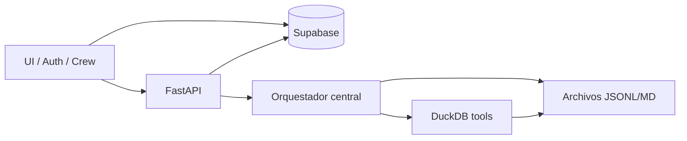

# Spec: Capas de almacenamiento (Supabase / Archivos / DuckDB)

> Estado: **aprobada** (ago 2026) — decisiones de producto cerradas en chat; pendiente aprobación formal  
> Relacionado: [SPEC_AI_JOURNEY_FILE_LEDGER.md](SPEC_AI_JOURNEY_FILE_LEDGER.md), [SPEC_APP_JOURNEY_MECHANICS.md](SPEC_APP_JOURNEY_MECHANICS.md), [SPEC_APP_WORLD_GLOSSARY.md](SPEC_APP_WORLD_GLOSSARY.md), [SPEC_APP_WAITING_PHRASES.md](SPEC_APP_WAITING_PHRASES.md), [SPEC_APP_PARALLEL_WORLDS.md](SPEC_APP_PARALLEL_WORLDS.md), [SPEC_AI_CENTRAL_ORCHESTRATOR.md](SPEC_AI_CENTRAL_ORCHESTRATOR.md)  
> **Diagrama:** [17-storage-decision-tree.md](../diagrams/17-storage-decision-tree.md) · [05-data-auth-model.md](../diagrams/05-data-auth-model.md)

## Contexto

Tras el cutover play → FastAPI + ledger JSONL/MD, hace falta un contrato único de **dónde vive cada dato**. Tres motores distintos:

| Motor | Rol |
| --- | --- |
| **Supabase (Postgres)** | Verdad de producto, auth, seguridad, estado UI |
| **Archivos** (`data/journey/`, glosarios, defs agentes) | Novela del viaje, contenido agentic, glosarios |
| **DuckDB** (in-process) | Consulta/tools sobre archivos; **no** BD de cuentas |

## Objetivo

1. Criterio estable para ubicar datos nuevos.
2. Lista normativa de qué queda / se migra / se elimina en cada capa.
3. Encajar mundos en paralelo, examen/retos en ledger, sin PlacementBank, sin `child_traits` en PG.

---

## 1. Decisiones

| # | Decisión | Valor |
| --- | --- | --- |
| D1 | Criterio PG | Auth, multi-tenant, FK, flags, niveles oficiales, config tutor, frases de espera |
| D2 | Criterio archivos | Append-only narrativo, semi-estructurado, generado por LLM, informes `.md` |
| D3 | Criterio DuckDB | `SELECT`/tools sobre JSONL (viaje + glosario); compactación Parquet opcional |
| D4 | DuckDB ≠ fuente de verdad | No sustituye Supabase; no guarda cuentas ni permisos |
| D5 | Examen / retos en curso | **Archivos** (estado de sesión en ledger), no tablas `placement_*` / `narrative_quests` |
| D6 | Ficha personaje | **`traveler.md`** (absorbe `child_traits`) |
| D7 | PlacementBank | **Eliminar**; el LLM genera ítems; anti-repetición vía JSONL reciente |
| D8 | Vocabulario canónico | `AgeBand` + `SubjectCatalog` en **código Python**; Zone/Mentor se absorben en agentes/caminos LLM |
| D9 | Frases de espera | **JSONL** `data/waiting/` ([SPEC_APP_WAITING_PHRASES](SPEC_APP_WAITING_PHRASES.md)) — **no** tabla PG como fuente |
| D10 | Glosario | JSONL + tools DuckDB ([SPEC_APP_WORLD_GLOSSARY](SPEC_APP_WORLD_GLOSSARY.md)) |
| D11 | Mundos | Paralelismo fantasy / sci-fi ([SPEC_APP_PARALLEL_WORLDS](SPEC_APP_PARALLEL_WORLDS.md)) |
| D12 | Orquestación IA | Orquestador central ([SPEC_AI_CENTRAL_ORCHESTRATOR](SPEC_AI_CENTRAL_ORCHESTRATOR.md)) |
| D13 | Parquet / `.duckdb` persistente / ETL | **Aplazado** — no implementar en el horizonte del backlog ago 2026 |
| D14 | Economía / equipaje | Saldo e inventario en **Supabase** (`child_wallets`, `child_inventory_items`); defs en **código/JSON** `data/items/`; grants narrativos en **ledger** — [SPEC_APP_REWARDS_ECONOMY](SPEC_APP_REWARDS_ECONOMY.md), [SPEC_APP_INVENTORY_BAGGAGE](SPEC_APP_INVENTORY_BAGGAGE.md) |

---

## 2. Criterio de decisión (checklist)

Ante un dato nuevo, preguntar en orden:

1. ¿Auth, ownership, RLS, permisos, PIN, settings tutor? → **Supabase**
2. ¿Nivel/rango/materias activas que la UI de crew muestra como verdad? → **Supabase**
2b. ¿Saldo de moneda o posesiones de equipaje? → **Supabase** (defs de ítem → **código/JSON**)
3. ¿Cola/índice/respuestas de un examen o camino en curso? → **Archivos** (sesión)
4. ¿Diálogo, evento narrativo, resumen, informe, glosario? → **Archivos**
5. ¿Agente necesita filtrar/agregar sobre (3)/(4)? → **DuckDB tool** sobre esos archivos
6. ¿Lista fija de ids (materias, bandas)? → **Código** (`backend/app/catalogs/`)

---

## 3. Mapa normativo

### 3.1 Supabase (se queda / se añade)

| Artefacto | Notas |
| --- | --- |
| Auth + `parent_accounts` + settings | Identidad tutor |
| `children` | nombre, edad, `age_band`, flags, PIN/permisos, `onboarding_step` mínimo |
| Progreso canónico | `general_level`, `rank_*`, niveles por materia **oficiales** (fuente UI) |
| Materias activas + puntos flojos tutor | Config editable |
| Economía / equipaje | `child_wallets`, `child_inventory_items` (por `world_theme`) |
| Frases de espera | **JSONL** `data/waiting/{fantasy,sci-fi,neutral}.jsonl` |
| Legal | `legal_documents` |
| Puntero de sesión (opcional) | `active_session_id` / mundo activo; **sin** payload del examen |

Progreso **por mundo** cuando aplique mundos paralelos: clave lógica `(child_id, world_theme)` — detalle en [SPEC_APP_PARALLEL_WORLDS](SPEC_APP_PARALLEL_WORLDS.md).

### 3.2 Archivos (ledger + contenido)

| Artefacto | Notas |
| --- | --- |
| `dialogue.jsonl` | Transcript (por mundo si paralelo) |
| `events.jsonl` | Eventos de sesión + **estado examen/retos** (cola, índice, scores) |
| `summary.md` / `journey-condensed.md` | Resúmenes |
| `traveler.md` (+ variante por mundo si hace falta) | Sustituye `child_traits` |
| `glossary/{world}.jsonl` | Glosarios tipológicos |
| `agents/*.md`, `skills/` | Definiciones versionadas en repo |
| Informes tutor `.md` | Generados |

Layout canónico (con mundos): ver ledger + parallel worlds.

### 3.3 DuckDB

| Uso | Notas |
| --- | --- |
| Tools de agentes | `glossary_search`, consultas a `dialogue`/`events` |
| Analítica / informes | Agregados por materia, sesión |
| Compactación | ETL opcional JSONL → Parquet |
| Proyección de estado | Caché opcional; **nunca** única fuente |

Runtime: embebido en FastAPI (`duckdb` Python); fichero `.duckdb` opcional solo para proyecciones locales, no para auth.

### 3.4 Código (no “bank”)

| Módulo | Rol |
| --- | --- |
| `AgeBand` | Edad → banda pedagógica |
| `SubjectCatalog` | Ids materias, etiquetas, base por banda, pesos |
| ~~`PlacementBank`~~ | **Prohibido** — no hay banco estático de ítems |
| ~~`ZoneCatalog` como nombres fijos de camino~~ | Caminos los genera el LLM; materia asociada vía SubjectCatalog |
| ~~`MentorCatalog` ficha estática~~ | Perfil en `.md` del agente mentor + mundo |

---

## 4. Migraciones / deprecaciones (PG)

| Tabla / artefacto | Acción |
| --- | --- |
| `dialogue_turns`, `story_beats`, `story_summaries` | Deprecar; ledger es canónico |
| `waiting_phrases` (tabla PG) | **Legado** — fuente de verdad pasa a JSONL `data/waiting/` |
| `narrative_quests` | Deprecar; caminos/retos en ledger |
| `child_traits` | Migrar semántica a `traveler.md`; dejar de escribir PG |
| `ai_purpose_model_queues`, cooldowns OpenRouter, `ai_call_attempts` (legado) | Ignorar / limpiar cuando toque ops; Gemini no las usa |
| `shared/Ai/placement_bank/` + `PlacementBank.php` | Eliminar |

Sin backfill histórico obligatorio: reset de viajeros ya contemplado en ledger §10.

---

## 5. Diagrama de flujo de escritura

---

## 6. Criterios de aceptación

1. Documento de decisión D1–D12 reflejado en specs hijas enlazadas.
2. Ningún nuevo feature escribe transcript o cola de examen en Postgres.
3. DuckDB solo aparece como dependencia de tools/consulta, no como store de `children`.
4. Tests/docs de PlacementBank marcados obsoletos o eliminados en el plan de implementación.
5. Diagrama [05-data-auth-model](../diagrams/05-data-auth-model.md) y [11-child-adventure-pipeline](../diagrams/11-child-adventure-pipeline.md) actualizados al aprobar.

## Fuera de alcance

- Implementar DuckDB en este documento (contrato solamente).
- Rediseño visual completo de ficha crew (ver mecánicas / crew specs).
