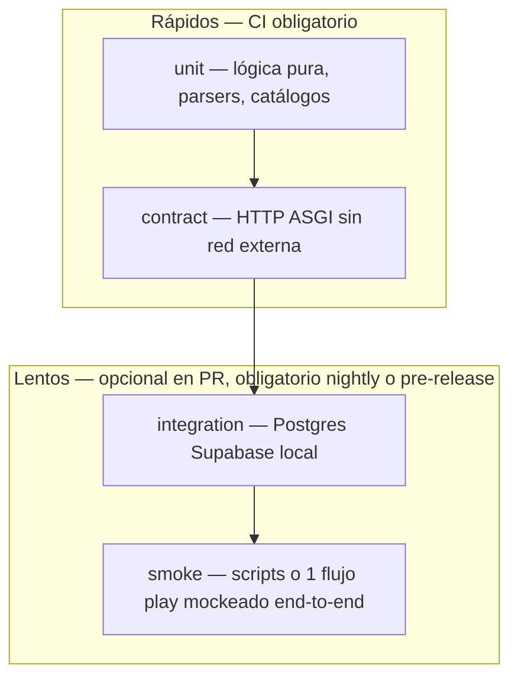

# Spec: Suite pytest del backend FastAPI

> **Estado:** implementada (fase 0 — ago 2026)  
> **Hilo:** validación / CI / SDD kidepik  
> **Relacionada con:** [SPEC_FASTAPI_BACKEND_MIGRATION](SPEC_FASTAPI_BACKEND_MIGRATION.md) §10, [SPEC_DEV_TEST_CI](SPEC_DEV_TEST_CI.md), diagrama [13-dev-test-validate](../diagrams/13-dev-test-validate.md)

---

## 1. Objetivo

Definir el **contrato de testing** del backend FastAPI (`backend/`) para que toda ruta, servicio y módulo de IA tenga cobertura reproducible con **pytest**, **parametrize**, **fixtures compartidas** y **mocks** donde corresponda — sin llamadas reales a Gemini, Supabase Auth ni Postgres salvo en tests explícitamente marcados como integración.

Esta spec **no sustituye** Playwright E2E (`web/e2e/`) ni los tests JS unitarios; complementa la pirámide en la capa API/Python.

---

## 2. Alcance

| Incluido | Excluido |
| --- | --- |
| `backend/app/**` (routers, services, `ai/`, `security/`, `catalogs/`, `storage/`) | Código PHP legado (`api/`, `shared/`) — PHPUnit hasta retiro |
| `backend/tests/**` | Scripts smoke en `backend/app/scripts/` (solo si se promueven a tests) |
| Configuración `pyproject.toml` / `conftest.py` | Despliegue prod / hosting §7 migración FastAPI |
| CI (`.github/workflows/ci.yml`) y `scripts/test-all.ps1` | Tests de carga / benchmarks |

---

## 3. Pirámide de tests



| Capa | Marker pytest | Red externa | DB | Tiempo objetivo |
| --- | --- | --- | --- | --- |
| **unit** | `@pytest.mark.unit` | No | No | < 50 ms/test |
| **contract** | `@pytest.mark.contract` | No (ASGI in-process) | No (deps mockeadas) | < 200 ms/test |
| **integration** | `@pytest.mark.integration` | Supabase local opcional | Sí (`DATABASE_URL`) | < 2 s/test |
| **slow** | `@pytest.mark.slow` | Cualquiera | Según caso | > 2 s — excluir de `-q` habitual |

**Regla:** el comando por defecto en CI y `test-all.ps1` ejecuta **solo** `unit` + `contract` (ver §8).

---

## 4. Stack y dependencias

### 4.1 Ya presentes (`backend/pyproject.toml`)

| Paquete | Uso |
| --- | --- |
| `pytest>=8.3` | Runner |
| `pytest-asyncio>=0.24` | Tests `async def` (`asyncio_mode = auto`) |

### 4.2 A añadir en `[project.optional-dependencies].dev`

| Paquete | Uso |
| --- | --- |
| `pytest-cov>=6.0` | Cobertura líneas/ramas |
| `pytest-mock>=3.14` | Fixture `mocker` (wrapper de `unittest.mock`) |
| `freezegun>=1.5` | Tiempo congelado (TTL upload, logs por día) — solo si hace falta |
| `respx>=0.21` | Mock declarativo de `httpx` (auth Supabase, futuros clientes HTTP) |

**No añadir** sin encargo: `factory_boy`, `faker`, `testcontainers` (Postgres ya lo aporta el stack Supabase local).

### 4.3 Configuración pytest (`pyproject.toml`)

```toml
[tool.pytest.ini_options]
asyncio_mode = "auto"
asyncio_default_fixture_loop_scope = "function"
testpaths = ["tests"]
pythonpath = ["."]
addopts = "-ra --strict-markers -m 'not integration and not slow'"
markers = [
  "unit: lógica pura sin I/O",
  "contract: HTTP ASGI con dependencias mockeadas",
  "integration: requiere Postgres/Supabase local",
  "slow: >2s o LLM real",
]
filterwarnings = [
  "error::DeprecationWarning",
]

[tool.coverage.run]
source = ["app"]
branch = true
omit = [
  "app/scripts/*",
  "app/__init__.py",
]

[tool.coverage.report]
fail_under = 85
show_missing = true
skip_covered = false
```

**Umbral inicial:** **≥ 85 %** líneas en `app/` (subir a 90 % cuando la suite esté completa). Excluir `app/scripts/` (herramientas CLI, no producto HTTP).

---

## 5. Layout de ficheros

```
backend/
  app/
    ...
  tests/
    conftest.py              # fixtures globales (app, client, settings, auth, tmp dirs)
    helpers/
      __init__.py
      factories.py           # builders de Settings, AuthClaims, child/session dicts
      http.py                # assert_json_error, assert_ai_envelope, etc.
    unit/
      test_exit_pin.py
      test_gemini_gateway.py # parte sync
      test_journey_ledger.py
      ...
    contract/
      test_health.py
      test_parents_routes.py
      test_crew_routes.py
      test_play_routes.py
      ...
    integration/
      test_parents_db.py     # opcional: contra Postgres local
      ...
```

### 5.1 Convención de nombres

| Elemento | Patrón | Ejemplo |
| --- | --- | --- |
| Fichero | `test_<módulo_o_feature>.py` | `test_crew_permissions.py` |
| Función | `test_<comportamiento>_<condición>` | `test_create_crew_member_returns_201` |
| Fixture | sustantivo corto | `app`, `client`, `auth_headers`, `settings` |
| Factory | `make_<entidad>` | `make_child_row`, `make_settings` |

### 5.2 Migración desde el layout actual

Los tests existentes en `backend/tests/test_*.py` se **mueven** a `unit/` o `contract/` según §3 sin cambiar la lógica en el primer PR de andamiaje. No mezclar refactor de producto con el movimiento de ficheros.

---

## 6. Fixtures compartidas (`conftest.py`)

Contrato mínimo que debe existir tras la Fase 0 de implementación de esta spec.

### 6.1 Settings y app

```python
@pytest.fixture
def settings(tmp_path: Path, monkeypatch: pytest.MonkeyPatch) -> Settings:
    """Settings de test: sin migraciones al arranque, dirs bajo tmp_path, IA desactivada por defecto."""
    monkeypatch.setenv("RUN_MIGRATIONS_ON_STARTUP", "false")
    monkeypatch.setenv("LOG_TO_FILES", "false")
    monkeypatch.setenv("AI_ENABLED", "false")
    monkeypatch.setenv("JOURNEY_DATA_DIR", str(tmp_path / "journey"))
    monkeypatch.setenv("GLOSSARY_DATA_DIR", str(tmp_path / "glossary"))
    monkeypatch.setenv("MEDIA_ROOT", str(tmp_path / "media"))
    get_settings.cache_clear()
    return get_settings()


@pytest.fixture
def app(settings: Settings) -> FastAPI:
    return create_app()


@pytest.fixture
async def client(app: FastAPI) -> AsyncIterator[AsyncClient]:
    transport = ASGITransport(app=app)
    async with AsyncClient(transport=transport, base_url="http://test") as ac:
        yield ac
```

**Reglas:**

- Siempre `get_settings.cache_clear()` en fixtures que toquen env.
- `RUN_MIGRATIONS_ON_STARTUP=false` en tests unit/contract para no depender del orden de ejecución ni de migraciones en lifespan.
- `LOG_TO_FILES=false` para no ensuciar `web/logs/` en CI.

### 6.2 Auth

```python
@pytest.fixture
def auth_claims() -> AuthClaims:
    return {
        "sub": "00000000-0000-4000-8000-000000000099",
        "role": "authenticated",
        "email": "tutor@example.com",
        "display_name": "Tutor Test",
        "avatar_url": None,
    }


@pytest.fixture
def auth_headers() -> dict[str, str]:
    return {"Authorization": "Bearer test-token"}


@pytest.fixture
def mock_auth(mocker: MockerFixture, auth_claims: AuthClaims):
    """Parchea validate_bearer en el dependency usado por los routers."""
    return mocker.patch(
        "app.services.auth.SupabaseAuthService.validate_bearer",
        new_callable=AsyncMock,
        return_value=auth_claims,
    )
```

**Regla:** los tests **contract** de rutas autenticadas usan `mock_auth` + `auth_headers`; no llamar a Supabase real.

### 6.3 HTTP externo (respx)

Para tests que ejerciten `SupabaseAuthService` sin parchear el servicio completo:

```python
import respx
import httpx

@respx.mock
@pytest.mark.asyncio
async def test_validate_bearer_rejects_401():
    respx.get("http://test/auth/v1/user").mock(return_value=httpx.Response(401))
    svc = SupabaseAuthService(settings=Settings(supabase_url="http://test", supabase_anon_key="k"))
    with pytest.raises(AuthError):
        await svc.validate_bearer("Bearer bad")
```

### 6.4 Datos en disco (`tmp_path`)

Patrón ya usado en `test_orchestrator_glossary.py`: directorios `journey/`, `glossary/`, `waiting/` bajo `tmp_path`; inyectar vía `Settings` o parámetro explícito del servicio (preferible **inyección por constructor** frente a env global cuando el módulo lo permita).

### 6.5 IA / Gemini

| Qué mockear | Cómo |
| --- | --- |
| `GeminiGateway.run_with_model_list` | `AsyncMock` devolviendo `(payload, "model-id")` |
| `Orchestrator.run_turn` / agent runner | Parche en capa service (`dialogue`, `placement`) |
| Pydantic AI agent | **No** invocar modelo real en CI; stub del runner que devuelve envelope Pydantic |

**Anti-patrón:** `GOOGLE_API_KEY` real en CI o en tests sin marker `slow`.

---

## 7. Patrones por tipo de test

### 7.1 Unit — lógica pura

- Sin `create_app()` salvo que el test sea del wiring mínimo.
- **`@pytest.mark.parametrize`** para tablas de entrada/salida (errores Gemini, aliases debug-ai, catálogos, PIN).
- Un comportamiento por función; el nombre del test describe la condición.

**Ejemplo (parametrize — clasificación errores IA):**

```python
@pytest.mark.unit
@pytest.mark.parametrize(
    "status_code,message,expected_code,advance",
    [
        (429, "RESOURCE_EXHAUSTED: per day quota", "ai_quota_exhausted", True),
        (429, "RESOURCE_EXHAUSTED", "ai_rate_limited", False),
        (503, "overloaded", "ai_provider_unavailable", True),
    ],
    ids=["daily-quota", "rpm", "unavailable"],
)
def test_classify_gemini_exception(status_code, message, expected_code, advance):
    class Exc(Exception):
        pass
    exc = Exc(message)
    exc.status_code = status_code
    classified = classify_gemini_exception(exc)
    assert classified.error_code == expected_code
    assert classified.advance_model is advance
```

### 7.2 Contract — rutas HTTP

- `client` + `mock_auth` cuando la ruta exige Bearer.
- Assert de **status**, **shape JSON** (claves obligatorias), no texto copy de LLM.
- Casos de error: 401 sin token, 403 permisos, 404 recurso ajeno, 422 validación Pydantic, envelopes IA (`error_code`, `retryable`).

**Plantilla:**

```python
@pytest.mark.contract
@pytest.mark.asyncio
async def test_get_health_ok(client: AsyncClient):
    response = await client.get("/api/v1/health")
    assert response.status_code == 200
    body = response.json()
    assert body["status"] == "ok"
    assert "service" in body


@pytest.mark.contract
@pytest.mark.asyncio
async def test_crew_list_requires_auth(client: AsyncClient):
    response = await client.get("/api/v1/crew")
    assert response.status_code == 401
```

### 7.3 Integration — Postgres

- Marker `@pytest.mark.integration`.
- Requiere `DATABASE_URL` apuntando a Supabase local (`:54322`).
- Usar transacciones con rollback por test **o** fixtures que inserten filas con UUIDs de prueba y limpien en teardown.
- **No** ejecutar en el job CI estándar hasta que el tiempo de suite sea estable (< 3 min adicionales).

### 7.4 Mocks — cuándo `unittest.mock` vs inyección

| Situación | Preferencia |
| --- | --- |
| Servicio ya acepta `client=` / `settings=` en `__init__` | Inyectar fake/stub (como `GeminiGateway` + `runner` callback) |
| Dependencia global `get_settings()` | `monkeypatch.setenv` + `get_settings.cache_clear()` |
| Método async de un servicio | `mocker.patch.object(..., new_callable=AsyncMock)` |
| HTTP saliente | `respx` con URL exacta |
| Tiempo / `datetime.now()` | `freezegun` o inyección de clock (si se introduce) |

**Regla:** mockear en el **borde** (HTTP, LLM, filesystem); no mockear la función bajo test salvo en contract tests de routers.

---

## 8. Comandos

### 8.1 Desarrollo local (contenedor — canónico en Windows)

```powershell
./scripts/poc-up.ps1
docker compose --env-file .env.poc -f docker/compose.yaml exec api pytest -q
```

### 8.2 Subconjuntos

```powershell
# Solo unit
docker compose ... exec api pytest -q -m unit

# Contract de un router
docker compose ... exec api pytest -q tests/contract/test_crew_routes.py

# Con cobertura (umbral en pyproject)
docker compose ... exec api pytest -q --cov=app --cov-report=term-missing

# Integración (stack + Supabase migrado)
docker compose ... exec api pytest -q -m integration --no-cov
```

### 8.3 CI y `test-all.ps1`

| Paso actual | Cambio propuesto |
| --- | --- |
| `pytest -q` | `pytest -q --cov=app --cov-fail-under=85` |
| Sin umbral Python | Fallar si cobertura < 85 % |
| PHPUnit legado | Mantener hasta retiro PHP; no exigir paridad |

---

## 9. Cobertura por módulo (objetivo)

Prioridad de implementación de tests (cada ítem = al menos contract + unit de errores dominantes):

| Módulo / router | Prioridad | Notas |
| --- | --- | --- |
| `health`, `architecture`, `legal` | P0 | Ya parcial; completar contract |
| `parents`, `settings` | P0 | Auth + bootstrap |
| `crew` | P0 | CRUD + permisos + PIN |
| `storage` | P1 | prepare-upload, token TTL |
| `play` | P1 | Diálogo, placement, journey — **mock IA** |
| `debug_ai` | P1 | Normalización purpose (ya hay unit) |
| `client_logs` | P2 | Ingesta JSONL |
| `ai/gemini_gateway` | P0 | Ya hay buena base unit |
| `ai/orchestrator` | P1 | resolve_purpose + tools |
| `ai/agents`, `ai/skills` | P1 | Registry + skills on disk |
| `services/dialogue`, `placement` | P1 | Envelopes y errores `compose_failed` |
| `security/exit_pin` | P0 | Ya cubierto |
| `db/migrations` | P2 | integration o unit con runner mockeado |

---

## 10. Contratos JSON a validar (checklist)

Reutilizar helpers en `tests/helpers/http.py`:

| Respuesta | Campos mínimos |
| --- | --- |
| Error auth | `{"detail": str}` status 401 |
| Error validación | `{"detail": ...}` status 422 |
| Error IA producto | `error_code`, `retryable`, `models_tried` (según [SPEC_AI_GEMINI_GATEWAY](SPEC_AI_GEMINI_GATEWAY.md)) |
| Health | `status`, `service` |
| Crew member | `id`, `display_name`, campos de spec crew |
| Play turn OK | envelope acordado en [SPEC_AI_PYDANTIC_AGENTS](SPEC_AI_PYDANTIC_AGENTS.md) — assert por tipo/keys, no prosa |

---

## 11. Buenas prácticas (resumen)

1. **Red-Green-Refactor:** test primero al añadir ruta o cambiar contrato HTTP.
2. **Parametrize** para matrices de error y catálogos; no copiar 5 tests casi idénticos.
3. **Fixtures con alcance mínimo** (`function`); evitar estado mutable compartido entre tests.
4. **`tmp_path`** para ledger, glosario, media; nunca escribir en `data/` ni `web/media/` del repo.
5. **Sin secretos:** `GOOGLE_API_KEY=test-key` solo en objetos `Settings` de test.
6. **Determinismo:** no assert sobre textos generados por LLM; assert estructura y códigos.
7. **Async:** un solo event loop por test (`pytest-asyncio` auto); no mezclar `asyncio.run()` en tests.
8. **Nombres legibles:** `ids=` en parametrize para fallos claros en CI.
9. **Aislar lentitud:** markers `integration` / `slow` desde el primer test que toque DB o red real.
10. **Alineación hub:** docstrings NumPy en APIs públicas nuevas; ver `Vibe-Coding/.cursor/skills/python-engineering/patterns.md`.

---

## 12. Anti-patrones

| Anti-patrón | Por qué |
| --- | --- |
| Llamar Gemini/OpenRouter en CI | Flaky, cuota, lento |
| `create_app()` sin desactivar migraciones | Orden de tests frágil |
| Assert del copy narrativo del mentor | No determinista |
| Tests que dependen de `web/logs/` en disco | Contamina host; usar `LOG_TO_FILES=false` |
| Duplicar fixtures en cada fichero | Usar `conftest.py` + `helpers/` |
| `pytest -k` como sustituto de markers | Markers registrados y documentados |
| Cobertura 100 % obsesiva en routers finos | Priorizar contratos y ramas de error |

---

## 13. Fases de implementación

| Fase | Entregable | Criterio de salida |
| --- | --- | --- |
| **0 — Andamiaje** | `conftest.py`, markers, deps dev, layout `unit/`+`contract/`, mover tests actuales | **hecho** ago 2026 |
| **1 — Tutor** | Contract `parents`, `settings`, `crew` con `mock_auth` | **hecho** ago 2026 |
| **2 — Play** | Contract play con IA mockeada; unit envelopes | **hecho** ago 2026 |
| **3 — Integración** | `tests/integration/` opt-in (`KIDEPIK_INTEGRATION_TESTS=1`) | **hecho** ago 2026 |
| **4 — Cierre** | `fail_under=55` en CI; objetivo **85%** (pendiente `crew.py`, resto `dialogue.py`) | **parcial** — ver nota abajo |

Plan detallado: [.cursor/tasks/FASTAPI_PYTEST_SUITE_PLAN.md](../tasks/FASTAPI_PYTEST_SUITE_PLAN.md).

### Nota cobertura 85 %

El umbral **55 %** en CI refleja ~55 % global tras la suite `tests/unit/test_dialogue_service.py` (`dialogue.py` ~69 %). Siguiente escalón: **70 %** con tests de `crew.py` / `parents.py` y fases restantes de diálogo (`_start_placement`, `_finish_placement`, etc.).

---

## 14. Actualización documental al cerrar

| Documento | Acción |
| --- | --- |
| Esta spec | Estado → **implementada** |
| [CURRENT_SPECS.md](../CURRENT_SPECS.md) | Fila «pytest FastAPI» |
| [SPEC_DEV_TEST_CI.md](SPEC_DEV_TEST_CI.md) | FastAPI como suite API primaria; umbrales Python |
| [13-dev-test-validate.md](../diagrams/13-dev-test-validate.md) | Nodo pytest + cobertura |
| [patterns.md](../skills/spec-driven-dev-kidepik/patterns.md) | Enlace a esta spec |
| [SPEC_FASTAPI_BACKEND_MIGRATION.md](SPEC_FASTAPI_BACKEND_MIGRATION.md) §10 | Enlace cruzado |

---

## 15. Criterios de aceptación (aprobación de esta spec)

1. El equipo acuerda pirámide §3, layout §5 y fixtures §6.
2. Umbral cobertura inicial **85 %** (subida a 90 % en Fase 4).
3. CI ejecuta `pytest -q --cov` con fallo si baja del umbral.
4. Ningún test de la suite por defecto llama a Gemini ni Supabase Auth real.
5. Tras Fase 0, existe `conftest.py` único y al menos un test contract de ejemplo por router P0.

---

## 16. Preguntas abiertas

1. ¿CI ejecuta `integration` en cada PR o solo en `workflow_dispatch` / nightly?
2. ¿Umbral 85 % o 90 % desde el primer merge de andamiaje?
3. ¿Introducir `respx` ya en Fase 0 o posponer a tests de auth HTTP explícitos?
