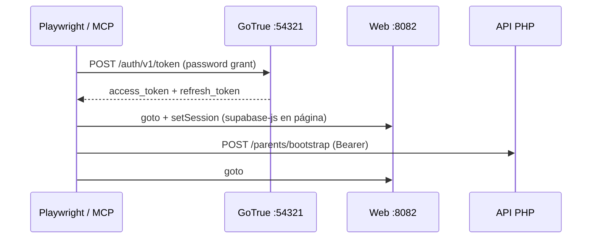

# Spec: Auth local para Playwright (agentes + E2E)

> Estado: **implementada** (jul 2026)  
> Relacionado: [SPEC_DEV_TEST_CI.md](SPEC_DEV_TEST_CI.md), [SPEC_APP_AUTH_GOOGLE_IMPLEMENTATION.md](SPEC_APP_AUTH_GOOGLE_IMPLEMENTATION.md), [SPEC_POC_DOCKER_LOCAL_DEV.md](SPEC_POC_DOCKER_LOCAL_DEV.md), [SPEC_WEB_DEV_PREVIEW.md](SPEC_WEB_DEV_PREVIEW.md)

## Problema

El MVP de producto usa **Google OAuth** en el cliente. Playwright MCP y `@playwright/test` arrancan sin cookies ni `localStorage` de Supabase → cualquier ruta autenticada (`#/crew`, `#/settings`, …) redirige a `#/loader`.

OAuth interactivo no es viable para agentes ni CI.

## Solución (solo local)

Usar **email + contraseña** contra GoTrue local (`[auth.email]` en `supabase/config.toml`, confirmaciones desactivadas). No cambia el producto: el CTA sigue siendo Google; el canal email existe solo en dev para tests.

### Flujo



### Usuario canónico de prueba

| Campo | Valor por defecto | Override |
| --- | --- | --- |
| Email | `playwright-tutor@kidepik.local` | `E2E_TUTOR_EMAIL` |
| Contraseña | `playwright-local-dev` | `E2E_TUTOR_PASSWORD` |

El script **crea** el usuario con `signup` si `signIn` falla. Luego llama `POST /api/v1/parents/bootstrap`.

## Artefactos

| Artefacto | Uso |
| --- | --- |
| `web/e2e/fixtures/local-auth.constants.js` | Credenciales y URLs por defecto |
| `web/e2e/helpers/local-auth.js` | API Node: sesión + `authenticatePlaywrightPage` |
| `web/e2e/helpers/ensure-tutor-user.mjs` | CLI: genera `web/e2e/.auth/tutor.json` |
| `web/e2e/global-setup.js` | Playwright: storageState antes de tests autenticados |
| `scripts/e2e-auth-setup.ps1` | Wrapper para agentes / humanos |

## Comandos

```powershell
./scripts/poc-up.ps1
./scripts/e2e-auth-setup.ps1          # genera storageState
cd web && npm run test:e2e            # incluye humo autenticado si hay setup
```

## MCP Playwright (agente)

Tras `e2e-auth-setup.ps1`, o con `authenticatePlaywrightPage` en `browser_run_code_unsafe`:

1. `POST` token password a `:54321`
2. `setSession` en `http://localhost:8082`
3. `bootstrap` API
4. Navegar a la ruta objetivo

Ver [web-mobile-preview/SKILL.md](../skills/web-mobile-preview/SKILL.md) § Auth local Playwright.

## Seguridad

| Regla | Detalle |
| --- | --- |
| Solo local | Credenciales de fixture; Supabase local no expuesto en prod |
| Sin service_role en web | Solo `anon` key (ya en `config.js`) |
| Sin endpoint PHP dev | No hace falta; GoTrue + bootstrap bastan |
| `.auth/` gitignored | `web/e2e/.auth/tutor.json` no se versiona |

## Criterios de aceptación

1. `ensure-tutor-user.mjs` verde con stack `poc-up` arriba.
2. Playwright puede abrir `#/crew` sin pasar por Google.
3. MCP documentado con snippet reutilizable.
4. CI: `global-setup` ejecuta ensure antes de specs autenticados.

## Fuera de alcance

- Bypass en producción / DreamHost.
- Sustituir Google OAuth en UI de producto.
- Persistir sesión humana del navegador del desarrollador (opcional manual: exportar storageState).
