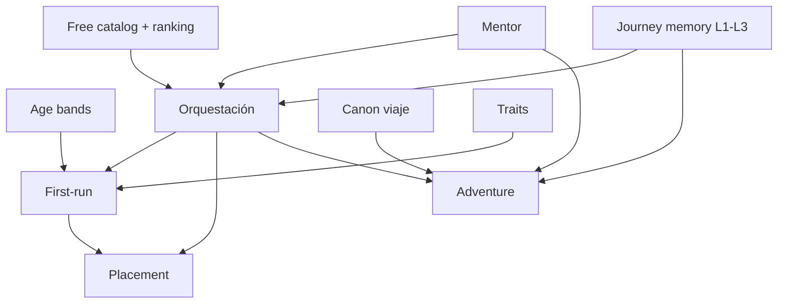

# Plan: Sistema de IA para play (aventura, examen, personaje, mentor, memoria)

> Estado: **Fases A–E parciales implementadas** (julio 2026)  
> Specs: ver §1  
> Backlog vivo: [AI_ADVENTURE_BACKLOG.md](AI_ADVENTURE_BACKLOG.md)  
> UI: play y diario tutor deben seguir [.cursor/DESIGN.md](../DESIGN.md) (section-frame + glass).

## 1. Paquete documental

### P0 (bloquear implementación)

| Spec | Rol |
| --- | --- |
| [SPEC_AI_GEMINI_GATEWAY.md](../specify/SPEC_AI_GEMINI_GATEWAY.md) | Gemini + Pydantic AI |
| [SPEC_APP_WORLD_JOURNEY_CANON.md](../specify/SPEC_APP_WORLD_JOURNEY_CANON.md) | Espina narrativa |
| [SPEC_APP_MENTOR.md](../specify/SPEC_APP_MENTOR.md) | Voz única del camino del héroe |
| [SPEC_APP_JOURNEY_MEMORY.md](../specify/SPEC_APP_JOURNEY_MEMORY.md) | L1 ledger / L2 condensado / L3 reciente |
| [SPEC_APP_AGE_BANDS.md](../specify/SPEC_APP_AGE_BANDS.md) | Cualquier edad 5–99 |
| [SPEC_APP_CHARACTER_TRAITS.md](../specify/SPEC_APP_CHARACTER_TRAITS.md) | Personaje pre-examen |
| [SPEC_AI_PLAY_ORCHESTRATION.md](../specify/SPEC_AI_PLAY_ORCHESTRATION.md) | Agentes + context pack |
| [SPEC_APP_ADVENTURE_SESSION.md](../specify/SPEC_APP_ADVENTURE_SESSION.md) | Sesión post-examen |

### P1 (deltas sobre contratos previos)

| Spec | Delta |
| --- | --- |
| PLAY_FIRST_RUN | character + age bands + mentor al elegir mundo |
| PLACEMENT_EXAM | banco por banda; §8 rewrite |
| ADVENTURE_DIALOGUE | roles mentor/explorer; memoria |
| CREW_SECTION | copy tripulante (sin rename DB) |

**Secretos:** `.secrets/openrouter.env` (gitignored).

## 2. Dependencias

## 3. Decisiones a aprobar (esta ronda)

1. Tripulantes **5–99** con 6 bandas (`band_early` … `band_senior`); legacy `age_7`/`age_9` migra.
2. Voz IA = **Guardián del Conocimiento** / **Arquitecto del Saber**; host neutro solo pre-mundo.
3. OpenRouter **solo free**; discovery `GET /models`; ranking interno; `AI_ALLOW_PAID=false`.
4. Memoria en **3 capas** (ledger completo, condensado viaje, ventana reciente detallada).
5. Tabla `children` **sin rename** en MVP (DTO puede decir member/explorer).
6. Resto del plan previo (pedagogía PHP, banco+rewrite, vertical slice 1 zona) se mantiene.

## 4. Fases de implementación (tras OK)

| Fase | Contenido |
| --- | --- |
| A | Gateway + FreeModelCatalog + ranking + mock |
| B | Dialogue API + mentor UI + first-run hasta character (age bands) |
| C | Placement banco por banda |
| D | Adventure slice + L2 summarizer + L3 context pack |
| E | Timeline tutor (lectura L1) + pulido capítulos |

## 5. Criterio «listo para implementar»

- [ ] Usuario aprueba esta ronda de deltas P0
- [ ] CURRENT_SPECS / diagrama 11 al día
- [ ] Sin código de producto hasta entonces
